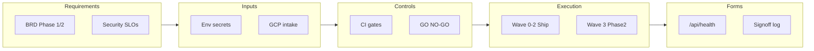
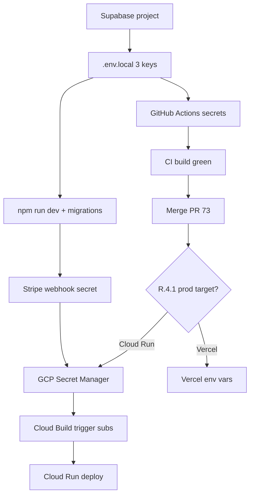

# MANGU Publishers — Master Program Document (RICEF)

| Field | Value |
|-------|--------|
| **Document ID** | MANGU-RICEF-001 |
| **Version** | 1.0 |
| **Repository** | [redinc23/my_publishing](https://github.com/redinc23/my_publishing) |
| **Application** | `mangu-publishers` (Next.js 14, Supabase, Stripe) |
| **Primary audience** | Product owner, engineering lead, platform operator, implementer |
| **Status (May 2026)** | Codebase healthy locally; **CI blocked on missing GitHub secrets**; **production path undecided** (Cloud Run vs Vercel vs Amplify); Phase 2 handoff **NO-GO** until intake/signoffs |

---

## How this document relates to other plans

This file is the **single canonical program view**. Earlier plans are merged here—not discarded.

| Prior artifact | Role after merge | Location |
|----------------|------------------|----------|
| **This document (RICEF)** | Strategy, gates, traceability, waves | [mangu_publishers_master_ricef.md](mangu_publishers_master_ricef.md) |
| **Operator Walkthrough Supplement** | Step-by-step: where to click, what to paste | [operator_walkthrough_supplement.md](operator_walkthrough_supplement.md) |
| Project Status Plan | Absorbed into R + E + F; use RICEF first | `~/.cursor/plans/project_status_plan_b82d82cb.plan.md` |
| Full Project Hardening Plan | Absorbed into C + E; audit snapshot (some items completed) | [full_project_hardening_plan_7b818069.plan.md](full_project_hardening_plan_7b818069.plan.md) |
| Phase 2 package | Absorbed into R (scope) + E (Wave 3) + F (signoffs) | [docs/phase2/README.md](../../docs/phase2/README.md) |
| Business source | FR traceability | [docs/BRD.md](../../docs/BRD.md) |

**Reading order for operators:** Section **E (Execution)** → [Operator Supplement](operator_walkthrough_supplement.md) Parts 1–9.

**Reading order for executives:** Section **R (Requirements)** + **F (Forms)** signoff gates.

---

## Program context (business + technical, 60 seconds)

**Business:** MANGU is a digital publishing marketplace (“Netflix for books”) connecting readers, indie authors, partners, and admins—monetized via Stripe, differentiated long-term by an AI “Resonance Engine” ([docs/BRD.md](../../docs/BRD.md)).

**Technical:** One Next.js 14 App Router application (`output: 'standalone'`), Supabase for auth/DB/storage, 11 API routes, role-based middleware, 12 SQL migrations (Jan 2026).

**Program problem today:** The **product code is largely Phase-1-ready**, but **release engineering is fragmented**: three deploy configs (Cloud Run, Vercel, Amplify), **secrets not wired in GitHub CI**, Phase 2 **ownership/evidence blank**, and **16 open PRs** (most stale). Success = unify **Inputs**, pass **Controls**, execute **Execution** waves, produce **Forms** evidence.



---

# R — Requirements

## R.1 Business requirements (what the business needs)

### R.1.1 Phase 1 — MVP (launch-ready scope)

Source: [docs/BRD.md](../../docs/BRD.md), [docs/FEATURE_PHASES.md](../../docs/FEATURE_PHASES.md).

| ID | Capability | Business outcome | Implementation status |
|----|------------|------------------|------------------------|
| BR-01 | Reader auth (email/password, reset) | Users can register and return safely | Built; **manual QA pending** |
| BR-02 | Marketplace (browse, search, detail) | Discovery drives purchase | Built; needs DB seed/migrations |
| BR-03 | In-browser reading + progress | Retention after purchase | Built |
| BR-04 | Stripe checkout + orders | Revenue | Built; needs webhook + secrets |
| BR-05 | Author portal (submit, dashboard) | Supply side onboarding | Built |
| BR-06 | Partner portal (catalogs, orders, ARC) | B2B channel | Partial / basic |
| BR-07 | Admin (content, users, health) | Operations control | Built |
| BR-08 | Security (RBAC, RLS) | Trust & compliance | Built; RLS verify script exists |

### R.1.2 Phase 2 — Growth (planned / partial)

| ID | Capability | Status |
|----|------------|--------|
| BR-20 | AI recommendations (Resonance) | Code exists; needs `OPENAI_API_KEY` in prod |
| BR-21 | Social (reviews, follows) | Migration `20260122000000_social_features.sql`; UI partial |
| BR-22 | Email notifications | Needs `RESEND_API_KEY` |
| BR-23 | Audiobooks | Not built |
| BR-24 | Production on custom domain + ops | **Phase 2 doc package** (M0–M7b) |

### R.1.3 Stakeholder personas (decision context)

| Persona | Needs from this program |
|---------|-------------------------|
| **Product / business owner** | Clear GO/NO-GO, one production URL, launch checklist |
| **Engineering lead** | Single CI/CD truth, merged PR #73, debt backlog prioritized |
| **Platform operator** | Secret map, runbooks, rollback, health probes |
| **Implementer (you)** | Inputs checklist + click-by-click supplement |

---

## R.2 Technical requirements (how the system must behave)

| ID | Requirement | Verification |
|----|-------------|--------------|
| TR-01 | Node **20.x** in CI, Docker, Cloud Build | `package.json` engines; [ci.yml](../../.github/workflows/ci.yml) |
| TR-02 | Standalone Next build for Cloud Run | `next.config.js` `output: 'standalone'`; artifact in Docker |
| TR-03 | Health endpoint for probes | `GET /api/health` → 200 when configured |
| TR-04 | No service-role or Stripe secret in client bundle | Secret scan step + manual bundle review |
| TR-05 | RBAC on `/admin`, `/author`, `/partner` | [middleware.ts](../../middleware.ts) |
| TR-06 | Stripe webhooks signature-verified | [app/api/webhook/route.ts](../../app/api/webhook/route.ts) + `STRIPE_WEBHOOK_SECRET` |
| TR-07 | DB schema version matches app | 12 migrations applied; health migration check |
| TR-08 | Type-check, lint, unit tests pass before release | CI job `test` |

---

## R.3 Non-functional requirements

| ID | NFR | Target |
|----|-----|--------|
| NFR-01 | Availability | Cloud Run probes on `/api/health` (PR #73 / [cloudbuild.yaml](../../cloudbuild.yaml)) |
| NFR-02 | Security headers | [next.config.js](../../next.config.js) CSP, HSTS, frame deny |
| NFR-03 | Observability | Admin `/admin/health`; Phase 2 P0-9 Sentry/uptime (pending) |
| NFR-04 | Recoverability | Rollback revision documented ([#65](https://github.com/redinc23/my_publishing/issues/65)) |
| NFR-05 | Test coverage | Minimum: 12 unit tests today; E2E not in CI (gap) |

---

## R.4 Open decisions (business — must be recorded)

| ID | Decision | Options | GitHub | Impacts |
|----|----------|---------|--------|---------|
| **R.4.1** | **Canonical production** | A) Cloud Run (README primary) B) Vercel (CI deploy today) C) Amplify (legacy) | [#70](https://github.com/redinc23/my_publishing/issues/70) | Which secrets to maintain; deprecate other pipelines |
| **R.4.2** | **Repository rename** | Keep `my_publishing` vs rename to `mangu-publishers` | [#71](https://github.com/redinc23/my_publishing/issues/71) | URLs, clones, docs |
| **R.4.3** | **Phase 2 cutover** | Execute M0–M7b now vs defer | [11-handoff-master-checklist.md](../../docs/phase2/11-handoff-master-checklist.md) | Operator time, GCP/Firebase scope |

**Recommendation (technical, not prescriptive):** Choose **R.4.1 = Cloud Run** to align README + `cloudbuild.yaml`; disable or document Vercel deploy job until intentional.

---

## R.5 Definition of done (program level)

| Gate | Criteria |
|------|----------|
| **DOD-Dev** | `.env.local` complete; `npm run dev`; `/api/health` healthy |
| **DOD-CI** | GitHub Actions `test` green on `main` |
| **DOD-Staging** | Cloud Run revision deployed; migrations applied; webhook test event OK |
| **DOD-Prod** | Custom domain HTTPS; P0 tests in [06-acceptance-and-test-protocol.md](../../docs/phase2/06-acceptance-and-test-protocol.md); signoffs in F.2 |
| **DOD-Handoff** | No PENDING in Phase 2 checklist Sections B–F; RACI names real |

---

# I — Inputs

Inputs are **everything that must exist before Execution** can succeed. They are **never committed to git** (except templates).

## I.1 Environment variable master matrix

| Variable | Class | Required for | Local `.env.local` | GitHub Secret | GCP Secret Manager | Cloud Build `_SUBST` | Vercel env |
|----------|-------|--------------|-------------------|---------------|-------------------|----------------------|------------|
| `NEXT_PUBLIC_SUPABASE_URL` | Public | Build + runtime | Yes | Yes | — | `_NEXT_PUBLIC_SUPABASE_URL` | Yes |
| `NEXT_PUBLIC_SUPABASE_ANON_KEY` | Public | Build + runtime | Yes | Yes | — | `_NEXT_PUBLIC_SUPABASE_ANON_KEY` | Yes |
| `SUPABASE_SERVICE_ROLE_KEY` | Secret | Server, migrations | Yes | Yes | `supabase-service-role-key` | via `--set-secrets` | Yes |
| `NEXT_PUBLIC_STRIPE_PUBLISHABLE_KEY` | Public | Checkout UI | For payments | Yes | — | `_NEXT_PUBLIC_STRIPE_PUBLISHABLE_KEY` | Yes |
| `STRIPE_SECRET_KEY` | Secret | Server payments | For payments | No | `stripe-secret-key` | via `--set-secrets` | Yes |
| `STRIPE_WEBHOOK_SECRET` | Secret | Webhook route | For webhooks | No | `stripe-webhook-secret` | via `--set-secrets` | Yes |
| `NEXT_PUBLIC_SITE_URL` | Public | SEO, redirects | Yes | Yes | — | `_NEXT_PUBLIC_SITE_URL` | Yes |
| `OPENAI_API_KEY` | Secret | Resonance | Optional | No | `openai-api-key` | via `--set-secrets` | Optional |
| `RESEND_API_KEY` | Secret | Email | Optional | No | `resend-api-key` | via `--set-secrets` | Optional |
| `USE_MOCKS` | Config | CI without full stack | — | — (CI sets `true`) | — | — | — |

**Validation authority:** [lib/utils/env-validation.ts](../../lib/utils/env-validation.ts) (3 Supabase vars required for `npm run dev`).

**Operator detail:** [Operator Supplement § Quick map](operator_walkthrough_supplement.md).

---

## I.2 Third-party accounts (prerequisites)

| Account | Purpose | Obtain at |
|---------|---------|-----------|
| Supabase | Auth, DB, storage | [supabase.com/dashboard](https://supabase.com/dashboard) |
| Stripe | Payments, webhooks | [dashboard.stripe.com](https://dashboard.stripe.com) |
| GitHub | Repo, Actions secrets | Repository Settings |
| GCP | Cloud Run, Secret Manager, Cloud Build | [console.cloud.google.com](https://console.cloud.google.com) |
| Vercel | Only if R.4.1 includes Vercel | [vercel.com/dashboard](https://vercel.com/dashboard) |
| OpenAI / Resend | Phase 2 features | Optional until BR-20/BR-22 needed |

---

## I.3 Repository configuration inputs (committed)

| Input artifact | Purpose |
|----------------|---------|
| [.env.local.example](../../.env.local.example) | Local template |
| [.env.production.example](../../.env.production.example) | GCP operator reference |
| [cloudbuild.yaml](../../cloudbuild.yaml) | Cloud Run pipeline + substitutions |
| [.github/workflows/ci.yml](../../.github/workflows/ci.yml) | PR/main CI + Vercel deploy |
| [docs/phase2/_intake/environment.example.sh](../../docs/phase2/_intake/environment.example.sh) | GCP shell intake template |
| [supabase/migrations/*.sql](../../supabase/migrations/) | Schema source of truth |

---

## I.4 Phase 2 intake inputs (GCP / org — Wave 3)

Fill [FIELDS_TO_GATHER.md](../../docs/phase2/_intake/FIELDS_TO_GATHER.md) → copy to gitignored `environment.local.sh`.

| Input group | Examples | Consumer |
|-------------|----------|----------|
| GCP routing | `PROJECT_ID`, `REGION`, `CUSTOM_DOMAIN`, `BILLING_ACCOUNT_ID` | Cloud Build, runbooks |
| Rollback | `KNOWN_GOOD_REVISION` | [07-operational-runbook.md](../../docs/phase2/07-operational-runbook.md) |
| Content probes | `SAMPLE_BOOK_SLUG`, etc. | P0 acceptance tests |
| People | Engineering lead, on-call names | [12-ownership-raci.md](../../docs/phase2/12-ownership-raci.md) |

**No secrets** in intake worksheet—only Secret Manager for server keys.

---

## I.5 Input dependency order



---

# C — Controls

Controls are **gates, policies, and checks** that prevent unsafe or incomplete release.

## C.1 Security controls

| Control | Mechanism | Owner |
|---------|-----------|-------|
| SC-01 | `.gitignore` blocks `.env.local`, `environment.local.sh`, `*.save` | Engineering |
| SC-02 | No `NEXT_PUBLIC_` on server secrets | Code review + grep |
| SC-03 | RLS on Supabase tables | Migrations + `npm run verify-rls` |
| SC-04 | Middleware RBAC | Automatic on each request |
| SC-05 | Stripe webhook HMAC | `STRIPE_WEBHOOK_SECRET` required at runtime |
| SC-06 | Cloud Build secret audit step | [cloudbuild.yaml](../../cloudbuild.yaml) `secret-audit` |
| SC-07 | Expand scan coverage | Backlog [#68](https://github.com/redinc23/my_publishing/issues/68) |

---

## C.2 Quality gates (automated)

| Gate | Command / trigger | Pass condition |
|------|-------------------|----------------|
| QG-01 | `npm run type-check` | Zero errors |
| QG-02 | `npm run lint` | Zero warnings |
| QG-03 | `npm test` | 12/12 unit tests |
| QG-04 | `npm run build` | Standalone output; no prerender Supabase error |
| QG-05 | GitHub Actions on PR | All of QG-01–04 in CI |
| QG-06 | Cloud Build on `main` | Lint, build, docker, deploy, verify steps green |

**Current breach:** QG-04/05 fail when GitHub Supabase secrets are empty (prerender requires client).

**Pre-push sanity (operator):**

```bash
git ls-files | grep -E '\.(save|swp|local)$|environment\.local' && echo STOP || echo OK
npm run type-check && npm run lint && npm test && npm run build
```

---

## C.3 Release controls

| Control | Rule |
|---------|------|
| RC-01 | Do not merge PR #73 until QG-05 passes |
| RC-02 | Do not route production traffic until `/api/health` returns acceptable JSON on new revision |
| RC-03 | Do not enable live Stripe until webhook secret in target environment |
| RC-04 | Migrations applied in timestamp order before seeding production data |

**Active release vehicle:** [PR #73](https://github.com/redinc23/my_publishing/pull/73) on branch `chore/full-project-hardening`.

---

## C.4 Phase 2 GO/NO-GO controls

Automatic **NO-GO** if ([11-handoff-master-checklist.md](../../docs/phase2/11-handoff-master-checklist.md)):

- Any milestone M0–M7b row = TODO without evidence URL
- Any P0 test P0-1–P0-9 = PENDING
- RACI Role Directory still has `_(worksheet: …)_` placeholders
- Critical/high risk without named owner ([08-risk-and-troubleshooting.md](../../docs/phase2/08-risk-and-troubleshooting.md))

---

## C.5 Risk controls (condensed register)

| Risk | Impact | Mitigation | Status |
|------|--------|------------|--------|
| Missing CI secrets | Build fails; false “broken code” | Wave 0: GitHub secrets | **Open** |
| Triple deploy path | Config drift, wrong env | Decide R.4.1; deprecate others | **Open** |
| Manual migrations | Schema drift prod vs app | Run I.5 migrations; #67 | **Open** |
| Thin test coverage | Regressions undetected | Backlog; optional E2E in CI | **Open** |
| Stale agent PRs | Confusion, merge accidents | E.7 triage | **Open** |

---

# E — Execution

Execution is **ordered work**—waves for operators, parallel engineering backlog for the team.

## E.0 Execution waves (summary)

| Wave | Goal | Who | Supplement | Est. |
|------|------|-----|------------|------|
| **0** | Unblock local + CI | Operator | Parts 1–2 | ~30 min |
| **1** | Land hardening on `main` | Operator + reviewer | Part 7 | ~1 hr |
| **2** | Production-ready Cloud Run path | Operator + platform | Parts 4–6 | ~half day |
| **3** | Phase 2 cutover & handoff | Full team | Part 8 + phase2 docs | multi-day |
| **B** | Engineering backlog | Engineering | Issues #65–#72 | ongoing |

---

## E.1 Wave 0 — Inputs for dev & CI (CRITICAL PATH)

**Business value:** Developers and CI can trust the build; stops false-negative “red builds.”

| Step | Action | Detail |
|------|--------|--------|
| E.1.1 | Create `.env.local` | Supplement Part 1 |
| E.1.2 | Add 5 GitHub Actions secrets | Supplement Part 2 — names must match `ci.yml` exactly |
| E.1.3 | Re-run PR #73 checks | Supplement Part 2.1 |
| E.1.4 | Local verify | `npm run dev` → `/api/health` |

**Exit criteria:** DOD-Dev + CI `test` job green on PR #73.

---

## E.2 Wave 1 — Merge platform hardening

**Business value:** Single Node 20 pipeline; Cloud Run probes; secret wiring in `cloudbuild.yaml`.

| Step | Action |
|------|--------|
| E.2.1 | Review PR #73 diff (CI, cloudbuild, docs) |
| E.2.2 | Merge to `main` |
| E.2.3 | Confirm GitHub Actions on `main` |
| E.2.4 | Record decision on R.4.1 in issue #70 |

**Completed hardening (do not repeat):** Docker `public/` COPY, `mangu-publishers` rename, `*.save` gitignore, intake walkthrough — see [full_project_hardening_plan](full_project_hardening_plan_7b818069.plan.md) todos marked completed.

---

## E.3 Wave 2 — Production inputs & go-live prep

**Business value:** Paying customers can check out; ops can deploy and roll back.

| Step | Action | Detail |
|------|--------|--------|
| E.3.1 | Decide R.4.1 | Document in #70 |
| E.3.2 | GCP Secret Manager | Supplement Part 4.2 — 5 secret IDs |
| E.3.3 | Cloud Build substitutions | Supplement Part 4.3 |
| E.3.4 | Supabase migrations | Supplement Part 5 — 12 files in order |
| E.3.5 | Stripe production webhook | Supplement Part 6 |
| E.3.6 | Smoke `/api/health` on prod URL | Supplement Part 4.4 |
| E.3.7 | Manual QA | Supplement Part 9 |

**Exit criteria:** DOD-Staging met.

---

## E.4 Wave 3 — Phase 2 program (optional / parallel)

**Business value:** Custom domain, monitoring, formal handoff—per [01-executive-summary.md](../../docs/phase2/01-executive-summary.md).

| Milestone | Business goal | Doc |
|-----------|---------------|-----|
| M0–M1 | Pre-flight + local security | [05-milestone-implementation-plan.md](../../docs/phase2/05-milestone-implementation-plan.md) |
| M2–M3 | Build + container | Same |
| M4–M5 | GCP + Cloud Build E2E | Same |
| M6 | Domain + Firebase hosting | Same |
| M7a–M7b | Cutover + stabilization | [13-cutover-day-runbook.md](../../docs/phase2/13-cutover-day-runbook.md) |

**Operator intake:** Supplement Part 8 + I.4.

**Exit criteria:** DOD-Handoff + DOD-Prod.

---

## E.5 Engineering backlog (technical execution)

| Priority | Item | Issue / location |
|----------|------|------------------|
| P1 | Cloud Run rollback tags + runbook | #65 |
| P1 | Health probes (in PR #73) | #66 |
| P1 | Migration automation or documented runbook | #67 |
| P2 | Secret scanning expansion | #68 |
| P2 | Remove duplicate `npm run build` in Cloud Build | #69 |
| P2 | Canonical prod decision | #70 |
| P3 | Repo rename | #71 |
| P3 | Pre-commit hooks | #72 |
| P2 | Analytics growth rate TODO | `AnalyticsOverview.tsx` |
| P2 | Upload hash dedup TODO | `lib/actions/upload.ts` |
| P2 | Jest / jsdom version alignment | `package.json` |
| P3 | Consolidate duplicate ErrorBoundary | `components/common` vs `shared` |

---

## E.6 CI/CD architecture (current state)

| Path | Trigger | Node | Deploy target | Canonical? |
|------|---------|------|---------------|------------|
| GitHub Actions `ci.yml` | PR + push `main` | 20 | Vercel (`deploy` job) | **De facto** for previews |
| `cloudbuild.yaml` | GCP trigger (manual/config) | 20 | Cloud Run `mangu-publishers` | **Documented** primary |
| `amplify.yml` | Amplify (if connected) | unpinned | AWS Amplify | Legacy |

**Target state (recommended):** One primary row; others archived in docs after R.4.1.

---

## E.7 Pull request portfolio

### Execute

| PR | Action |
|----|--------|
| [#73](https://github.com/redinc23/my_publishing/pull/73) | **Merge** after Wave 0 |

### Close (superseded — verify diff first)

| PRs | Reason |
|-----|--------|
| #48, #23, #45 | CI/CD overlap with main + #73 |
| #39, #31, #30, #29 | Schema likely in `supabase/migrations/` |
| #28, #26 | Amplify path pending R.4.1 |
| #12, #10, #9, #8 | Small perf; cherry-pick if needed |
| #5, #1 | Large stale agent audits |

---

# F — Forms & deliverables

Forms are **tangible outputs** and **signoffs** that prove Requirements were met.

## F.1 Standard deliverables (artifacts)

| Form ID | Deliverable | Produced by | Storage |
|---------|-------------|-------------|---------|
| F-01 | Healthy local env | Operator | `.env.local` (local only) |
| F-02 | CI green badge | GitHub Actions | PR / `main` checks |
| F-03 | Health JSON | Runtime | `GET /api/health` |
| F-04 | Admin health dashboard | App | `/admin/health` (admin login) |
| F-05 | Cloud Run revision record | GCP | Console / `gcloud run services describe` |
| F-06 | Migration apply log | Operator | Supabase SQL history or `schema_migrations` |
| F-07 | Stripe webhook delivery log | Stripe Dashboard | Event IDs for test purchase |
| F-08 | Phase 2 evidence log | Lead | [14-evidence-and-signoff-log.md](../../docs/phase2/14-evidence-and-signoff-log.md) |

---

## F.2 Signoff forms (business gates)

| Form | Roles | When |
|------|-------|------|
| Phase 2 Section F — GO/NO-GO | Eng, Platform, Security, Product | Before public cutover |
| RACI Role Directory | Named humans | Before M5+ execution |
| Cutover checklists T-24h / T-2h / T-30m | Platform + on-call | Wave 3 |

Template: [11-handoff-master-checklist.md](../../docs/phase2/11-handoff-master-checklist.md) Section F.

---

## F.3 Traceability matrix (sample — extend for audit)

| Business req | Technical req | Input | Control | Execution | Form |
|--------------|---------------|-------|---------|-----------|------|
| BR-01 Auth | TR-05 RBAC | Supabase keys | SC-03 RLS | E.3.4 migrations | F-03 health |
| BR-04 Payments | TR-06 webhooks | Stripe 3 keys | SC-05 HMAC | E.3.5 webhook | F-07 Stripe log |
| BR-07 Admin health | TR-03 health | All env | QG-04 build | E.3.6 smoke | F-04 dashboard |
| BR-24 Prod domain | NFR-01 availability | GCP intake I.4 | C.4 GO/NO-GO | E.4 Wave 3 | F-08 evidence |

Full FR list: [docs/BRD.md](../../docs/BRD.md) §4.

---

## F.4 Manual test record (operator form)

Use Supplement Part 9 checklist; store results in issue comment or `14-evidence-and-signoff-log.md`.

| Test | Pass (Y/N) | Date | Tester |
|------|------------|------|--------|
| Register + profile row | | | |
| Login / logout | | | |
| Admin blocked for non-admin | | | |
| Test card checkout | | | |
| Webhook received | | | |

---

# Appendix A — Application architecture (technical reference)

| Layer | Technology |
|-------|------------|
| UI | Next.js 14 App Router, React 18, Tailwind, shadcn |
| Auth | Supabase SSR + [middleware.ts](../../middleware.ts) |
| Data | PostgreSQL via Supabase; 12 migrations |
| Payments | Stripe Checkout + `/api/webhook` |
| AI | OpenAI embeddings (`/api/resonance/*`) |
| Container | Node 20 Alpine, standalone, UID 1001 |
| Scale unit | Cloud Run service `mangu-publishers`, 512Mi |

**Route groups:** `(consumer)`, `(auth)`, `(portals)/author|partner`, `admin`, `checkout`, `dashboard`.

---

# Appendix B — Document maintenance

| When | Action |
|------|--------|
| R.4.1 decided | Update E.6 table + README deployment section |
| PR #73 merged | Mark Wave 1 todos complete; refresh F-02 |
| New migration added | Update I.3 + Supplement Part 5 list |
| Phase 2 milestone done | Update F-08 + checklist Section B |

**Owner:** Engineering lead (named in RACI once I.4 complete).

---

*End of MANGU-RICEF-001. For click-level steps, open [operator_walkthrough_supplement.md](operator_walkthrough_supplement.md).*
