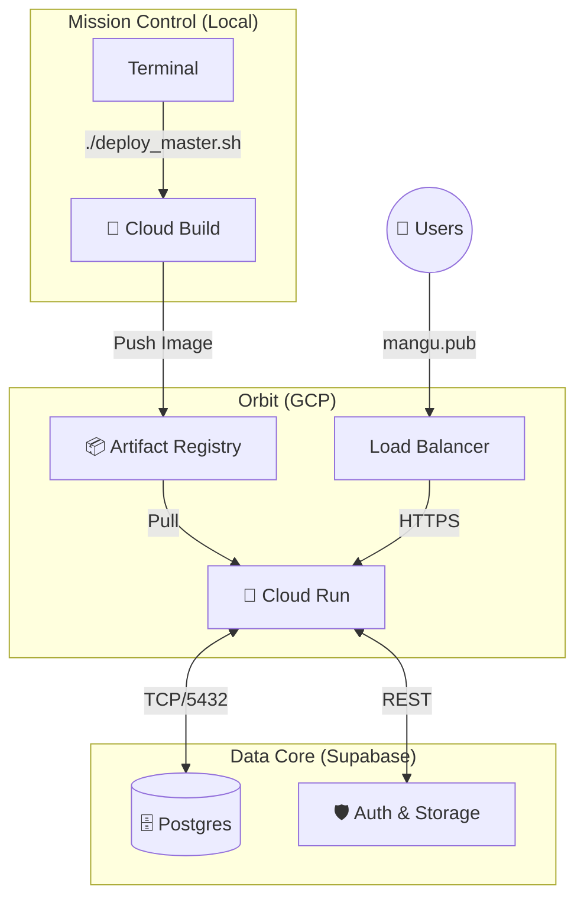

# 🚀 MANGU: The Final Countdown

> *"Failure is not an option. We are go for launch."*

> This is the **Master Flight Manual** for the deployment of the MANGU production environment. It covers infrastructure provisioning, automated deployment, observability, and emergency protocols.

### 📡 Mission Status

**Target:** `production`

**Region:** `us-central1`

**Version:** v1.0.0-RC1

**Readiness:** **GO**

### 👨‍🚀 Crew Check

- [x] **Flight Director:** Birdman
- [ ] **DevOps:** Auto-Pilot
- [ ] **Comms:** Pending

---

<aside>
⚠️

**DEFCON 1: READ BEFORE EXECUTING**

Production deployment involves live payment gateways and real user data. Once you execute the launch script, the system is live. Ensure you have reviewed the **Emergency Abort Protocols** at the bottom of this document.

</aside>

## 🗺️ Telemetry: System Architecture



---

## 🛠️ Phase 1: Pre-Flight Checks

### 1. Secrets & Encryption

You must provision the `.env.production` file. These keys are the ignition codes.

| **Code** | **Clearance** | **Source** |
| --- | --- | --- |
| `SUPABASE_SERVICE_ROLE_KEY` | **TOP SECRET** | Supabase > Settings > API |
| `STRIPE_SECRET_KEY` | **TOP SECRET** | Stripe > Developers > Keys |
| `STRIPE_WEBHOOK_SECRET` | **TOP SECRET** | Stripe > Webhooks |
| `OPENAI_API_KEY` | **CONFIDENTIAL** | OpenAI Platform |
| `NEXT_PUBLIC_...` | **PUBLIC** | Supabase / Domain |

**Action:** Create `.env.production` locally. **DO NOT COMMIT THIS FILE.**

### 2. Database Integrity

Before deploying code, the database schema must be aligned.

- [ ] **Snapshot:** Create a manual backup of the current state (if migrating).
- [ ] **Migration:** Run `supabase db push` against the production ref.
- [ ] **Seed:** Ensure static data (e.g., categories, default plans) is present.

### 3. Storage Buckets

Ensure the following buckets exist in Supabase Storage:

- `public-covers` (Public: `true`)
- `protected-content` (Public: `false`)
- `protected-attachments` (Public: `false`)

---

## 🚀 Phase 2: Ignition (The Master Launch Script)

This **"All-in-One" Master Script** automates 90% of the mission.

**What it DOES do:**

- ✅ Checks all prerequisites (gcloud, supabase, git)
- ✅ Validates your secrets file
- ✅ Enables all necessary Google Cloud APIs
- ✅ Pushes database migrations to Supabase (Interactive)
- ✅ Builds and pushes the Docker container
- ✅ Deploys to Cloud Run with all env vars
- ✅ Performs a post-launch "pulse check" (HTTP 200 verification)

**What it CANNOT do (Human intervention required):**

- ❌ **DNS Registrar:** You must still log into GoDaddy/Namecheap to update DNS records.
- ❌ **Initial Auth:** You must run `gcloud auth login` and `supabase login` once before running this.

### **The Script (`deploy_master.sh`)**

The script is located at the project root as `deploy_master.sh`. Run:

```bash
chmod +x deploy_master.sh
./deploy_master.sh
```

---

## 📡 Phase 3: Orbit Establishment (Domains & DNS)

Once the service is active, we must establish a secure link.

1. **Map Domain:** Cloud Run Console > Integrations > Custom Domains.
2. **DNS Propagation:**
   - Type: `CNAME`
   - Name: `www`
   - Value: `ghs.googlehosted.com`
3. **SSL Provisioning:** Automatic (Wait 15m)

---

## 🔬 Phase 4: Post-Launch Forensics

Execute immediately upon orbit insertion.

### 🩺 Vital Signs

- [ ] **Sanity Check:** Page loads without 500 errors.
- [ ] **Auth:** Sign up a fresh user (smoke test).
- [ ] **Payment:** Run a `$0.50` transaction via Stripe.
- [ ] **Upload:** Upload a test asset to Storage.

### 🔍 Observability

- [ ] **Logs:** Check Cloud Logging for startup crashes.
- [ ] **Errors:** Verify Sentry is receiving events.
- [ ] **Performance:** Check "Cold Start" latency in Cloud Run metrics.

---

## 🚨 Emergency Protocols

### **Scenario A: Bad Deployment (Broken Code)**

If the new version crashes immediately:

1. Go to **Cloud Run Console** > **Revisions**.
2. Identify the previous Green revision (e.g., `publishing-house-web-00004-xez`).
3. Click **"Manage Traffic"**.
4. Route **100%** of traffic to the previous revision.
5. *Time to mitigate: < 30 seconds.*

### **Scenario B: Data Corruption**

If a migration corrupted data:

1. Go to **Supabase Dashboard** > **Database** > **Backups**.
2. Select the **PITR (Point-in-Time Recovery)** snapshot from 1 hour ago.
3. Restore to a new project (to verify) or overwrite (if desperate).

---

## 📣 Communication Plan

Once verified stable:

- [ ] **Internal:** Slack message to team ("We are live.")
- [ ] **Public:** Publish Release Notes.
- [ ] **Social:** Tweet / LinkedIn post with launch graphics.

> *"This is one small step for code, one giant leap for MANGU."*
