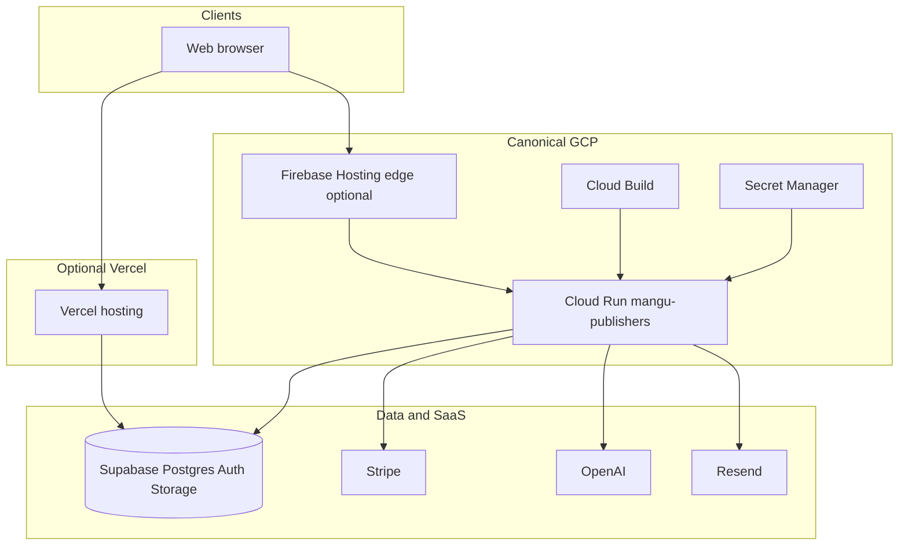

# MANGU Publishers — End-to-End Project Document

**Document ID:** MANGU-E2E-001  
**Version:** 1.0  
**Last updated:** 2026-05-19  
**Repository:** [redinc23/my_publishing](https://github.com/redinc23/my_publishing) (private)  
**Application name:** `mangu-publishers`  
**Cloud Run service:** `mangu-publishers`  

This is the **single comprehensive planning reference** for the project. It merges the Project Status Plan, Master RICEF, Full Hardening audit, Operator Walkthrough, Phase 2 package, and BRD into one narrative any role can follow.

**Companion docs (deeper slices):**

| Doc | Purpose |
|-----|---------|
| [.cursor/plans/mangu_publishers_master_ricef.md](../.cursor/plans/mangu_publishers_master_ricef.md) | RICEF program structure |
| [.cursor/plans/operator_walkthrough_supplement.md](../.cursor/plans/operator_walkthrough_supplement.md) | Click-by-click operator steps |
| [.cursor/plans/full_project_hardening_plan_7b818069.plan.md](../.cursor/plans/full_project_hardening_plan_7b818069.plan.md) | File-level technical audit snapshot |
| [docs/CANONICAL_PRODUCTION.md](./CANONICAL_PRODUCTION.md) | Production target decision |
| [docs/BRD.md](./BRD.md) | Business requirements source |

---

## Table of contents

1. [Executive summary](#1-executive-summary)  
2. [Business context](#2-business-context)  
3. [Product scope](#3-product-scope)  
4. [System architecture](#4-system-architecture)  
5. [Repository and codebase map](#5-repository-and-codebase-map)  
6. [Environments and configuration](#6-environments-and-configuration)  
7. [Deployment and CI/CD](#7-deployment-and-cicd)  
8. [Database and migrations](#8-database-and-migrations)  
9. [Integrations](#9-integrations)  
10. [Security and compliance](#10-security-and-compliance)  
11. [Testing and quality](#11-testing-and-quality)  
12. [Phase 2 program (LitStream / GCP cutover)](#12-phase-2-program-litstream--gcp-cutover)  
13. [Current status and blockers](#13-current-status-and-blockers)  
14. [RICEF summary (Requirements → Forms)](#14-ricef-summary-requirements--forms)  
15. [Execution roadmap](#15-execution-roadmap)  
16. [GitHub backlog (issues and PRs)](#16-github-backlog-issues-and-prs)  
17. [Operator quick start](#17-operator-quick-start)  
18. [Glossary](#18-glossary)  

---

## 1. Executive summary

**MANGU Publishers** is a digital publishing platform (“Netflix for books”): readers discover and buy books, read in-browser, authors submit manuscripts, partners manage catalogs/orders, and admins operate the marketplace.

**Stack:** Next.js 14 (App Router, standalone output), React 18, TypeScript, Tailwind, Supabase (auth + Postgres + storage), Stripe, optional OpenAI (Resonance recommendations) and Resend (email).

**Program status (May 2026):**

| Area | Status |
|------|--------|
| Application code (Phase 1 MVP) | Largely complete |
| Local build (type-check, lint, 12 unit tests, build) | Passes when env is valid |
| GitHub CI | Configured; requires repo secrets for prerender |
| Canonical production | **Cloud Run** via `cloudbuild.yaml` ([CANONICAL_PRODUCTION.md](./CANONICAL_PRODUCTION.md)) |
| GCP production | Project `delta-wonder-488420-i3`; secrets + Cloud Run deploy still operator-dependent |
| Phase 2 handoff (M0–M7b) | **NO-GO** — milestones and RACI not signed |
| Open engineering issues | #65–#72 (except #70 closed) |

**What blocks launch today:** Real credentials in `.env.local` / GCP Secret Manager, Supabase migrations applied to production DB, Stripe webhook on production URL, and manual QA of auth/payments/admin.

---

## 2. Business context

### 2.1 Vision

Modernize reading and democratize publishing by connecting readers, indie authors, and institutional partners in one web application—without proprietary hardware.

### 2.2 Differentiators

- **Resonance Engine:** AI embeddings for semantic book recommendations (Phase 2+; needs `OPENAI_API_KEY`).
- **Portals:** Separate experiences for readers, authors, partners, and admins.
- **Direct-to-consumer:** Stripe checkout; no walled-garden device.

### 2.3 Personas

| Persona | Role | Primary goals |
|---------|------|----------------|
| The Enthusiast | Reader | Discover, read across devices, track habits |
| The Indie Author | Author | Publish, earn transparently, reach audience |
| The Librarian | Partner | Institutional content, ARC requests |
| The Curator | Admin | Quality, disputes, revenue oversight |

### 2.4 Success metrics (launch-grade)

- Custom domain loads over HTTPS; deep links work.
- `GET /api/health?ready=1` returns HTTP 200 with DB/auth checks passing.
- No server secrets in client bundle or public logs.
- Stripe checkout and webhooks process test/live payments correctly.
- RBAC blocks unauthorized `/admin`, `/author`, `/partner` access.

---

## 3. Product scope

### 3.1 Phase 1 — MVP (implemented in codebase)

| Feature | Routes / modules | Services |
|---------|------------------|----------|
| Auth (email/password, reset) | `app/(auth)/*` | Supabase Auth |
| Marketplace (browse, search, detail) | `app/(consumer)/books`, `genres`, `discover` | Supabase DB |
| Reading + progress | `app/(consumer)/library`, reading flows | Supabase + storage |
| Checkout | `app/checkout`, `app/api/checkout` | Stripe |
| Author portal | `app/(portals)/author/*` | Supabase |
| Partner portal | `app/(portals)/partner/*` | Supabase |
| Admin | `app/admin/*` | Supabase + health APIs |
| Webhooks | `app/api/webhook` | Stripe |

### 3.2 Phase 2 — Growth (partial / planned)

| Feature | Status |
|---------|--------|
| Social (reviews, follows) | Migration exists; UI partial |
| AI recommendations | API routes exist; needs OpenAI in prod |
| Email notifications | Code exists; needs Resend |
| Audiobooks | Not built |
| Custom domain + Firebase edge + full ops | Phase 2 doc package M0–M7b |

See [FEATURE_PHASES.md](./FEATURE_PHASES.md) and [BRD.md](./BRD.md) for full FR lists.

---

## 4. System architecture



### 4.1 Request path (Cloud Run)

1. User hits HTTPS (custom domain or Cloud Run URL).
2. Next.js standalone Node server handles SSR/API.
3. `middleware.ts` enforces Supabase session + role routes.
4. Server components / API routes call Supabase (anon or service role) or Stripe.

### 4.2 API surface

| Endpoint | Purpose |
|----------|---------|
| `GET /api/health?ready=1` | Env, DB, auth, Stripe, migration checks |
| `GET /api/live` | Lightweight Cloud Run liveness probe |
| `POST /api/checkout` | Stripe Checkout session |
| `POST /api/webhook` | Stripe events (requires webhook secret) |
| `POST /api/upload` | File upload |
| `GET/POST /api/session` | Session helpers |
| `/api/analytics/*` | Analytics |
| `/api/resonance/*` | Embeddings / recommendations |
| `app/(auth)/callback` | OAuth callback |

### 4.3 Auth and roles

- **Middleware:** [`middleware.ts`](../middleware.ts) — SSR cookies via `@supabase/ssr`.
- **Roles:** reader (default), author, partner, admin — enforced on portal and admin paths.
- **Profile creation:** Trigger migration `20260121000000_profile_trigger.sql`.

---

## 5. Repository and codebase map

### 5.1 Top-level layout

| Path | Contents |
|------|----------|
| `app/` | Next.js App Router (route groups, pages, API) |
| `components/` | UI (shadcn `ui/`), domain components (~66 files) |
| `lib/` | Actions, services, Supabase/Stripe clients, utils (~47 modules) |
| `supabase/migrations/` | 12 SQL migrations (Jan 2026) |
| `tests/unit/` | Jest (3 suites, 12 tests) |
| `tests/e2e/` | Playwright (`purchase-flow.spec.ts`; full purchase test commented out) |
| `scripts/` | validate-env, migrations, seed, GCP verify/sync, bundle-migrations |
| `docs/` | Deployment, BRD, Phase 2 runbooks, this document |
| `.github/workflows/` | `ci.yml`, `admin-setup.yml`, `bug-to-issue.yml` |
| `cloudbuild.yaml` | Canonical production pipeline |
| `Dockerfile` | Node 20 Alpine, standalone |

### 5.2 Route groups

| Group | Path prefix | Access |
|-------|-------------|--------|
| Consumer | `(consumer)/` | Public + authenticated |
| Auth | `(auth)/` | Public |
| Author portal | `(portals)/author/` | author, admin |
| Partner portal | `(portals)/partner/` | partner, admin |
| Admin | `admin/` | admin |
| Checkout | `checkout/` | authenticated |

### 5.3 Known code TODOs (non-blocking for planning)

| Item | File |
|------|------|
| Growth rate hardcoded `0` | `components/analytics/AnalyticsOverview.tsx` |
| File hash dedup not implemented | `lib/actions/upload.ts` |
| Duplicate ErrorBoundary | `components/common/` vs `components/shared/` |

---

## 6. Environments and configuration

### 6.1 Environment variable matrix

| Variable | Class | Local `.env.local` | GitHub Actions | GCP Secret Manager | Cloud Build `_SUBST` |
|----------|-------|-------------------|----------------|--------------------|----------------------|
| `NEXT_PUBLIC_SUPABASE_URL` | Public | Required | Secret | — | `_NEXT_PUBLIC_SUPABASE_URL` |
| `NEXT_PUBLIC_SUPABASE_ANON_KEY` | Public | Required | Secret | — | `_NEXT_PUBLIC_SUPABASE_ANON_KEY` |
| `SUPABASE_SERVICE_ROLE_KEY` | Secret | Required | Secret | `supabase-service-role-key` | `--set-secrets` |
| `NEXT_PUBLIC_STRIPE_PUBLISHABLE_KEY` | Public | Payments | Secret | — | `_NEXT_PUBLIC_STRIPE_PUBLISHABLE_KEY` |
| `STRIPE_SECRET_KEY` | Secret | Payments | — | `stripe-secret-key` | `--set-secrets` |
| `STRIPE_WEBHOOK_SECRET` | Secret | Webhooks | — | `stripe-webhook-secret` | `--set-secrets` |
| `NEXT_PUBLIC_SITE_URL` | Public | Recommended | Secret | — | `_NEXT_PUBLIC_SITE_URL` |
| `OPENAI_API_KEY` | Secret | Optional | — | `openai-api-key` | `--set-secrets` |
| `RESEND_API_KEY` | Secret | Optional | — | `resend-api-key` | `--set-secrets` |
| `USE_MOCKS` | Flag | Dev/CI | `true` in CI | — | — |

**Validation:** `npm run dev` runs `scripts/validate-env.ts` → requires 3 Supabase vars minimum.

**Doc note:** `.env.local.example` labels Stripe as Phase 1 required; runtime validation treats Stripe as optional until you test payments.

### 6.2 Where to get values

| Service | URL |
|---------|-----|
| Supabase API keys | https://supabase.com/dashboard/project/_/settings/api |
| Stripe keys | https://dashboard.stripe.com/test/apikeys |
| Stripe webhooks | https://dashboard.stripe.com/webhooks |
| GitHub secrets | Repo → Settings → Secrets and variables → Actions |
| GCP Secret Manager | Console → Security → Secret Manager |
| OpenAI | https://platform.openai.com/api-keys |
| Resend | https://resend.com/api-keys |

### 6.3 Phase 2 intake (non-secret)

File: `docs/phase2/_intake/environment.local.sh` (gitignored). Template: `environment.example.sh`. Worksheet: [FIELDS_TO_GATHER.md](./phase2/_intake/FIELDS_TO_GATHER.md).

| Field | Example / note |
|-------|----------------|
| `PROJECT_ID` | `delta-wonder-488420-i3` (seeded locally) |
| `REGION` | `us-central1` |
| `SERVICE_NAME` | `mangu-publishers` |
| `CUSTOM_DOMAIN` | hostname only, no `https://` |
| Sample slugs | book/author/category for P0 probes |

---

## 7. Deployment and CI/CD

### 7.1 Canonical production: Cloud Run

**Decision:** [CANONICAL_PRODUCTION.md](./CANONICAL_PRODUCTION.md) — GitHub issue #70 closed.

**Pipeline:** [cloudbuild.yaml](../cloudbuild.yaml)

1. `npm ci`  
2. lint + type-check  
3. `npm run build`  
4. secret-audit (static bundle scan)  
5. Docker build + push (`:SHORT_SHA`, `:main`)  
6. `gcloud run deploy` with startup/liveness probes on `/api/live`  
7. verify-deploy  

**Runtime secrets (Secret Manager names):**

- `supabase-service-role-key`
- `stripe-secret-key`
- `stripe-webhook-secret`
- `resend-api-key`
- `openai-api-key`

**Operator scripts:**

```bash
gcloud auth login
./scripts/sync-gcp-secrets-from-env.sh   # from .env.local
./scripts/verify-gcp-production.sh       # secrets + health
```

### 7.2 Secondary: GitHub Actions and legacy Vercel

[`.github/workflows/ci.yml`](../.github/workflows/ci.yml):

- **On PR / push to `main`:** type-check, lint, test, build.
- **No production deploy:** production releases are Cloud Build + Cloud Run only.
- **Legacy Vercel workflow:** manual-only via `.github/workflows/vercel-deploy.yml`.

### 7.3 Legacy: AWS Amplify

[`amplify.yml`](../amplify.yml), [AMPLIFY_READY.md](../AMPLIFY_READY.md) — no longer recommended for new releases.

### 7.4 CI/CD comparison

| Path | Node | Tests in pipeline | Production? |
|------|------|-------------------|-------------|
| Cloud Build | 20 | lint, type-check, build | **Yes (canonical)** |
| GitHub Actions | 20 | lint, type-check, test, build | CI only |
| Amplify | unpinned | build only | Legacy |

---

## 8. Database and migrations

### 8.1 Migration files (apply in order)

1. `20260116000000_initial_schema.sql` — profiles, authors, books, genres, core schema  
2. `20260117000000_analytics_events.sql`  
3. `20260117000006_storage_policies.sql`  
4. `20260117000001_analytics_sessions.sql`  
5. `20260117000002_book_stats_materialized.sql`  
6. `20260117000003_revenue_tracking.sql`  
7. `20260117000004_author_payouts.sql`  
8. `20260117000005_book_pricing.sql`  
9. `20260118000000_critical_fixes.sql`  
10. `20260120000006_performance_optimizations.sql`  
11. `20260121000000_profile_trigger.sql`  
12. `20260122000000_social_features.sql`  

**Note:** There is no separate `create_books_table.sql`; books are in `initial_schema.sql`.

### 8.2 How to apply

| Method | When to use |
|--------|-------------|
| **Supabase SQL Editor** | Recommended — run each file or use bundle |
| `./scripts/bundle-migrations.sh` | Print all SQL in order → paste into editor |
| `npm run db:migrate` | Only if `exec_sql` RPC exists (usually not on hosted Supabase) |
| Supabase CLI `db push` | If project linked via CLI |

Full guide: [MIGRATIONS.md](./MIGRATIONS.md).

### 8.3 Seed and verify

```bash
npm run db:seed -- --create-profiles --minimal
npm run verify-rls
```

---

## 9. Integrations

### 9.1 Supabase

- Auth, Postgres, RLS, Storage.
- Clients: `lib/supabase/client.ts`, `server.ts`, `admin.ts`.
- Health check verifies connectivity and migration table when configured.

### 9.2 Stripe

- Checkout: `app/api/checkout`, client in `lib/stripe/`.
- Webhooks: `app/api/webhook` — **requires** `STRIPE_WEBHOOK_SECRET`.
- Local testing: Stripe CLI → [WEBHOOK_TESTING.md](./WEBHOOK_TESTING.md).
- Production: [STRIPE_WEBHOOK_PRODUCTION.md](./STRIPE_WEBHOOK_PRODUCTION.md).

### 9.3 OpenAI (Resonance)

- Routes under `app/api/resonance/`.
- Embeddings in seed script when `OPENAI_API_KEY` set.

### 9.4 Resend (email)

- `lib/email/send.ts` — throws if key missing when module loaded.

---

## 10. Security and compliance

| Control | Implementation |
|---------|----------------|
| Secret hygiene | `.gitignore` for `.env*`, `environment.local.sh`, `*.save` |
| No secrets in `NEXT_PUBLIC_*` | Code review + cloudbuild secret-audit step |
| RLS | Supabase policies in migrations; `npm run verify-rls` |
| RBAC | Middleware route guards |
| Webhook verification | Stripe HMAC |
| Security headers | CSP, HSTS, X-Frame-Options in `next.config.js` |
| Admin health exposure | `/admin/health` shows config presence — restrict admin users |

**Risks (open):** Expand secret scanning ([#68](https://github.com/redinc23/my_publishing/issues/68)); pre-commit hooks ([#72](https://github.com/redinc23/my_publishing/issues/72)).

---

## 11. Testing and quality

| Layer | Tool | CI? | Count |
|-------|------|-----|-------|
| Unit | Jest | Yes (`npm test`) | 12 tests, 3 suites |
| E2E | Playwright | No | 1 spec; purchase flow commented out |
| Type-check | `tsc` | Yes | strict |
| Lint | ESLint | Yes | 0 warnings target |

**Manual QA checklist:** [OPERATOR_QA_LOG.md](./OPERATOR_QA_LOG.md) and [IMPLEMENTATION_STATUS.md](./IMPLEMENTATION_STATUS.md).

**Sanity before push:**

```bash
npm run type-check && npm run lint && npm test && npm run build
```

---

## 12. Phase 2 program (LitStream / GCP cutover)

**Purpose:** Move from dev-only to production custom domain, hardened container, Cloud Build E2E, monitoring, and formal handoff.

**Package:** [docs/phase2/README.md](./phase2/README.md)

### 12.1 Milestones

| ID | Goal |
|----|------|
| M0 | Pre-flight setup |
| M1 | Local security hardening |
| M2 | Build pipeline scripts |
| M3 | Runtime container |
| M4 | GCP foundation |
| M5 | Cloud Build end-to-end |
| M6 | Firebase hosting + domain |
| M7a | Pre-cutover guardrails |
| M7b | Post-cutover stabilization |

### 12.2 Handoff gates (automatic NO-GO if)

- Any milestone in [11-handoff-master-checklist.md](./phase2/11-handoff-master-checklist.md) still TODO without evidence URL.
- Any P0 test P0-1–P0-9 PENDING in [06-acceptance-and-test-protocol.md](./phase2/06-acceptance-and-test-protocol.md).
- RACI in [12-ownership-raci.md](./phase2/12-ownership-raci.md) still has `_(worksheet: …)_` placeholders.

### 12.3 P0 acceptance tests (summary)

Secret leakage, build-before-docker, deep links, security headers, health checks, Cloud Run config, CI security gates, content rebuild automation, observability + cost controls.

---

## 13. Current status and blockers

*Snapshot for planning; verify live state in GitHub/GCP dashboards.*

### 13.1 Done (engineering / program)

| Item | Notes |
|------|-------|
| PR #73 merged | Node 20 CI, cloudbuild hardening, intake walkthrough |
| GitHub Actions secrets | 5 secrets configured (Supabase, Stripe pub, site URL) |
| Canonical prod decision | Cloud Run; #70 closed |
| Stale PR triage | 15 agent PRs closed |
| Migration docs | Fixed order; `bundle-migrations.sh` added |
| GCP helper scripts | `verify-gcp-production.sh`, `sync-gcp-secrets-from-env.sh` |

### 13.2 Still on you (cannot be completed by docs alone)

| Blocker | Action |
|---------|--------|
| Real `.env.local` | Replace placeholder Supabase URL/keys from dashboard |
| GCP auth | `gcloud auth login` → sync secrets → deploy Cloud Run |
| Supabase migrations | SQL Editor or bundle script against real project |
| Stripe prod webhook | Dashboard endpoint → Secret Manager |
| Phase 2 RACI names | Fill `12-ownership-raci.md` |
| Browser QA | Register, admin, checkout per OPERATOR_QA_LOG |

### 13.3 Engineering backlog (GitHub issues)

| Issue | Priority | Topic |
|-------|----------|-------|
| [#65](https://github.com/redinc23/my_publishing/issues/65) | P1 | Rollback tags + runbook |
| [#66](https://github.com/redinc23/my_publishing/issues/66) | P1 | Health probes (partially in cloudbuild) |
| [#67](https://github.com/redinc23/my_publishing/issues/67) | P1 | Migration automation |
| [#68](https://github.com/redinc23/my_publishing/issues/68) | P2 | Secret scanning |
| [#69](https://github.com/redinc23/my_publishing/issues/69) | P2 | Duplicate build in Cloud Build |
| [#71](https://github.com/redinc23/my_publishing/issues/71) | P3 | Repo rename |
| [#72](https://github.com/redinc23/my_publishing/issues/72) | P3 | Pre-commit hooks |

---

## 14. RICEF summary (Requirements → Forms)

### R — Requirements

- **Business:** BRD Phase 1 MVP + Phase 2 growth ([BRD.md](./BRD.md)).
- **Technical:** Node 20, standalone build, health endpoint, RBAC, webhook verification, 12 migrations ([Master RICEF](../.cursor/plans/mangu_publishers_master_ricef.md)).
- **Decisions:** Cloud Run canonical (#70 closed); repo rename #71 open; Phase 2 cutover when RACI filled.

### I — Inputs

- Env matrix (§6.1), GCP intake (§6.3), third-party accounts (Supabase, Stripe, GCP).

### C — Controls

- CI gates: type-check, lint, test, build.
- Security: gitignore, RLS, middleware, secret scan in Cloud Build.
- Phase 2 NO-GO rules (§12.2).

### E — Execution

| Wave | Focus |
|------|--------|
| 0 | `.env.local` + GitHub secrets |
| 1 | Merge hardening / green `main` CI |
| 2 | GCP secrets, Cloud Run, migrations, Stripe webhook |
| 3 | Phase 2 M0–M7b + signoffs |

### F — Forms (deliverables)

| Deliverable | Evidence |
|-------------|----------|
| Healthy CI | Green GitHub Actions on `main` |
| Health API | `/api/health?ready=1` JSON on prod |
| Migration state | Supabase tables + `schema_migrations` if used |
| Phase 2 signoff | [14-evidence-and-signoff-log.md](./phase2/14-evidence-and-signoff-log.md) |
| Manual QA | [OPERATOR_QA_LOG.md](./OPERATOR_QA_LOG.md) |

---

## 15. Execution roadmap

### Week 1 — Unblock and align

1. Fix `.env.local` with real Supabase (and Stripe if testing payments).  
2. Confirm GitHub secrets match (re-sync if you rotate keys).  
3. `gcloud auth login` → `./scripts/sync-gcp-secrets-from-env.sh` → `./scripts/verify-gcp-production.sh`.  
4. Apply migrations ([MIGRATIONS.md](./MIGRATIONS.md)).  
5. Configure Stripe webhook ([STRIPE_WEBHOOK_PRODUCTION.md](./STRIPE_WEBHOOK_PRODUCTION.md)).  

### Week 2 — Product confidence

6. Manual QA (auth, admin, checkout).  
7. Seed data if needed.  
8. Trigger Cloud Build on `main`; confirm Cloud Run revision.  

### Month 1 — Hardening and Phase 2

9. Close or schedule #65–#69, #72.  
10. Fill Phase 2 intake + RACI if pursuing cutover.  
11. Execute M0–M5 per [05-milestone-implementation-plan.md](./phase2/05-milestone-implementation-plan.md).  

---

## 16. GitHub backlog (issues and PRs)

### Open issues

See §13.3 (#65–#72; #70 closed).

### Pull requests

- **#73:** Merged (`chore/full-project-hardening`).
- **Stale agent PRs:** Closed per triage (#48, #45, #39, #31, #30, #29, #28, #26, #23, #12, #10, #9, #8, #5, #1).
- **Remote branches:** Many `origin/copilot/*` and `origin/cursor/*` may remain — prune when convenient.

---

## 17. Operator quick start

**Detailed clicks:** [.cursor/plans/operator_walkthrough_supplement.md](../.cursor/plans/operator_walkthrough_supplement.md)

```bash
# 1) Local
cp .env.local.example .env.local
# Edit Supabase + optional Stripe

# 2) Verify
npm run type-check && npm run lint && npm test && npm run build
npm run dev
# Open http://localhost:3000/api/health

# 3) Migrations
./scripts/bundle-migrations.sh > /tmp/mangu-migrations.sql
# Paste into Supabase SQL Editor

# 4) GCP (after auth)
gcloud auth login
./scripts/sync-gcp-secrets-from-env.sh
./scripts/verify-gcp-production.sh
```

---

## 18. Glossary

| Term | Meaning |
|------|---------|
| **RICEF** | Requirements, Inputs, Controls, Execution, Forms — program doc structure |
| **Resonance Engine** | OpenAI embedding-based recommendations |
| **RLS** | Row Level Security (Supabase Postgres) |
| **Standalone output** | Next.js build mode for Docker/Cloud Run |
| **Phase 2** | GCP/LitStream production hardening and cutover program |
| **P0 test** | Launch-blocking acceptance test in Phase 2 protocol |
| **NO-GO** | Handoff blocked until checklist/RACI complete |

---

## Document history

| Version | Date | Change |
|---------|------|--------|
| 1.0 | 2026-05-19 | Initial end-to-end merge of all planning artifacts |

**Maintainer:** Update this file when production URL, issue status, or Phase 2 milestones change.
