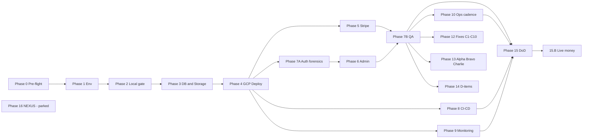

# **MANGU PUBLISHERS — MASTER EXECUTION CHECKLIST v2.0**

### **Unified Go-Live · Revamp · Fixes · Feature Build-Out · Operations**

**Target:** `redinc23/my_publishing` · Next.js 14 App Router · Supabase · Stripe · GCP Cloud Run · Upstash Redis · Resend (opt) · OpenAI (opt)
**Prod:** https://mangu-publishers.com · GCP project `delta-wonder-488420-i3` · region `us-central1` · service `mangu-publishers` · Supabase ref `tkzvikozrcynhwsqtkqp`
**Separate track:** NEXUS (`redinc23/centuries`) — Phase 16, parked, does NOT block Mangu.

> **v2.0 changes:** Every Mission from v1.0 is preserved verbatim in intent and claim; this revision adds granular sub-substeps, per-item verification recipes, evidence-capture formats, decision trees, a master mission index, a phase dependency map, recurring-cadence templates, PR checklists for the 3-agent split, and a progress tracker (Appendix 4). ID scheme extends downward: `4.4` → `4.4.9` → `4.4.9.a`.

---

## **§0. HOW AN AI AGENT USES THIS DOCUMENT (READ FIRST)**

**Operating mode.** This is a sequential mission plan for an autonomous or semi-autonomous agent. Every item follows the same atomic contract:

**☐ ID — Title** → `Pre-conditions` → `Action/Execution` → `Verification (TEST)` → `IF-fail THEN fallback` → `Escalation trigger`

### **§0.1 — Global execution rules (never override)**

1. **GATE RULE:** Do NOT proceed to the next Mission until the current Mission's Verification passes, is explicitly waived by the operator with a documented reason, or is marked `[DEFERRED]` with a tracking note in `docs/OPERATOR_QA_LOG.md`.
2. **RETRY RULE:** On Verification failure → execute the Fallback once → re-verify. Max **2 fallback loops** per Mission. After 2 failures → HALT that branch and **ALERT OPERATOR** with: Mission ID, exact command output, fallback attempted, and your hypothesis.
3. **KNOWN-ISSUE RULE:** Before treating any failure as novel, query the **Phase 11 Known-Issues Lookup Table**. If the symptom matches, apply the listed resolution instead of diagnosing from scratch.
4. **SECRETS RULE:** Never write secrets to git. Never log full secret values. Secrets live only in `.env.local` (git-ignored) and GCP Secret Manager. If `.gitignore` doesn't exclude `.env.local` → ABORT immediately and fix (leak risk).
5. **DESTRUCTIVE-ACTION RULE:** Any irreversible action (dropping tables, deleting Stripe endpoints, rotating live keys, deleting Cloud Run services, force-pushes) → **ALERT OPERATOR and wait for explicit approval** before executing.
6. **TESTING RULE:** Every feature (new or existing-critical) has a paired TEST block. A feature is not "done" until its TEST block passes. New features additionally require: unit test (if pattern exists) + E2E stub/extension + manual smoke + docs update.
7. **DOCS RULE:** After completing any Mission that changes behavior, update the relevant doc (`FEATURE_PHASES.md`, `IMPLEMENTATION_STATUS.md`, `MIGRATIONS.md`, `OPERATOR_QA_LOG.md`) in the same PR/session.
8. **GCP IDENTITY RULE:** Auth gcloud ONLY as `renee@mangu-publishers.com` (has Secret Manager access). NEVER auth as `books@mangu-publishers.com`.
9. **MACHINE CONTEXT:** Windows + PowerShell. Repo at `C:\Users\max\my_publishing`. Bash scripts run via `& "C:\Program Files\Git\bin\bash.exe" scripts/<name>.sh`. Node v24.14.0, Python 3.12.10, gcloud SDK 556 (gcloud logs write to `C:\Users\chris` — dual-profile machine, harmless). Do not click inside PowerShell windows during long commands (select-mode freeze).
10. **STATUS REPORTING:** After every Mission, emit: `[PASS|FAIL|DEFERRED|BLOCKED] <Mission-ID> — <one-line evidence>`.

### **§0.2 — Session-start ritual (run at the top of EVERY working session)**

- ☐ 0.2.a Read the last 30 lines of `docs/OPERATOR_QA_LOG.md` — identify last completed Mission and any open `[BLOCKED]`/`[DEFERRED]` items.
- ☐ 0.2.b `git status` + `git log --oneline -5` — confirm clean tree (or understand why dirty) and confirm which branch you're on. **IF unexpected branch THEN** stop and confirm with operator before touching files.
- ☐ 0.2.c Confirm the Mission-State Ledger (§0.5) reflects reality — reconcile against QA log if drift found.
- ☐ 0.2.d Re-check §0 state variables are still loaded (esp. after key rotation or endpoint recreation).
- ☐ 0.2.e Check the Phase 11 table for any NEW entries added since last session (other agents append incidents).
- ☐ 0.2.f State to the operator: "Resuming at Mission `<ID>`; last PASS was `<ID>`; blockers: `<list|none>`."

### **§0.3 — Evidence formats (what counts as PASS proof, by verification type)**

| Verification type | Required evidence to log                                                              |
| ----------------- | ------------------------------------------------------------------------------------- |
| Command/exit code | Exact command + exit code + last 5 lines of output                                    |
| HTTP probe        | `curl` command + status code + relevant body field (e.g., timestamp from `/api/live`) |
| SQL check         | Query text + row count / value returned (NEVER paste secret column values)            |
| Dashboard check   | Dashboard path (breadcrumb), the setting/value observed, and timestamp of observation |
| E2E/unit suite    | Suite name + pass/fail counts + duration                                              |
| Browser smoke     | URL + action performed + observed result + console-errors yes/no                      |
| Deploy            | Build ID + Cloud Run revision name + traffic %                                        |

Every PASS line in `docs/OPERATOR_QA_LOG.md` must carry at least one evidence cell in the above format.

### **§0.4 — Escalation levels**

- **L1 (self-heal):** Fallback in this doc → retry.
- **L2 (lookup):** Phase 11 table → apply resolution.
- **L3 (alert operator, continue elsewhere):** Non-blocking failure → log, alert, proceed to independent branch.
- **L4 (alert operator, HALT):** Launch-blocking failure, destructive-action approval, unknown identifier, or 2-loop retry exhaustion.

**Escalation message template (use verbatim):**

```
[ESCALATION Lx] Mission <ID> — <title>
Symptom: <one line>
Command/output: <exact>
Fallbacks attempted: <n>/<2> — <what>
Phase-11 match: <row | none>
Hypothesis: <one line>
Requested action: <approve X | provide Y | decide Z>
```

### **§0.5 — Mission-State Ledger (maintain in `docs/OPERATOR_QA_LOG.md` or session notes)**

| Mission ID | Status | Evidence (per §0.3) | Date | Fallback loops used | Notes |
| ---------- | ------ | ------------------- | ---- | ------------------- | ----- |
| 0.1        |        |                     |      | 0/2                 |       |
| …          |        |                     |      |                     |       |

Rules: one row per Mission; status ∈ `PASS/FAIL/DEFERRED/BLOCKED/WAIVED`; WAIVED requires operator name + reason; a FAIL row must reference its escalation message.

### **§0.6 — State variables to collect before starting (HALT at L4 if any unknown — do not guess)**

```
GITHUB_REPO=redinc23/my_publishing
PROD_BRANCH=main
GCP_PROJECT_ID=delta-wonder-488420-i3
GCP_REGION=us-central1
CLOUD_RUN_SERVICE=mangu-publishers
CLOUD_RUN_URL=https://________________.run.app
CUSTOM_DOMAIN=https://mangu-publishers.com
SUPABASE_PROJECT_REF=tkzvikozrcynhwsqtkqp
NEXT_PUBLIC_SUPABASE_URL=https://tkzvikozrcynhwsqtkqp.supabase.co
NEXT_PUBLIC_SUPABASE_ANON_KEY=________________
SUPABASE_SERVICE_ROLE_KEY=________________          # server-only, never client-exposed
NEXT_PUBLIC_STRIPE_PUBLISHABLE_KEY=pk_____________
STRIPE_SECRET_KEY=sk_____________
STRIPE_WEBHOOK_SECRET=whsec_____________            # populated in Phase 5
STRIPE_WEBHOOK_URL=https://mangu-publishers.com/api/webhook
NEXT_PUBLIC_SITE_URL=https://mangu-publishers.com   # no trailing slash
UPSTASH_REDIS_REST_URL=________________
UPSTASH_REDIS_REST_TOKEN=________________
OPENAI_API_KEY=________________                     # Phase 10 optional
RESEND_API_KEY=________________                     # Phase 10 optional
SENTRY_DSN=________________                         # Phase 10 optional
ADMIN_USER_EMAIL=________________
UPTIME_MONITOR_URLS=/, /api/health
```

**Per-variable shape sanity checks (run mentally or with grep before accepting a value):**

| Variable                             | Shape check                                               | Red flag                                            |
| ------------------------------------ | --------------------------------------------------------- | --------------------------------------------------- |
| `NEXT_PUBLIC_SUPABASE_URL`           | `https://<ref>.supabase.co`, ref = `tkzvikozrcynhwsqtkqp` | Different ref = wrong project                       |
| `NEXT_PUBLIC_SUPABASE_ANON_KEY`      | JWT (`eyJ…`), role claim `anon`                           | `service_role` claim = catastrophic client exposure |
| `SUPABASE_SERVICE_ROLE_KEY`          | JWT (`eyJ…`), role claim `service_role`                   | `anon` claim = wrong key pasted                     |
| `NEXT_PUBLIC_STRIPE_PUBLISHABLE_KEY` | starts `pk_test_` or `pk_live_`                           | `sk_` prefix = secret key in public slot (L4 ABORT) |
| `STRIPE_SECRET_KEY`                  | starts `sk_test_` or `sk_live_`                           | test/live mode must match publishable key mode      |
| `STRIPE_WEBHOOK_SECRET`              | starts `whsec_`                                           | Must belong to the ACTIVE endpoint (Phase 5.2)      |
| `NEXT_PUBLIC_SITE_URL`               | `https://mangu-publishers.com` exactly                    | Trailing slash, `http:`, `www.`, or localhost       |
| `UPSTASH_REDIS_REST_URL`             | `https://*.upstash.io`                                    | REST URL, not the redis:// connection string        |
| `UPSTASH_REDIS_REST_TOKEN`           | long opaque token                                         | Read-only token won't work for rate limiting        |

---

## **MASTER MISSION INDEX (v2.0)**

Launch-critical path: **Phase 0 → 1 → 2 → 3 → 4 → 5 → 6 → 7A → 7B → 15 (DoD)**. Loops 8–10 harden operations. 12/13/14 are improvement tracks. 16 is parked.

| Phase                   | Missions            | Blocking class                                | Depends on                 |
| ----------------------- | ------------------- | --------------------------------------------- | -------------------------- |
| 0 Pre-flight            | 0.1–0.3             | Launch-blocking                               | —                          |
| 1 Env provisioning      | 1.1–1.3             | Launch-blocking                               | 0                          |
| 2 Local validation gate | 2.1                 | Launch-blocking                               | 1                          |
| 3 DB & storage          | 3.1–3.5             | Launch-blocking                               | 1 (env), 2 recommended     |
| 4 GCP deploy            | 4.1–4.5             | Launch-blocking                               | 2, 3                       |
| 5 Stripe webhook        | 5.1–5.2             | Launch-blocking                               | 4                          |
| 6 Admin bootstrap       | 6.1–6.2             | Launch-blocking                               | 4, 3; 6.1 also gated by 7A |
| 7A Auth forensics       | A1–A8               | Launch-blocking (highest-probability blocker) | 4                          |
| 7B Go-live QA           | B1–B5               | Launch-blocking                               | 5, 6, 7A                   |
| 8 CI/CD unification     | 8.1–8.4             | Post-launch hardening (pre-DoD)               | 4                          |
| 9 Monitoring            | 9.1–9.3             | Pre-DoD                                       | 4                          |
| 10 Ops cadence          | 10.1–10.5           | Pre-DoD (10.4 backups)                        | 4–7                        |
| 11 Known-issues table   | lookup              | Always-on reference                           | —                          |
| 12 Near-term fixes      | C1–C10              | Post-launch (C8 highest priority)             | 7B                         |
| 13 Revamp program       | ALPHA/BRAVO/CHARLIE | Feature track                                 | 7B recommended             |
| 14 Add-ons & build-out  | D1–D3               | Feature track                                 | 7B; D1.2 EARLY             |
| 15 Definition of Done   | booleans + 15.B     | Final gate                                    | all launch-blocking        |
| 16 NEXUS                | N0–N12              | Parked, independent                           | —                          |



---

## **PHASE 0 — PRE-FLIGHT / DECISION LOCK**

### **☐ 0.1 — Confirm canonical production target**

- **Pre-conditions:** Repo cloned at `main`.
- **Action:** Confirm deployment target is **GCP Cloud Run** (`docs/CANONICAL_PRODUCTION.md`), not Vercel (`vercel.json`) or AWS Amplify (`amplify.yml`) — those are legacy/secondary.
- **Sub-substeps:**
  - ☐ 0.1.a `cat docs/CANONICAL_PRODUCTION.md | head -50` — confirm doc opens and names Cloud Run.
  - ☐ 0.1.b Note (do NOT delete) legacy configs present at root: `amplify.yml`, `AMPLIFY_READY.md`, any `vercel.json` — they are secondary; their presence is expected and harmless.
  - ☐ 0.1.c Record in ledger: "Canonical target = Cloud Run, confirmed via CANONICAL_PRODUCTION.md."
- **TEST:** Document explicitly names Cloud Run as authoritative.
- **IF ambiguous THEN** default to Cloud Run per this spec. **IF operator requests Vercel/Amplify as primary THEN** require explicit written override before proceeding.

### **☐ 0.2 — Collect and lock identifiers**

- **Action:** Populate the state-variable block in §0.6 from operator input or existing config.
- **Per-variable collection sub-checklist:**
  - ☐ 0.2.a Supabase trio (`NEXT_PUBLIC_SUPABASE_URL`, `NEXT_PUBLIC_SUPABASE_ANON_KEY`, `SUPABASE_SERVICE_ROLE_KEY`) — Supabase Dashboard → Project Settings → API. Run the §0.6 shape checks (anon vs service_role JWT claim) before accepting.
  - ☐ 0.2.b Stripe pair (`NEXT_PUBLIC_STRIPE_PUBLISHABLE_KEY`, `STRIPE_SECRET_KEY`) — Stripe Dashboard → Developers → API Keys. Verify BOTH are same mode (test/test or live/live).
  - ☐ 0.2.c Upstash pair — Upstash Console → your database → REST API tab (NOT the redis:// string).
  - ☐ 0.2.d `CLOUD_RUN_URL` — `gcloud run services describe mangu-publishers --region us-central1 --format='value(status.url)'` (after 4.1 auth; leave blank until then).
  - ☐ 0.2.e `ADMIN_USER_EMAIL` — operator-provided; needed no later than Phase 6.
  - ☐ 0.2.f Optional Phase-2 keys (OpenAI/Resend/Sentry) — may stay blank; mark each as `DEFERRED-D1.x` in the ledger.
- **TEST:** All non-Phase-2 fields non-empty; `GCP_PROJECT_ID` matches `gcloud config get-value project` after auth; every collected value passed its shape check.
- **IF any identifier unknown THEN** L4 HALT — request from operator. Never guess project IDs or domains.
- **IF a shape check fails THEN** the value is from the wrong dashboard slot — re-collect; do NOT "fix" a key by editing characters.

### **☐ 0.3 — Check resumption state (handoff-brief context)**

This section captures where the last session left off — verify each before repeating work. **Decision tree per item: re-run its TEST → IF PASS → tick and move on; IF FAIL → jump to the owning Phase; IF UNTESTABLE (missing env/etc.) → mark BLOCKED with reason.**

- ☐ 0.3.a `.env.local` filled & validated (`npm run validate-env` previously PASS). **TEST:** re-run validate-env → still PASS. IF fail → Phase 1.
- ☐ 0.3.b Readiness suite v2 (`fix-and-verify.ps1`, supports `-Quick` / `-FreshInstall`, logs to `logs/`): TOOLCHAIN/ENV/DEPS/TYPE-CHECK/READINESS previously all PASS (type-check fixed via `@types/jest`). **TEST:** re-run `-Quick` → PASS.
- ☐ 0.3.c DB: 36 tables, 15 migrations previously applied. **TEST:** count tables in Supabase. IF mismatch → Phase 3.
  - Count recipe (SQL Editor): `SELECT count(*) FROM information_schema.tables WHERE table_schema='public' AND table_type='BASE TABLE';`
- ☐ 0.3.d ⚠️ **DO NOT RE-DIAGNOSE:** `verify-rls` script has FALSE POSITIVES — it flags "orders accessible / reading_progress unverifiable", but direct anon-role SQL proved 0 rows visible; policies are correct. Do not chase this again.
- ☐ 0.3.e Security hardening migrations ALREADY APPLIED by Claude:
  - `enable_rls_on_exposed_tables`: RLS enabled on `book_content`, `reading_sessions`, `resonance_vectors`, `engagement_events`, `order_items`, `analytics_events_2025/2026/2027/default`, `rate_limits` (previously fully exposed). Now deny-all for anon; service-role unaffected.
  - `harden_definer_views_and_rpcs`: REVOKE SELECT on `author_earnings` FROM anon/authenticated; REVOKE EXECUTE `handle_new_user()` FROM anon/authenticated (trigger still works); REVOKE EXECUTE `update_reading_progress(uuid,uuid,numeric)` FROM anon (kept for authenticated).
  - ⚠️ **SMOKE-TEST WATCHLIST from these changes:** (1) reader page `/reading/[bookId]` progress saving, (2) any author-earnings UI. **IF either breaks THEN** add scoped policy / re-grant — 30-second known fix, not a novel incident.
- ☐ 0.3.f Advisor leftovers (non-blocking, post-launch): 3 SECURITY DEFINER views (`book_overview`, `book_stats_summary` intentionally public-ish), function search_path warnings, extensions in public schema, leaked-password protection off in Auth, `analytics_sessions` permissive policy. Track in Phase 12 backlog.
- ☐ 0.3.g Historical gotchas (don't re-diagnose): June-24 builds all failed (pre-existing). A May-era deployment may be serving (stale `/api/live` timestamp). **After any successful deploy, `/api/live` MUST return a current timestamp; IF stale THEN** suspect Cloudflare proxy caching → set DNS-only (grey cloud). `verify-rls` needs env explicitly: `npx tsx --env-file=.env.local scripts/verify-rls.ts`. Secret names created by sync script: `supabase-service-role-key`, `stripe-secret-key`, `stripe-webhook-secret`, `upstash-redis-rest-url`, `upstash-redis-rest-token`, plus pre-existing `resend-api-key`.

---

## **PHASE 1 — ENVIRONMENT PROVISIONING**

### **☐ 1.1 — Materialize local env file**

- **Pre-conditions:** `.env.local.example` exists at repo root; `.env.local` is git-ignored.
- **Sub-substeps:**
  - ☐ 1.1.a Verify ignore FIRST (before the file exists): `git check-ignore -v .env.local` → must print a `.gitignore` rule. **IF no output THEN** L4 ABORT — add `.env.local` to `.gitignore`, commit that alone, re-verify.
  - ☐ 1.1.b `cp .env.local.example .env.local`
  - ☐ 1.1.c `git status` → `.env.local` must NOT appear (ignored), and nothing staged.
  - ☐ 1.1.d Diff awareness: skim `.env.local.example` for any keys NOT in the §0.6 block — new keys added since v1.0 must be triaged (required vs optional) before Phase 2.
- **TEST:** `git status` shows `.env.local` untracked/ignored, not staged.
- **IF `.gitignore` doesn't exclude `.env.local` THEN** add it immediately and ABORT until fixed (secret-leak risk, L4).

### **☐ 1.2 — Populate Phase-1 (required) variables**

- **Action:** Fill from real dashboards:

| Variable                             | Source                                             |
| ------------------------------------ | -------------------------------------------------- |
| `NEXT_PUBLIC_SUPABASE_URL`           | Supabase → Project Settings → API                  |
| `NEXT_PUBLIC_SUPABASE_ANON_KEY`      | Supabase → Project Settings → API                  |
| `SUPABASE_SERVICE_ROLE_KEY`          | Supabase → Project Settings → API (server-only)    |
| `NEXT_PUBLIC_STRIPE_PUBLISHABLE_KEY` | Stripe Dashboard → API Keys                        |
| `STRIPE_SECRET_KEY`                  | Stripe Dashboard → API Keys                        |
| `STRIPE_WEBHOOK_SECRET`              | Left blank now — populated in Phase 5              |
| `NEXT_PUBLIC_SITE_URL`               | `https://mangu-publishers.com` (no trailing slash) |
| `UPSTASH_REDIS_REST_URL`             | Upstash Console → REST API                         |
| `UPSTASH_REDIS_REST_TOKEN`           | Upstash Console → REST API                         |

- **Per-key fill loop (repeat for each row):**
  - ☐ 1.2.a Obtain value from the listed source (copy button, not manual transcription).
  - ☐ 1.2.b Paste into `.env.local`; no surrounding quotes unless the example file uses them; no trailing whitespace.
  - ☐ 1.2.c Run the §0.6 shape check for that key.
  - ☐ 1.2.d After ALL keys: `npm run validate-env`.
- **Execution:** manual edit or `./scripts/setup-env-interactive.sh`.
- **TEST:** `npm run validate-env` exits 0.
- **IF fail THEN** read stderr for the specific missing/malformed key → fix → re-run. Do not enter Phase 2 with a failing validator. **IF key unavailable THEN** L4 request from operator.
- **NEXT*PUBLIC* baking rule (memorize):** any `NEXT_PUBLIC_*` value is compiled INTO the client bundle at `next build` time. Changing one later requires a FULL rebuild + redeploy (Phase 4), never a restart. This single rule explains three Phase-11 rows (localhost API calls, stale site URL, wrong redirect).

### **☐ 1.3 — Phase-2 (optional) variables — defer or set**

- **Action:** Optionally set `OPENAI_API_KEY`, `RESEND_API_KEY`, `SENTRY_DSN` / `NEXT_PUBLIC_SENTRY_DSN` / `SENTRY_ORG` / `SENTRY_PROJECT` / `SENTRY_AUTH_TOKEN`, `NEXT_PUBLIC_VERCEL_ANALYTICS_ID`. Non-blocking for launch — leave unset for MVP unless operator requests.
- **Sub-substeps:**
  - ☐ 1.3.a For each optional key left blank: add a ledger row `DEFERRED-D1.x` so it isn't silently forgotten.
  - ☐ 1.3.b If setting any now: after `.env.local` edit, remember the downstream chain — sync to Secret Manager (4.2) → map into Cloud Run → FULL redeploy (4.4).
- **TEST:** Absence does not fail `validate-env`.
- **IF validate-env fails on optional keys THEN** this is the known "env validation strictness mismatch" (Phase 11 / Fix C9) — suppress if confirmed empty by design, and flag for engineering.
- **IF a Phase-2 feature is requested live later THEN** return here → add key → re-sync secrets → full redeploy (Phase 4).

### **☐ 1.4 — Key-rotation sub-checklist (use whenever ANY credential is rotated, now or later)**

- ☐ 1.4.a Generate/obtain the new value at its source dashboard.
- ☐ 1.4.b Update `.env.local` → `npm run validate-env` → PASS.
- ☐ 1.4.c `./scripts/sync-gcp-secrets-from-env.sh` → new secret VERSION created.
- ☐ 1.4.d Confirm IAM binding still on the secret (bindings survive versioning, but verify per 4.3 if the secret is NEW).
- ☐ 1.4.e Full redeploy (4.4) — Cloud Run resolves secret refs at deploy, and `NEXT_PUBLIC_*` bakes at build.
- ☐ 1.4.f Post-rotation smoke: hit the subsystem that uses the key (`/api/health?ready=1` + one functional call).
- ☐ 1.4.g Revoke/disable the OLD value at the source only AFTER the new revision is serving healthy.
- **IF rotating STRIPE_WEBHOOK_SECRET THEN** this only changes via endpoint recreation — follow Phase 5.2, not this list alone.

---

## **PHASE 2 — LOCAL VALIDATION GATE**

### **☐ 2.0 — Pre-gate hygiene**

- ☐ 2.0.a Node version matches `.nvmrc` expectations (machine context: Node v24.14.0). `node -v`.
- ☐ 2.0.b Clean dependency state: `npm ci` (NOT `npm install`) against `package-lock.json`.
- ☐ 2.0.c Optional-but-recommended: delete `.next/` before the gate run to avoid stale build cache masking errors.
- ☐ 2.0.d `npm run validate-env` PASS (Phase 1 exit condition still true).

### **☐ 2.1 — Run full local launch-readiness gate**

- **Pre-conditions:** Phase 1 complete; `npm ci` run against `package-lock.json`.
- **Execution:** `bash scripts/launch-readiness.sh`
- **TEST:** exits 0; all four sub-stages (type-check, lint, test, build) pass.
- **Per-stage sub-checklist (tick each independently — a later stage passing does not excuse an earlier one):**
  - ☐ 2.1.a **Type-check** (`npm run type-check`, i.e. `tsc --noEmit`): exits 0.
    - **IF fail THEN** inspect `tsc` output → fix types → re-run. Known issue: type-check/Jest types may pre-exist on `main` — IF pre-existing and already tracked THEN don't hard-block, but flag it.
    - Triage rule: `error TS2307 Cannot find module` → missing dep or path alias; `TS2339 property does not exist` → schema/type drift (check `types/database.ts` vs migrations).
  - ☐ 2.1.b **Lint** (`npm run lint`): exits 0.
    - **IF fail THEN** `npm run lint -- --fix` where safe → manually resolve remainder. Never disable a rule repo-wide to pass the gate.
  - ☐ 2.1.c **Unit tests** (`npm test`): all suites green.
    - **IF fail THEN** run `npm test` in isolation to identify the failing suite → fix root cause. **NEVER skip/xfail to force green.**
    - Named suites to expect green (per 7B B5.4): queries, rate limits, analytics optimizer, BookCard.
  - ☐ 2.1.d **Build** (`next build`): completes; note bundle-size output.
    - **IF fail THEN** check for missing build-time env vars (`NEXT_PUBLIC_*` bake in at build) or bundle-size violations (250 kB gzip budget enforced later in cloudbuild).
    - Pre-empt the cloudbuild perf budget: if first-load JS is trending near 250 kB gzip locally, run `npm run analyze` NOW rather than discovering it at 4.4.
- **Gate exit:** all four boxes ticked in the same run (not across stale runs) → record one ledger row with the four exit codes.

---

## **PHASE 3 — DATABASE MIGRATION & STORAGE SETUP**

### **☐ 3.1 — Verify migration-set integrity**

- **Pre-conditions:** Repo at `main`.
- **Execution:** `bash scripts/verify-migrations.sh`
- **TEST:** all **15** files present and non-empty, in filename order:
  1. `20260116000000_initial_schema.sql` — core schema: `profiles`, `authors`, `books`, `book_content`, `reading_sessions`, `reading_progress`, `resonance_vectors`, `engagement_events`, `manuscripts`, `partners`, `arc_requests`, `orders`, `order_items`, `subscriptions`, `notifications`; pgvector/pg_trgm/unaccent; RLS everywhere
  2. `20260117000000_analytics_events.sql` — partitioned `analytics_events` (2025–2027 + default)
  3. `20260117000001_analytics_sessions.sql` — aggregated session tracking
  4. `20260117000002_book_stats_materialized.sql` — `book_stats_daily` + materialized-view refresh
  5. `20260117000003_revenue_tracking.sql` — `book_sales` with Stripe fields
  6. `20260117000004_author_payouts.sql` — `author_payouts`, `payout_items`
  7. `20260117000005_book_pricing.sql` — regional prices, discounts, pay-what-you-want
  8. `20260117000006_storage_policies.sql` — storage buckets + policies + virus-scan placeholder trigger
  9. `20260118000000_critical_fixes.sql` — visibility/role/RLS fixes, `webhook_events`, `export_jobs`, `audit_logs`
  10. `20260120000006_performance_optimizations.sql` — composite indexes, full-text search, triggers
  11. `20260121000000_profile_trigger.sql` — auto-create profile on `auth.users` insert
  12. `20260122000000_social_features.sql` — `reviews`, `review_votes`, `comments`, `user_follows`, `reading_lists`, `user_activities`
  13. `20260619124500_add_content_type_to_books.sql` — `content_type` column (books/comics/papers)
  14. `20260619162409_add_content_type.sql` — ⚠️ duplicate/overlapping with #13 — verify idempotency before applying both
  15. `20260619170000_add_retailer_urls.sql` — external retailer URLs (Amazon, Kindle, Audible…)
- **Sub-substeps:**
  - ☐ 3.1.a Count check: `ls supabase/migrations/*.sql | wc -l` → 15.
  - ☐ 3.1.b Non-empty check: script covers it; spot-verify #13/#14 by reading both — confirm each uses `IF NOT EXISTS` / `ADD COLUMN IF NOT EXISTS` semantics before assuming safe double-apply.
  - ☐ 3.1.c Record the 15 filenames in the ledger (they are the canonical set for docs/MIGRATIONS.md per BRAVO-5).
- **IF a file missing/empty THEN** do not proceed — pull latest `main` or escalate L4. **IF #13/#14 conflict on apply THEN** apply #13 → dry-run #14 for idempotency before committing.

### **☐ 3.2 — Apply migrations to production Supabase**

- **Pre-conditions:** 3.1 passed; Supabase CLI authenticated and linked to `tkzvikozrcynhwsqtkqp` (or Claude with Supabase connector handles DB work directly).
- **Before-apply snapshot (enables partial-application forensics):**
  - ☐ 3.2.a Record CURRENT table count: `SELECT count(*) FROM information_schema.tables WHERE table_schema='public' AND table_type='BASE TABLE';`
  - ☐ 3.2.b If tables already exist (resumption path §0.3.c), determine which migrations are already in — do NOT blind-apply the full chain over a partially-migrated DB.
- **Execution (choose one):**
  - Bundle+manual: `./scripts/bundle-migrations.sh > /tmp/mangu-migrations.sql` → paste into Supabase SQL Editor → Run
  - CLI: `./scripts/apply-supabase-migrations.sh` (wraps `supabase db push`)
  - Also valid: `npm run db:migrate`
- **TEST:** expected tables queryable in prod (`profiles`, `books`, `orders`, `webhook_events`, `resonance_vectors`, …); zero error output during apply. Expected end-state: **36 tables**.
- **After-apply verification sub-substeps:**
  - ☐ 3.2.c Re-run the count query → 36.
  - ☐ 3.2.d Spot-query five sentinel tables (one per migration era): `SELECT 1 FROM profiles LIMIT 1;` · `SELECT 1 FROM analytics_events LIMIT 1;` · `SELECT 1 FROM webhook_events LIMIT 1;` · `SELECT 1 FROM reviews LIMIT 1;` · `SELECT content_type FROM books LIMIT 1;` (proves #13/#14 landed).
  - ☐ 3.2.e Confirm extensions: `SELECT extname FROM pg_extension;` → expect `vector`, `pg_trgm`, `unaccent` present.
  - ☐ 3.2.f Confirm profile trigger exists: `SELECT tgname FROM pg_trigger WHERE tgname ILIKE '%user%' OR tgname ILIKE '%profile%';` (migration #11 — its absence is the A6.2 failure mode).
- **IF a migration errors mid-apply THEN** note the failing statement → check for prior partial application → re-run only remaining migrations. **NEVER blindly re-run non-idempotent migrations.**

### **☐ 3.3 — Verify storage buckets**

- **Pre-conditions:** migration #8 applied.
- **TEST (inspect Supabase Dashboard → Storage or Management API):**

| Bucket            | Public | Limit  | Types                |
| ----------------- | ------ | ------ | -------------------- |
| `book-covers`     | Yes    | 5 MB   | JPEG, PNG, WebP, GIF |
| `manuscripts`     | No     | 100 MB | PDF, DOC, DOCX, TXT  |
| `published-epubs` | Yes    | 50 MB  | EPUB                 |

- **Per-bucket verification loop (repeat 3×):**
  - ☐ 3.3.a Bucket exists with the exact name above.
  - ☐ 3.3.b Public flag matches the table (`manuscripts` MUST be private — a public manuscripts bucket is an L4 data-exposure incident).
  - ☐ 3.3.c File-size limit matches.
  - ☐ 3.3.d Allowed MIME types match.
  - ☐ 3.3.e Policies attached (Dashboard → Storage → bucket → Policies shows non-empty set).
- **Functional smoke (optional but cheap):** upload a tiny test image to `book-covers` via Dashboard → confirm public URL renders → delete it.
- **IF a bucket missing THEN** re-run migration #8 or create manually matching spec → re-apply storage policies → re-verify.

### **☐ 3.4 — Verify Row-Level Security**

- **Pre-conditions:** all migrations applied.
- **Execution:** `npx tsx --env-file=.env.local scripts/verify-rls.ts` (env MUST be passed explicitly — known gotcha).
- **TEST:** pass against production ref.
- **IF it flags "orders accessible / reading_progress unverifiable" THEN** this is the KNOWN FALSE POSITIVE (§0.3.d) — verify via direct anon-role SQL (expect 0 rows) and move on. **IF a genuinely new table fails THEN** inspect the defining migration's policy → correct → re-apply that policy only (not the whole chain).
- **Direct anon-role spot-check recipes (SQL Editor, run as anon via `set role anon;` in a transaction, then `rollback;`):**
  - ☐ 3.4.a `SELECT count(*) FROM orders;` → 0 rows visible (or permission denied).
  - ☐ 3.4.b `SELECT count(*) FROM book_content;` → 0 / denied (hardening §0.3.e).
  - ☐ 3.4.c `SELECT count(*) FROM profiles;` → only rows policy intends (public profiles if designed; NOT all users' emails).
  - ☐ 3.4.d `SELECT * FROM author_earnings LIMIT 1;` → denied (view revoked per §0.3.e).
  - ☐ 3.4.e Log each result to the ledger with the §0.3 SQL evidence format.

### **☐ 3.5 — Seed data (optional but recommended for QA)**

- **Pre-conditions:** 3.2–3.4 passed.
- **Execution:** `npm run db:seed -- --create-profiles --minimal`
- **TEST:** `books` non-zero row count; test profiles created.
- **Post-seed verification sub-substeps:**
  - ☐ 3.5.a `SELECT count(*) FROM books;` > 0; note the count.
  - ☐ 3.5.b Seeded books have `published`/visible status so they appear on `/books` (a seeded-but-hidden catalog makes 7B B4.3 look broken when it isn't).
  - ☐ 3.5.c Cover URLs resolve (seed may use `picsum.photos` — allowed by `next.config.js` image remotes).
- **IF seed fails on embeddings dependency THEN** re-run with `--skip-embeddings`.

---

## **PHASE 4 — GCP PRODUCTION DEPLOYMENT**

### **☐ 4.1 — Authenticate & target project**

- **Pre-conditions:** operator IAM access to `delta-wonder-488420-i3`. **Identity MUST be `renee@mangu-publishers.com`** (Rule 8).
- **Execution:** `gcloud auth login` → `gcloud config set project delta-wonder-488420-i3`
- **Sub-substeps:**
  - ☐ 4.1.a `gcloud auth list` → active account is `renee@mangu-publishers.com`; **IF `books@` is active THEN** `gcloud config set account renee@mangu-publishers.com` (or re-login) BEFORE anything else.
  - ☐ 4.1.b `gcloud config get-value project` → `delta-wonder-488420-i3`.
  - ☐ 4.1.c Capture `CLOUD_RUN_URL` into §0.6 now: `gcloud run services describe mangu-publishers --region us-central1 --format='value(status.url)'`.
- **TEST:** `gcloud config get-value project` → `delta-wonder-488420-i3`.
- **IF auth fails THEN** verify IAM role; do NOT proceed with a different/personal project or with `books@`.

### **☐ 4.2 — Sync secrets to Secret Manager**

- **Pre-conditions:** 1.2 complete (`STRIPE_WEBHOOK_SECRET` may still be blank).
- **Execution:** `./scripts/sync-gcp-secrets-from-env.sh`
- **TEST:** `gcloud secrets list` shows `supabase-service-role-key`, `stripe-secret-key`, `stripe-webhook-secret`, `upstash-redis-rest-url`, `upstash-redis-rest-token`, plus any of `resend-api-key` / OpenAI keys configured.
- **Per-secret verification loop (repeat for each name above):**
  - ☐ 4.2.a Secret exists: appears in `gcloud secrets list`.
  - ☐ 4.2.b Latest version is ENABLED: `gcloud secrets versions list <name> --limit 1` → state `enabled`.
  - ☐ 4.2.c Never `gcloud secrets versions access` to "check" values in logs — verify by version metadata only (Rule 4).
- **IF a secret fails to sync THEN** check IAM (`secretmanager.admin` or equivalent) on executing identity.

### **☐ 4.3 — Grant Cloud Run SA secret access ⚠️ (known past failure)**

- **Pre-conditions:** 4.2 complete.
- **Execution:** `./scripts/grant-cloudrun-secret-access.sh`
- **TEST:** `gcloud secrets get-iam-policy <secret-name>` shows compute SA `1070235111096-compute@developer.gserviceaccount.com` with `roles/secretmanager.secretAccessor` on EVERY required secret — **including the two newer Upstash secrets** (this exact gap killed build `be003bd2` at step 9).
- **Secret-by-secret binding checklist (tick EACH — the failure mode is precisely "all but one"):**
  - ☐ 4.3.a `supabase-service-role-key` → accessor binding present
  - ☐ 4.3.b `stripe-secret-key` → accessor binding present
  - ☐ 4.3.c `stripe-webhook-secret` → accessor binding present
  - ☐ 4.3.d `upstash-redis-rest-url` → accessor binding present ⚠️ historical gap
  - ☐ 4.3.e `upstash-redis-rest-token` → accessor binding present ⚠️ historical gap
  - ☐ 4.3.f `resend-api-key` (if configured) → accessor binding present
  - ☐ 4.3.g any OpenAI/Sentry secrets (if configured) → accessor binding present
- **IF binding missing THEN:**

```
gcloud secrets add-iam-policy-binding <secret> \
  --member="serviceAccount:1070235111096-compute@developer.gserviceaccount.com" \
  --role="roles/secretmanager.secretAccessor"
```

- Max 2 loops, then L4.

### **☐ 4.4 — Submit Cloud Build pipeline**

- **Pre-conditions:** 4.1–4.3 complete; Phase 2 gate passed locally. IF a prior build (e.g. `cf3cf9f8`) was mid-flight → **CHECK ITS OUTCOME FIRST** before submitting a new one (`gcloud builds list --limit 3`).
- **Action:** canonical 16-step pipeline: `npm ci` → lint+type-check → `next build` → **250 kB gzip perf budget** → **secret-audit grep** → Docker build/push → **Trivy CRITICAL CVE scan** → Cloud Run deploy (Secret Manager refs) → verify `/api/live`.
- **Execution:** `./scripts/gcloud-build-submit.sh`
- **Pipeline watch-list — what each checkpoint proves and what its failure means:**
  - ☐ 4.4.1 `npm ci` — lockfile-clean install. Fail → lockfile drift; re-run Phase 2.0.b locally first.
  - ☐ 4.4.2 lint — same gate as 2.1.b. Fail in cloud but not local → node/eslint version drift.
  - ☐ 4.4.3 type-check — same gate as 2.1.a.
  - ☐ 4.4.4 `next build` — env-dependent; fail here with local pass → missing build-time substitution/`NEXT_PUBLIC_*`.
  - ☐ 4.4.5 **perf budget (250 kB gzip)** — Fail → `npm run analyze` → reduce bundle → retry. Do not raise the budget to pass.
  - ☐ 4.4.6 **secret-audit grep** — Fail → a hardcoded secret pattern is in source → locate & remove. **NEVER bypass this gate.** IF it's a false positive (e.g., a `pk_test_` in docs) → confirm harmless, adjust the pattern surgically with operator approval.
  - ☐ 4.4.7 Docker build — Fail → Dockerfile/standalone-output issue; verify `output:'standalone'` in `next.config.js` and `public/` copy (BRAVO-4).
  - ☐ 4.4.8 Docker push — Fail → Artifact Registry perms.
  - ☐ 4.4.9 **Trivy CRITICAL scan** — Fail → patch/upgrade the flagged dependency. **NEVER suppress the scan.**
    - ☐ 4.4.9.a Identify the flagged package + fixed version from Trivy output.
    - ☐ 4.4.9.b Bump locally → `npm ci` → Phase 2.1 full gate → resubmit.
  - ☐ 4.4.10–15 Cloud Run deploy steps (service update, secret-ref resolution, revision rollout) — Fail → re-check 4.3 bindings — Cloud Run fails to start if it can't resolve a secret reference.
  - ☐ 4.4.16 `/api/live` verify — Fail → see 4.5 stale-timestamp playbook.
- **TEST:** Cloud Build `SUCCESS`; new Cloud Run revision `Serving` 100% traffic.
- **IF step-9 secret error repeats THEN** apply the two IAM bindings from 4.3 → resubmit (max 2 loops) → L4.

### **☐ 4.5 — Post-deploy production verification**

- **Pre-conditions:** 4.4 SUCCESS.
- **Execution:** `./scripts/verify-gcp-production.sh` then `curl https://mangu-publishers.com/api/live` and `curl "https://mangu-publishers.com/api/health?ready=1"`
- **TEST:** secrets resolvable + health probe green + `/api/live` returns **TODAY'S timestamp** (not the stale May-era one) + `/api/health?ready=1` healthy across env/DB/auth/migrations/Stripe.
- **Sub-substeps:**
  - ☐ 4.5.a Identify the serving revision: `gcloud run services describe mangu-publishers --region us-central1 --format='value(status.latestReadyRevisionName)'` and confirm traffic 100% on it.
  - ☐ 4.5.b `curl -s https://mangu-publishers.com/api/live` → timestamp is TODAY (compare to `date`).
  - ☐ 4.5.c `curl -s "https://mangu-publishers.com/api/health?ready=1"` → every subsystem healthy: env / DB / auth / migrations / Stripe.
  - ☐ 4.5.d Also curl the raw `CLOUD_RUN_URL` `/api/live` — if raw URL is fresh but custom domain is stale, the problem is DNS/Cloudflare (6.2), not the deploy.
  - ☐ 4.5.e **Record `KNOWN_GOOD_REVISION=<revision-name>`** in the ledger and in `docs/ROLLBACK.md` context — this is the rollback target for Phase 9.3. Do this after EVERY successful deploy, no exceptions.
- **IF `/api/live` timestamp stale THEN** old revision or Cloudflare proxy caching → check Cloud Run revision serving; IF Cloudflare proxied THEN set DNS-only for the record.
- **IF health probe fails THEN** `gcloud run services logs read mangu-publishers --region us-central1` and map the failing subsystem back to its Phase: env → Phase 1, DB/migrations → Phase 3, Stripe → Phase 5.

---

## **PHASE 5 — STRIPE WEBHOOK CONFIGURATION**

### **☐ 5.1 — Create webhook endpoint**

- **Pre-conditions:** Phase 4 deploy live and reachable at custom domain.
- **Execution:** `./scripts/create-stripe-webhook.sh` (or Stripe Dashboard → Developers → Webhooks → Add Endpoint → `https://mangu-publishers.com/api/webhook`).
- **Event-type subscription sub-checklist:**
  - ☐ 5.1.a `checkout.session.completed` — REQUIRED at launch (order fulfillment).
  - ☐ 5.1.b `customer.subscription.created` — add when BRAVO-2 lands.
  - ☐ 5.1.c `customer.subscription.updated` — add when BRAVO-2 lands.
  - ☐ 5.1.d `customer.subscription.deleted` — add when BRAVO-2 lands.
  - ☐ 5.1.e Endpoint URL is EXACTLY `https://mangu-publishers.com/api/webhook` — no trailing slash, custom domain not run.app (keeps the secret stable if DNS changes later are avoided).
- **TEST:** Stripe Dashboard shows endpoint `Enabled`, correct URL, relevant event types subscribed.
- **IF script fails THEN** create manually in Dashboard → copy `whsec_...` into 5.2.
- **Signing-secret lifecycle (memorize):** the `whsec_` belongs to ONE endpoint object. Deleting/recreating the endpoint mints a NEW secret; test-mode and live-mode endpoints have DIFFERENT secrets; rotating means re-running 5.2 end-to-end.

### **☐ 5.2 — Re-sync webhook secret and redeploy**

- **Pre-conditions:** 5.1 complete; `whsec_...` in hand.
- **Execution:**

```
# update .env.local: STRIPE_WEBHOOK_SECRET=whsec_...
./scripts/sync-gcp-secrets-from-env.sh
./scripts/gcloud-build-submit.sh
```

- **Sub-substeps:**
  - ☐ 5.2.a Paste `whsec_` into `.env.local` → `npm run validate-env`.
  - ☐ 5.2.b Sync → confirm a NEW version on `stripe-webhook-secret` (`gcloud secrets versions list stripe-webhook-secret --limit 1`).
  - ☐ 5.2.c Full redeploy (Phase 4.4) — the running revision must pick up the new secret ref.
  - ☐ 5.2.d Stripe Dashboard → the endpoint → "Send test webhook" → pick `checkout.session.completed`.
  - ☐ 5.2.e Confirm the event row shows `Succeeded` (HTTP 200) — and check `webhook_events` table gained a row (idempotency store working end-to-end).
- **TEST:** Stripe Dashboard "Send test webhook" → event shows `Succeeded` (HTTP 200).
- **IF 400 THEN** secret is stale relative to the endpoint (endpoint recreated after last sync) → re-verify `whsec_` matches the ACTIVE endpoint → re-sync → redeploy.

---

## **PHASE 6 — ADMIN BOOTSTRAP**

### **☐ 6.1 — Create and elevate admin user**

- **Pre-conditions:** Phase 4 live; Phase 3 migrations applied (profile trigger active); **Phase 7A email verification working** (or verification temporarily disabled as a documented diagnostic).
- **Execution sub-substeps:**
  - ☐ 6.1.a Operator registers at `https://mangu-publishers.com/register` in a browser and gives Claude the email used.
  - ☐ 6.1.b Confirm the user verified email (or the documented diagnostic bypass is active) — an unverified account may not have a usable session.
  - ☐ 6.1.c UUID lookup recipe (SQL Editor): `SELECT id, email FROM auth.users WHERE email = '<ADMIN_USER_EMAIL>';` → copy the `id`.
  - ☐ 6.1.d Confirm the profile row exists: `SELECT id, role FROM profiles WHERE id = '<uuid>';` — **IF missing THEN** trigger problem → A6.2 before elevating.
  - ☐ 6.1.e Elevate: `UPDATE profiles SET role='admin' WHERE id='<uuid>';` ⚠️ **Column gotcha:** the `profiles` table's `role` column is updated by `id`, but policy quals reference `profiles.user_id = auth.uid()` — match on the correct column when looking up the UUID.
  - ☐ 6.1.f Verify the write: `SELECT role FROM profiles WHERE id='<uuid>';` → `admin`.
  - ☐ 6.1.g Force session refresh: log OUT and back IN (RBAC middleware reads the profile per session; a stale cookie will still bounce you).
- **TEST:** login as this user → `/admin/dashboard` loads (not redirected by RBAC middleware).
- **IF still redirected THEN** confirm the `role` update committed AND `middleware.ts` reads the same `profiles` row → force re-login (stale session/cookie) → re-test.

### **☐ 6.2 — Domain wiring confirmation (Step 6b)**

- **Action:** Confirm how `mangu-publishers.com` is wired (Cloud Run domain mapping vs Cloudflare — currently unverified).
- **Decision tree:**
  - ☐ 6.2.a Determine the wiring: inspect DNS (`nslookup mangu-publishers.com` / registrar dashboard) — does it point at Cloud Run domain-mapping records (ghs.googlehosted.com style) or at Cloudflare NS?
  - ☐ 6.2.b **Branch: Cloud Run domain mapping** →
    - ☐ mapping exists: `gcloud beta run domain-mappings list --region us-central1` includes the domain.
    - ☐ certificate status ACTIVE; DNS records match what the mapping demands.
  - ☐ 6.2.c **Branch: Cloudflare in front** →
    - ☐ SSL mode **Full (strict)** (never Flexible — loops/526s).
    - ☐ IF caching interferes with API freshness (stale `/api/live`) THEN set the API-serving record to grey-cloud (DNS-only).
    - ☐ "Always Use HTTPS" ON.
  - ☐ 6.2.d Whichever branch: `curl -sI https://mangu-publishers.com` → 200/307, valid cert, no redirect loop; record wiring conclusion in the ledger (this answers a standing unknown).
- **TEST:** DNS + SSL valid; site resolves to the current Cloud Run revision.
- **IF Cloudflare-proxied THEN** SSL mode **Full (strict)**; IF caching interferes with API freshness THEN set API record to grey-cloud (DNS-only).

---

## **PHASE 7 — SMOKE TEST / QA VERIFICATION (run in full after EVERY Phase-4 redeploy; log ALL results to `docs/OPERATOR_QA_LOG.md`)**

## **PHASE 7A — EMAIL VERIFICATION / AUTH CHAIN FORENSICS**

_(Run when: registration email arrives but clicking the link does not verify/log in — or proactively on first launch. This is the highest-probability launch blocker.)_

### **☐ A0 — Pre-forensics snapshot (do BEFORE touching anything — 5 min, saves hours)**

- ☐ A0.1 Capture "state of the world": current Supabase Site URL value, redirect allow-list contents, active email sender (built-in vs SMTP), "Confirm email" toggle state — screenshot or transcribe each.
- ☐ A0.2 Note the deploy state: current Cloud Run revision + the `NEXT_PUBLIC_SITE_URL` it was built with (A5.1.c method).
- ☐ A0.3 Prepare the evidence table (below) — one row per attempt; fill as you go rather than reconstructing later.

**Evidence-capture table (fill one row per registration attempt):**

| #   | Time | Email used | Browser/device | Link's `redirect_to` | Redirect chain observed | Final URL + params | `email_confirmed_at` set? | `profiles` row? | Cookies present? | Verdict |
| --- | ---- | ---------- | -------------- | -------------------- | ----------------------- | ------------------ | ------------------------- | --------------- | ---------------- | ------- |

**Time-box guidance:** A1 ≤ 10 min · A2 ≤ 15 min · A3 ≤ 10 min · A4 ≤ 30 min · A5 ≤ 15 min · A6 ≤ 15 min. If total exceeds ~90 min without a verdict, run A7 (structured repro) once, then escalate L3 with the full evidence table.

**How the flow is SUPPOSED to work:**

1. `/register` → server action calls `supabase.auth.signUp()`
2. Supabase sends confirmation email with link
3. Link points to Supabase `/auth/v1/verify` OR directly to app `/callback` (template-dependent)
4. Supabase verifies token → redirects to **redirect URL** (should be `https://mangu-publishers.com/callback`)
5. `/callback` exchanges code for session via `exchangeCodeForSession()`
6. Session cookie set via `@supabase/ssr`; middleware refreshes; user logged in
7. DB trigger (migration #11) auto-creates `profiles` row

**Failure is almost always in steps 3–5. Work top-to-bottom (most-likely first).**

### **☐ A1 — Supabase URL Configuration (MOST LIKELY CULPRIT)**

Dashboard: `https://supabase.com/dashboard/project/tkzvikozrcynhwsqtkqp/auth/url-configuration`

- ☐ A1.1 Site URL:
  - ☐ A1.1.a exactly `https://mangu-publishers.com`
  - ☐ A1.1.b NOT `http://localhost:3000` (the default — #1 cause: email links redirect to localhost and silently die)
  - ☐ A1.1.c no trailing slash
  - ☐ A1.1.d `https` scheme, not `http`
- ☐ A1.2 Redirect URLs allow-list:
  - ☐ A1.2.a `https://mangu-publishers.com/callback` present
  - ☐ A1.2.b `https://mangu-publishers.com/**` wildcard added (safe catch-all)
  - ☐ A1.2.c if still developing locally: keep `http://localhost:3000/callback`
  - ☐ A1.2.d **IF a redirect URL is not in this list THEN** Supabase silently falls back to Site URL — if Site URL is localhost, the whole chain breaks with no visible error
- ☐ A1.3 After ANY change here:
  - ☐ A1.3.a register a **fresh** account (old emails contain links baked with the old URL)
  - ☐ A1.3.b never re-click old email links to test
- **TEST:** fresh registration email's link contains `redirect_to=https://mangu-publishers.com/callback`.

### **☐ A2 — Inspect the ACTUAL link in the confirmation email**

- ☐ A2.1 Get the raw URL: open email → right-click link → Copy link address (do NOT click) → paste to text editor
- ☐ A2.2 Decode:
  - ☐ A2.2.a starts with `https://tkzvikozrcynhwsqtkqp.supabase.co/auth/v1/verify?token=...`? (default template — OK)
  - ☐ A2.2.b find `redirect_to=`:
    - **IF `redirect_to=http://localhost:3000/...` THEN** A1 is your problem → fix Site URL / allow-list
    - **IF `redirect_to=https://mangu-publishers.com/callback` THEN** URL config fine → go to A3/A4
    - **IF points at the domain but NOT `/callback` (e.g. just `/`) THEN** `signUp` isn't passing `emailRedirectTo`, or the template overrides it → check A5
- ☐ A2.3 Click and observe:
  - ☐ A2.3.a DevTools → Network → "Preserve log" ON **before** clicking
  - ☐ A2.3.b click
  - ☐ A2.3.c record redirect chain: `supabase.co/verify` → ??? → final page (paste chain into the evidence table)
  - ☐ A2.3.d note final URL + error params (`?error=`, `?error_code=`, `?error_description=`):
    - **IF `error_code=otp_expired` THEN** link expired (default 24h) or already used (single-use) → register fresh, click promptly
    - **IF `error=access_denied` THEN** redirect URL not in allow-list → A1.2
    - **IF lands on `/callback` then bounces to `/login` with no session THEN** code exchange failing → A4

### **☐ A3 — Email provider & rate limits (Supabase side)**

Dashboard → Authentication → Emails / Rate Limits

- ☐ A3.1 Which sender is active?
  - ☐ A3.1.a Built-in SMTP: capped ~**2–4 emails/hour**, dev-only. Repeated testing → later emails silently don't send. Confirm even though "email arrives" suggests otherwise.
  - ☐ A3.1.b Custom SMTP (recommended for prod, e.g. Resend): verify credentials current
- ☐ A3.2 Confirmation setting: Authentication → Providers → Email → "Confirm email" toggle ON (intended). Diagnostic: temporarily OFF — **IF login works with it off THEN** code path is fine; issue is purely the verification-link chain. **Re-enable after the diagnostic and log the toggle window in the QA log.**
- ☐ A3.3 Auth logs (source of truth): Dashboard → Logs → Auth logs → register test account → click link → read entries. Look for `user_confirmation_requested`, `user_signedup`, token-verify events, and any 4xx with reasons.

### **☐ A4 — The `/callback` route (`app/(auth)/callback/route.ts` or similar)**

- ☐ A4.1 Code-exchange logic:
  - ☐ A4.1.a reads `code` from `request.url` search params
  - ☐ A4.1.b calls `supabase.auth.exchangeCodeForSession(code)`
  - ☐ A4.1.c uses **server client** from `@supabase/ssr` with proper cookie handlers (get/set/remove) — if cookies aren't written, the session evaporates immediately
  - ☐ A4.1.d handles the error case: logs it and redirects somewhere visible (not a silent bounce to `/login`)
  - ☐ A4.1.e also handles `token_hash + type` params via `verifyOtp()` — **IF the template uses `{{ .TokenHash }}` THEN** a code-only callback will fail
- ☐ A4.2 Check production logs while reproducing:
  - ☐ A4.2.a `gcloud run services logs read mangu-publishers --region us-central1 --limit 100`
  - ☐ A4.2.b register + click, look for requests hitting `/callback`:
    - **IF `/callback` never hit THEN** problem is upstream (A1/A2 — redirect never reaches the app)
    - **IF hit with 4xx/5xx or error log THEN** read it; likely PKCE mismatch (A4.3) or cookie config
- ☐ A4.3 PKCE code-verifier gotcha (very common, sneaky):
  - ☐ A4.3.a Supabase JS defaults to PKCE: `signUp` stores a code verifier in a browser cookie at registration
  - ☐ A4.3.b `exchangeCodeForSession` needs that same cookie → **the confirmation link must be opened in the SAME browser and device used to register**
  - ☐ A4.3.c TEST: register on desktop Chrome → open the email link in that same Chrome. **IF it works now THEN** this was it. Fixes: (1) accept the limitation, (2) switch email template to `token_hash + verifyOtp()` (browser-independent), or (3) use implicit flow.
  - ☐ A4.3.d Symptom signature: `both auth code and code verifier should be non-empty` or `invalid flow state` in Cloud Run logs
- ☐ A4.4 Middleware interference:
  - ☐ A4.4.a `middleware.ts` matcher: `/callback` must NOT be a protected route or an auth-page redirect target
  - ☐ A4.4.b middleware must not bounce not-yet-logged-in users away from `/callback` before the exchange
  - ☐ A4.4.c rate limiter must not catch `/callback` under the 5/min auth bucket during testing

### **☐ A5 — `signUp` call & email-template alignment**

- ☐ A5.1 Registration server action (`app/(auth)/register/` or `lib/actions/`):
  - ☐ A5.1.a `signUp` includes `options: { emailRedirectTo: ${NEXT_PUBLIC_SITE_URL}/callback }`
  - ☐ A5.1.b `NEXT_PUBLIC_SITE_URL` in the **production build** equals `https://mangu-publishers.com` — bakes at build time; **IF the last build ran with the wrong value THEN** fix + full redeploy (Phase 4), not a restart
  - ☐ A5.1.c verify what's actually baked: view page source in prod, or check the Cloud Build substitution/env in `cloudbuild.yaml`
- ☐ A5.2 Email template (Dashboard → Authentication → Emails → Confirm signup):
  - ☐ A5.2.a default uses `{{ .ConfirmationURL }}` — fine (respects Site URL + redirect_to)
  - ☐ A5.2.b **IF customized with `{{ .SiteURL }}` or `{{ .TokenHash }}` THEN** constructed URL must match what `/callback` expects (A4.1.e)

### **☐ A6 — Session persistence AFTER verification (verify works but login "doesn't happen")**

- ☐ A6.1 Cookies:
  - ☐ A6.1.a DevTools → Application → Cookies → mangu-publishers.com: after clicking the link, do `sb-...-auth-token` cookies exist?
  - ☐ A6.1.b **IF cookies set but user appears logged out THEN** middleware session refresh or server-client cookie config bug
  - ☐ A6.1.c cookie domain/secure flags correct for `https://mangu-publishers.com` (no `www.` mismatch)
- ☐ A6.2 Profile row:
  - ☐ A6.2.a Supabase → Table Editor → `profiles`: row exists for new user id?
  - ☐ A6.2.b **IF `auth.users` has the user but `profiles` doesn't THEN** migration-11 trigger missing/failed in prod → re-apply → check Postgres logs
  - ☐ A6.2.c a missing profile can make the app treat the user as logged-out even with a valid session (middleware fetches `profiles.role`)
- ☐ A6.3 `auth.users` state:
  - ☐ A6.3.a Dashboard → Authentication → Users → find the test user
  - ☐ A6.3.b `email_confirmed_at` set after clicking?
    - **IF set THEN** verification worked; problem is session/cookies/profile → A6.1/A6.2
    - **IF NULL THEN** verification never landed → A1–A5

### **☐ A7 — Structured reproduction (do once, capture everything)**

- ☐ A7.1 fresh email (or `youremail+test1@gmail.com` aliasing)
- ☐ A7.2 desktop browser, DevTools open, Network tab, Preserve log ON
- ☐ A7.3 register → screenshot success state
- ☐ A7.4 open email in the SAME browser → copy link → paste in same browser
- ☐ A7.5 record: full redirect chain, final URL, all query params
- ☐ A7.6 check cookies (A6.1), `auth.users` (A6.3), `profiles` (A6.2)
- ☐ A7.7 pull Cloud Run logs for the same minute
- ☐ A7.8 pull Supabase Auth logs for the same minute
- ☐ A7.9 log findings in `docs/OPERATOR_QA_LOG.md` — attach the completed evidence table from A0.3

### **☐ A8 — Symptom → likely cause quick-reference**

| Observation                                   | Most likely cause                                    | Item       |
| --------------------------------------------- | ---------------------------------------------------- | ---------- |
| Link redirects to localhost:3000              | Site URL still default                               | A1.1       |
| Link "does nothing" / lands on Site URL root  | redirect_to not in allow-list                        | A1.2       |
| `otp_expired` error                           | Link expired or clicked twice                        | A2.3.d     |
| Works same-browser, fails cross-device        | PKCE code verifier                                   | A4.3       |
| `/callback` hit, then bounced to `/login`     | exchangeCodeForSession failing / cookies not written | A4.1, A6.1 |
| `email_confirmed_at` set but still logged out | Session/cookie/middleware or missing profile         | A6         |
| User in `auth.users`, no row in `profiles`    | Profile trigger not applied in prod                  | A6.2       |
| No email at all after several tries           | Built-in SMTP rate limit (2–4/hr)                    | A3.1       |

**Highest-probability fix order: A1 → A2 → A4.3.**

**Exit condition for 7A:** one fresh registration completes the full chain (register → email → click → `/callback` → session cookie → `profiles` row → logged-in state) with every column of the evidence table green. Log that row as the PASS evidence.

## **PHASE 7B — GO-LIVE COMPLETION CHECKLIST**

### **☐ B1 — Auth fully working (blocked by Part A)**

- ☐ B1.1 email verification chain fixed (Part A complete)
- ☐ B1.2 login/logout round-trip works in prod
  - ☐ B1.2.a login sets session cookie; header/nav switches to logged-in state
  - ☐ B1.2.b logout clears cookie; protected route (`/library`) bounces to `/login` after
- ☐ B1.3 password reset: request → email → `/reset-password/confirm` → new password works
  - ☐ B1.3.a request email arrives (watch A3.1 rate limit while testing)
  - ☐ B1.3.b link lands on the confirm page (not localhost — same A1 rules apply to reset links)
  - ☐ B1.3.c new password logs in; OLD password rejected
- ☐ B1.4 `/verify-email` resend works
- ☐ B1.5 OAuth/magic-link `/callback` works (if any OAuth providers enabled)

### **☐ B2 — End-to-end purchase proof**

- ☐ B2.1 registered, verified user buys a book with test card `4242 4242 4242 4242`
  - ☐ B2.1.a any future expiry, any CVC, any postal code
  - ☐ B2.1.b Stripe Checkout page loads from `/checkout` (session created by `POST /api/checkout`)
- ☐ B2.2 Stripe Dashboard → Webhooks → `checkout.session.completed` delivered with **200** (**IF 400 THEN** signing-secret mismatch → Phase 5.2)
- ☐ B2.3 order row exists (`orders` / `order_items`); `webhook_events` shows the event (idempotency working)
  - ☐ B2.3.a SQL: `SELECT id,status FROM orders ORDER BY created_at DESC LIMIT 1;`
  - ☐ B2.3.b SQL: `SELECT count(*) FROM webhook_events WHERE event_type='checkout.session.completed';` — count increments by exactly 1 per purchase (idempotency = no dupes on Stripe retries)
- ☐ B2.4 book appears in `/library`
- ☐ B2.5 `/reading/[bookId]` opens; reading progress persists across reload ⚠️ (hardening-watchlist item — IF broken THEN §0.3.e re-grant fix)

### **☐ B3 — Admin bootstrapping**

- ☐ B3.1 admin account registered through the now-working flow
- ☐ B3.2 `UPDATE profiles SET role='admin' WHERE id='<uuid>';` (full recipe: 6.1.c–g)
- ☐ B3.3 `/admin/dashboard` loads; stats populated
- ☐ B3.4 reader-role account is BLOCKED from `/admin` and `/author`
  - ☐ B3.4.a test with a SECOND, non-elevated account — never test role gates with the admin account
- ☐ B3.5 `/admin/health` shows green

### **☐ B4 — Content**

- ☐ B4.1 seed (`npm run db:seed -- --create-profiles --minimal`) OR create real books via admin
- ☐ B4.2 covers uploaded to `book-covers` bucket and render
- ☐ B4.3 `/books`, `/comics`, `/papers`, `/genres`, `/audio` all show data; search/filter/sort work
- ☐ B4.4 known gap: `/admin/books/new` route missing (404) — **IF hit THEN** insert via Supabase DB directly as stopgap + flag Fix C1

### **☐ B5 — Full QA pass**

- ☐ B5.1 **API checks:** `curl https://mangu-publishers.com/api/live` → 200 OK; `curl ".../api/health?ready=1"` → healthy (env, DB, auth, migrations, Stripe). **IF a subsystem unhealthy THEN** map back: env→Phase 1, DB/migrations→Phase 3, Stripe→Phase 5.
- ☐ B5.2 **Web checks — per-page recipes (each pass/fail; log evidence per §0.3 browser-smoke format):**
  - ☐ B5.2.1 **Landing `/`** — loads (redirect to `/homepage/v_a_1.html` per BRAVO-4); hero/stats/features/CTA render; no broken images.
  - ☐ B5.2.2 **Register** — new account works (+ email verification chain per 7A).
  - ☐ B5.2.3 **Login/logout** — per B1.2 sub-recipe.
  - ☐ B5.2.4 **Password reset** — per B1.3 sub-recipe.
  - ☐ B5.2.5 **`/books`** — real data loads; type a search term → results narrow; apply a genre filter → results filter; change sort → order changes; paginate → page 2 loads.
  - ☐ B5.2.6 **Book detail `/books/[slug]`** — cover renders; Vimeo trailer tab plays; audio player appears when `audio_url` set; tabs switch; "similar books" section populated; purchase CTA present for unpurchased book.
  - ☐ B5.2.7 **`/comics`, `/papers`, `/genres`, `/audio`** — each lists data; one detail page per section opens.
  - ☐ B5.2.8 **Checkout** — completes with `4242 4242 4242 4242` (B2 recipe).
  - ☐ B5.2.9 **Webhook + order** — event in Stripe Dashboard; order recorded (B2.2/B2.3).
  - ☐ B5.2.10 **Library + reading** — purchased book in `/library`; `/reading/[bookId]` works; progress saves ⚠️ watchlist.
  - ☐ B5.2.11 **Reviews** — create/edit/delete from `/dashboard/my-reviews`.
  - ☐ B5.2.12 **Author portal** — submit manuscript WITH a real file upload (exercises `manuscripts` bucket + 100 MB policy).
  - ☐ B5.2.13 **Admin** — dashboard stats, book edit, manuscript review (status change visible to author), user management, `/admin/health` green.
  - ☐ B5.2.14 **Role gates** — reader blocked from `/admin` and `/author` (B3.4 second-account rule).
  - ☐ B5.2.15 **Author-earnings UI** — renders (⚠️ watchlist — IF broken THEN §0.3.e re-grant).
- ☐ B5.3 **Browser console/network:** no CORS errors; no CSP violations; API calls hit prod domain not localhost. **IF localhost calls THEN** `NEXT_PUBLIC_SITE_URL` baked wrong or stale deploy → fix var → FULL rebuild (Phase 4), not restart.
  - ☐ B5.3.a check console on: landing, books list, book detail, checkout return, reading page (the five highest-JS pages).
- ☐ B5.4 **Automated gates:** `npm test` green (Jest: queries, rate limits, analytics optimizer, BookCard) · `npm run test:e2e` green (Playwright: auth flow, purchase flow, smoke) · optional `tests/k6/load-test.js`. **IF a suite fails THEN** isolate → fix root cause → never skip/xfail.
- ☐ B5.5 evidence logged in `docs/OPERATOR_QA_LOG.md`
- **Browser/device spot-matrix (minimum):** ☐ desktop Chrome (primary) · ☐ one non-Chromium desktop (Firefox or Safari) · ☐ one mobile viewport (real device or DevTools emulation) on landing/books/checkout.
- **IF any B5 item fails THEN** it is a launch blocker: do not mark Definition of Done until it passes or is explicitly waived by operator with documented reason.

---

## **PHASE 8 — LOOP 1: DEPLOYMENT AUTOMATION (CI/CD unification)**

### **☐ 8.1 — Fix broken CI workflows**

- **Root cause:** `ci.yml` and `deploy.yml` use `secrets.*` inside job-level `if:` — unsupported GitHub Actions pattern → deploy jobs silently skip.
- **File-by-file execution sub-substeps:**
  - ☐ 8.1.a `.github/workflows/ci.yml`: grep for `if:` lines referencing `secrets.` → list every occurrence.
  - ☐ 8.1.b For each occurrence, replace with either: a repo/org **variable** gate (`vars.DEPLOY_ENABLED == 'true'`), or an explicit upstream "check-secrets" step that writes a step output the job-level `if:` can read.
  - ☐ 8.1.c `.github/workflows/deploy.yml`: same `if:` replacement, PLUS replace plain env-var secret injection with Secret Manager references (matching `cloudbuild.yaml`) so secrets never sit as plain Cloud Run env vars.
  - ☐ 8.1.d Dry-run without merging: push to a scratch branch (or add `workflow_dispatch:` temporarily) → trigger → confirm the deploy job EXECUTES (not `skipped`) when conditions are met, and is cleanly `skipped` (not failed) when not.
  - ☐ 8.1.e Remove any temporary dispatch hook; open PR with before/after `if:` snippets in the description.
- **TEST:** test push to a branch triggers the workflow and the deploy job actually EXECUTES (not skipped) when conditions are met.
- **IF condition still evaluates false unexpectedly THEN** dump the `if:` context in a debug step (`- run: echo "${{ toJSON(vars) }}"`) to confirm variable resolution → re-test.

### **☐ 8.2 — Cloud Build trigger on `main`**

- **Execution click-path:** GCP Console → Cloud Build → Triggers → **Connect Repository** (first time: authorize the GitHub App on `redinc23/my_publishing`) → New Trigger → source `redinc23/my_publishing`, event "push to branch", branch `^main$`, config `cloudbuild.yaml`.
- **Sub-substeps:**
  - ☐ 8.2.a Repo connection healthy (Console shows the repo linked; if not, re-run the GitHub App install for the repo).
  - ☐ 8.2.b Trigger created with branch regex `^main$` (not `.*` — avoid building every branch).
  - ☐ 8.2.c Fire a real test: merge a trivial change (e.g., doc touch) to `main` → build starts automatically within ~1 min.
  - ☐ 8.2.d Confirm the triggered build runs the SAME 16-step pipeline as manual submits (it must use `cloudbuild.yaml`, not an inline config).
  - ☐ 8.2.e Document trigger setup in `docs/CANONICAL_PRODUCTION.md` (Rule 7).
- **TEST:** a merge to `main` automatically starts a build (no manual `gcloud builds submit`).
- **IF trigger doesn't fire THEN** check repo-connection permissions between GCP and GitHub.

### **☐ 8.3 — Merge pending debug-cleanup PR**

- **Action:** merge before next prod deploy to avoid debug leaks on health probes.
- **Sub-substeps:**
  - ☐ 8.3.a Locate the PR; re-review the diff against CURRENT `main` (it may be stale).
  - ☐ 8.3.b CI green on the PR after any rebase.
  - ☐ 8.3.c Post-merge deploy → curl `/api/health` and `/api/live` → responses contain status fields only.
- **TEST:** `/api/health` and `/api/live` contain no debug/stack-trace leakage.
- **IF merge conflicts THEN** resolve against current `main` first — do NOT deploy with unresolved debug leaks.

### **☐ 8.4 — Repo hygiene automation**

- ☐ 8.4.a enable Dependabot (repo Settings → Security). **TEST:** alerts visible in Security tab.
  - ☐ 8.4.a.i also enable Dependabot security UPDATES (auto-PRs), not just alerts, if operator agrees.
- ☐ 8.4.b confirm CodeQL (`codeql.yml`) active on push/PR + weekly cron. **TEST:** runs visible in Actions. **IF failing THEN** review findings before merging further changes.
- ☐ 8.4.c confirm `bug-to-issue.yml` becomes useful once CI is green.
- ☐ 8.4.d `vercel-deploy.yml`: add a test step or retire the workflow (green-but-meaningless today — dummy creds, no tests) → Fix C10.
- ☐ 8.4.e optional: add `site-ops.yml` workflow — weekly health audit + `npm audit` report filed as a GitHub issue.
- **Per-workflow audit checklist (run once across `.github/workflows/`):** for EACH workflow file, record: trigger events · does it gate on secrets correctly (post-8.1 pattern) · last run status · is it meaningful (has real assertions) or vestigial → keep / fix / retire decision in the ledger.
- **Target day-to-day flow:** `code change → PR → CI green → merge main → Cloud Build trigger → Cloud Run (~5–10 min)`.

---

## **PHASE 9 — LOOP 2: HEALTH & INCIDENT MONITORING**

### **☐ 9.1 — Uptime monitors**

- **Execution:** UptimeRobot / Better Stack / GCP Monitoring — two monitors:
  - `/api/live` every 1–5 min
  - `/api/health?ready=1` every 15 min
- **Monitor-by-monitor setup sub-substeps:**
  - ☐ 9.1.a Monitor 1: URL `https://mangu-publishers.com/api/live` · interval 1–5 min · assert HTTP 200 · (optional keyword assert on a stable body field).
  - ☐ 9.1.b Monitor 2: URL `https://mangu-publishers.com/api/health?ready=1` · interval 15 min · assert HTTP 200 (a degraded subsystem should make this non-200 or keyword-detectable).
  - ☐ 9.1.c Wire alert channel (email and/or Slack webhook) to BOTH monitors — **never leave alerting unconfigured.**
  - ☐ 9.1.d **Alert-fire test (mandatory):** force one failure — pause the monitor target or point a temporary third monitor at a 404 path — confirm the alert actually arrives at the channel → remove the test monitor.
  - ☐ 9.1.e Record monitor dashboard URL + alert channel in the ledger and `docs/OPERATOR_QA_LOG.md`.
- **TEST:** both report "up" post-config; baseline green check reviewed; test alert received.

### **☐ 9.2 — Weekly operator health ritual (~15 min) — copy-paste block**

- **Execution:**

```
curl -sS https://mangu-publishers.com/api/health | jq .
./scripts/verify-gcp-production.sh
npm audit --audit-level=high
```

- **Expected outputs:** health JSON all-green · verify script exits 0 · audit reports 0 high/critical.
- Plus manual: skim Stripe Dashboard → Webhooks (failed events); skim Supabase Dashboard → DB size/errors.
- **TEST:** clean output, no high-severity findings, no failed webhook events.
- **IF `npm audit` high finding THEN** patch/upgrade → re-run `launch-readiness.sh` → redeploy (Phase 4). **IF failed Stripe webhook THEN** re-check Phase 5 wiring.
- ☐ 9.2.a Log a one-line weekly entry in `docs/OPERATOR_QA_LOG.md` even when all green (absence of entries is indistinguishable from skipped rituals).

### **☐ 9.3 — Incidents & rollback**

- **Incidents:** follow `docs/phase2/07-operational-runbook.md`.
- **Rollback:** `docs/ROLLBACK.md` — shift Cloud Run traffic to known-good revision. Keep `KNOWN_GOOD_REVISION` recorded after every successful deploy (per 4.5.e).
- **Rollback rehearsal sub-checklist (do once, off-peak, so the first real rollback isn't also the first attempt):**
  - ☐ 9.3.a Confirm `KNOWN_GOOD_REVISION` is recorded and the revision still exists (`gcloud run revisions list`).
  - ☐ 9.3.b Shift 10% traffic to it: `gcloud run services update-traffic mangu-publishers --region us-central1 --to-revisions <KNOWN_GOOD_REVISION>=10` → verify serving.
  - ☐ 9.3.c Shift back to 100% latest. Total exercise < 5 min.
  - ☐ 9.3.d Time-record the exercise in the QA log — this is your measured RTO.
- **Incident quick-protocol:** detect (monitor alert) → classify (down vs degraded) → Phase 11 lookup FIRST → if deploy-correlated, rollback per above → root-cause AFTER service is restored → append a new Phase 11 row.

---

## **PHASE 10 — LOOP 3: CONTENT & USER MANAGEMENT + OPS CADENCE**

### **☐ 10.1 — Add/edit catalog content**

- **Execution:** `/admin` book management UI.
- **Sub-substeps:**
  - ☐ 10.1.a Create/edit → confirm the change on `/books` AND the detail page (revalidation working).
  - ☐ 10.1.b Cover upload lands in `book-covers` and renders (correct MIME, ≤ 5 MB).
  - ☐ 10.1.c Set `content_type` correctly (books/comics/papers) so section pages pick it up.
- **TEST:** new/edited book appears on `/books` + detail page.
- **IF "new book" link 404s THEN** known missing `/admin/books/new` route → direct DB insert via Supabase Dashboard as stopgap → flag Fix C1.

### **☐ 10.2 — Manuscript review pipeline**

- **Execution:** `/admin/manuscripts` approve/reject.
- **Sub-substeps:**
  - ☐ 10.2.a Author submits (with file) → appears in admin queue.
  - ☐ 10.2.b Admin approves → status change reflected in author's `/author/projects/[id]`.
  - ☐ 10.2.c Admin rejects (second test manuscript) → rejection state also reflected.
  - ☐ 10.2.d Once BRAVO-1 lands: status-change email fires (or skips cleanly in dev).
- **TEST:** status change reflected in author's `/author/projects/[id]`.

### **☐ 10.3 — User/role management**

- **Execution:** `/admin/users` or Supabase Dashboard.
- **Sub-substeps:**
  - ☐ 10.3.a Change a test user's role → user logs out/in → new role active.
  - ☐ 10.3.b Downgrade path too: demote a test author → author portal now blocked for them.
- **TEST:** role changes take effect on next login (RBAC re-reads `profiles.role`).

### **☐ 10.4 — Scheduled backups + restore rehearsal**

- **Execution:** schedule `scripts/backup-db.sh` via cron or Cloud Scheduler.
- **Sub-substeps:**
  - ☐ 10.4.a Manual run first: `bash scripts/backup-db.sh` → artifact produced; note size and location.
  - ☐ 10.4.b Schedule it (Cloud Scheduler job or cron) → confirm next-run timestamp exists.
  - ☐ 10.4.c After first scheduled run: artifact present WITHOUT manual intervention.
  - ☐ 10.4.d **Monthly restore rehearsal:** restore latest backup into a scratch project/database → row-count spot-check 3 tables (`profiles`, `books`, `orders`) vs prod → tear down scratch. Existence of backups is NOT the test; restorability is.
- **TEST:** backup artifact produced on schedule; **monthly restore-test** of a backup (rehearsal, not just existence).
- **IF backup script fails THEN** verify Supabase CLI auth token hasn't expired.

### **☐ 10.5 — Standing cadences (recurring-checklist templates — copy each into the QA log per run)**

**WEEKLY (~15 min):**

- ☐ W1 `curl -sS https://mangu-publishers.com/api/health | jq .` → all green
- ☐ W2 `./scripts/verify-gcp-production.sh` → exit 0
- ☐ W3 `npm audit --audit-level=high` → 0 findings
- ☐ W4 Stripe Dashboard → Webhooks → 0 failed events
- ☐ W5 Supabase Dashboard → DB size within plan; no error spikes
- ☐ W6 one-line QA-log entry with date + all-green or exceptions

**MONTHLY:**

- ☐ M1 restore-test a backup (10.4.d recipe)
- ☐ M2 review Sentry (if wired) + CodeQL findings → file issues for real ones
- ☐ M3 rotate any credential due (1.4 rotation checklist)
- ☐ M4 review uptime stats vs last month; investigate regressions
- ☐ M5 skim Phase 11 table — prune resolved, confirm entries still accurate

**PER RELEASE:**

- ☐ R1 `bash scripts/launch-readiness.sh` local PASS
- ☐ R2 PR → CI green → merge `main`
- ☐ R3 auto Cloud Build (8.2) → SUCCESS
- ☐ R4 smoke `/api/health?ready=1` + `/api/live` fresh timestamp
- ☐ R5 spot-check purchase flow (B2 short form)
- ☐ R6 record new `KNOWN_GOOD_REVISION` (4.5.e)

**PER SCHEMA CHANGE:**

- ☐ S1 migration file follows naming convention, idempotent where possible
- ☐ S2 apply via `supabase-migrate.yml` or SQL Editor
- ☐ S3 `npm run verify-rls` (with the explicit env-file invocation)
- ☐ S4 update `docs/MIGRATIONS.md` count + list
- ☐ S5 sentinel query against the new/changed table

- ☐ **Optional automation later:** Supabase webhook → Cloud Build rebuild on content change; Stripe webhook failure → GitHub issue.

---

## **PHASE 11 — KNOWN-ISSUES LOOKUP TABLE (query BEFORE escalating any failure)**

_v2.0 adds two columns: "Verify fix worked" (the recheck that proves the resolution took) and "Recurrence guard" (what prevents it coming back). When appending new incidents, fill all five columns._

| Symptom / Failure                                      | Root cause                                                           | Agent action / resolution                                                            | Verify fix worked                                            | Recurrence guard               |
| ------------------------------------------------------ | -------------------------------------------------------------------- | ------------------------------------------------------------------------------------ | ------------------------------------------------------------ | ------------------------------ |
| GitHub deploy job silently skips                       | `secrets.*` in job-level `if:` in `ci.yml`/`deploy.yml`              | Phase 8.1 — switch to `vars.*` or gate step                                          | Test push → job EXECUTES                                     | 8.4 per-workflow audit         |
| Secrets visible as plain Cloud Run env vars            | `deploy.yml` doesn't use Secret Manager                              | Phase 8.1                                                                            | `gcloud run services describe` shows secret refs, not values | cloudbuild secret-audit step   |
| 404 on "Add Book" from admin                           | `/admin/books/new` route missing                                     | Insert via Supabase DB directly; flag Fix C1                                         | Route returns 200 post-C1                                    | C1 E2E check                   |
| 404 on `/authors` index                                | Nav links to non-existent index page                                 | Build index page or fix nav link → Fix C2                                            | Nav link resolves 200                                        | C2 test                        |
| Duplicate `content_type` migrations                    | `20260619124500` + `20260619162409` overlap                          | Verify idempotency, consolidate → Fix C3                                             | Fresh-DB full-chain apply clean                              | C3 consolidation               |
| README migration filename mismatch                     | References `000000` instead of `000006`                              | Doc fix only → Fix C4                                                                | Doc matches `ls` output                                      | BRAVO-5 doc pass               |
| Duplicate ErrorBoundary components                     | `components/common/` vs `components/shared/`                         | Deduplicate → Fix C5 / CHARLIE-5                                                     | grep shows single ErrorBoundary                              | CHARLIE-5 grep-verify          |
| Growth rate always 0                                   | Hardcoded in `AnalyticsOverview.tsx`                                 | Implement calculation → Fix C6 / CHARLIE-2                                           | Non-zero rate with seeded history                            | C6 unit test                   |
| Rate limits inconsistent across Cloud Run instances    | In-memory limiter doesn't share state                                | Apply Finding-1 patch (`finding-1-deploy/`) fail-closed Upstash → Fix C8 / CHARLIE-5 | Two-session hammer test both throttle                        | C8 test in suite               |
| Env validator too lenient on Stripe/Upstash            | `env-validation.ts` warns; `.env.local.example` says required        | Align strictness → Fix C9                                                            | validate-env FAILS when key absent                           | C9 test                        |
| `vercel-deploy.yml` green but meaningless              | No test step, dummy creds                                            | Add tests or retire → Fix C10                                                        | Workflow runs real tests or is gone                          | 8.4 audit                      |
| CORS error in browser                                  | Allowed origin missing exact scheme+host, or trailing-slash mismatch | Fix `CORS_ORIGIN`/allowed-origin config, redeploy                                    | Browser call succeeds, no console error                      | B5.3 console check per deploy  |
| Web calls `localhost` in prod                          | `NEXT_PUBLIC_SITE_URL` wrong at build time, or stale deploy          | Fix var → FULL rebuild (NEXT*PUBLIC* bakes at build)                                 | B5.3 network tab hits prod domain                            | A5.1.c baked-value check       |
| DB resets on redeploy (Railway/SQLite contexts)        | Volume not mounted at `/data`                                        | Mount persistent volume (NEXUS track)                                                | Data survives redeploy                                       | N3 checklist                   |
| API SSL issue behind Cloudflare                        | Proxy enabled on API CNAME                                           | Set DNS-only (grey cloud) for API record                                             | curl succeeds, cert valid                                    | 6.2 wiring record              |
| Vercel monorepo build fails                            | Root Directory not set to app subfolder                              | Set Root Directory = `apps/web` (NEXUS)                                              | Build green                                                  | N4 checklist                   |
| Stripe webhook 400s                                    | `STRIPE_WEBHOOK_SECRET` stale vs active endpoint                     | Phase 5.2                                                                            | Test webhook → 200                                           | 5.1 secret-lifecycle note      |
| 404 on app routes post-deploy                          | Wrong framework preset/root, or standalone output misconfigured      | Verify `output: 'standalone'` and deploy root                                        | Routes 200                                                   | 4.4.7 Docker checkpoint        |
| `/api/live` timestamp stale after deploy               | Old revision serving or Cloudflare caching                           | Check revision traffic; DNS-only fix                                                 | Fresh timestamp                                              | 4.5.b per-deploy check         |
| verify-rls flags orders/reading_progress               | KNOWN FALSE POSITIVE                                                 | §0.3.d — do not chase                                                                | Direct anon SQL = 0 rows                                     | §0.3.d standing note           |
| Reading progress won't save / earnings UI broken       | Hardening migrations revoked too much                                | §0.3.e — scoped policy / re-grant, 30-sec fix                                        | Progress persists / UI renders                               | B2.5+B5.2.15 watchlist         |
| Build fails step 9 secret access                       | Compute SA missing secretAccessor on Upstash secrets                 | Phase 4.3 IAM bindings                                                               | Build passes step 9                                          | 4.3 secret-by-secret checklist |
| `both auth code and code verifier should be non-empty` | PKCE cross-browser                                                   | Phase 7A A4.3                                                                        | Same-browser verify succeeds                                 | A4.3.c documented limitation   |
| No confirmation email after several tries              | Built-in SMTP rate limit (2–4/hr)                                    | Phase 7A A3.1 → wire Resend SMTP (Fix D1.2)                                          | Emails arrive without drop                                   | D1.2.c custom SMTP             |
| PowerShell command appears frozen                      | Select-mode freeze — someone clicked in window                       | Press Enter/Esc in window; don't click during long commands                          | Command resumes                                              | Rule 9 reminder                |

---

## **PHASE 12 — NEAR-TERM FIXES (Part C — known issues; each fix = implement → TEST → doc update)**

_Every C-item now carries the full fix contract: **Scope → Files → Implementation substeps → TEST substeps → Docs → Regression check**. Priority order for execution: **C8 first** (security posture), then C1/C2 (user-visible 404s), then the rest._

### **✅ C1 — Create `/admin/books/new` route (or remove the dead link)** _(verified present 2026-07-11 — `app/admin/books/new/page.tsx` + `BookCreateForm.tsx`)_

- **Scope:** admin can create a book end-to-end via UI; no 404.
- **Files:** `app/admin/books/new/page.tsx` (new) · reuse `BookEditForm` pattern from `app/admin/books/[id]/edit/` · `lib/actions/books.ts` (create action, exists per Appendix 2).
- **Implementation:**
  - ☐ C1.1 Read `[id]/edit/BookEditForm.tsx` — decide reuse-with-empty-initial-values vs a thin `BookCreateForm` wrapper.
  - ☐ C1.2 Build the `new` page: form → `books.ts` create server action → redirect to the edit page of the created book.
  - ☐ C1.3 Include required fields at minimum: title, slug, `content_type`, price, status/visibility, cover upload (to `book-covers`).
  - ☐ C1.4 Revalidate `/books` and admin list after create.
- **TEST:** ☐ admin creates a book via UI → lands on edit page → book visible on `/books` · ☐ reader role gets bounced from the route (RBAC).
- **Docs:** update `IMPLEMENTATION_STATUS.md` admin section; delete the B4.4/10.1 stopgap notes.
- **Regression:** existing edit flow still works; `npm run build` green.

### **✅ C2 — Create `/authors` index page (or fix `components/shared/Navigation.tsx` link)** _(done 2026-07-11 — built `app/(consumer)/authors/page.tsx`, AuthorCard grid)_

- **Scope:** nav link resolves 200.
- **Files:** `app/(consumer)/authors/page.tsx` (new) OR `components/shared/Navigation.tsx` (link removal).
- **Implementation:**
  - ☐ C2.1 Decision: build index (list authors with published books, link to `/authors/[id]`) vs remove the nav link. Prefer building — the detail page exists, discovery is valuable.
  - ☐ C2.2 If building: server component querying `authors` joined to published `books`; card grid matching `/books` visual pattern.
- **TEST:** ☐ nav link → 200 with author cards · ☐ each card links to a working `/authors/[id]`.
- **Docs:** feature inventory row in `IMPLEMENTATION_STATUS.md`.
- **Regression:** `/authors/[id]` unchanged.

### **✅ C3 — Consolidate duplicate `content_type` migrations (`20260619124500` + `20260619162409`)** _(done 2026-07-11 — both already idempotent; documented in MIGRATIONS.md; files kept per C3.2)_

- **Scope:** fresh DB apply of full chain succeeds with no duplicate-column errors.
- **Files:** the two migration files; possibly a new consolidating migration.
- **Implementation:**
  - ☐ C3.1 Diff both files — identify exact overlap (column add, constraint, enum?).
  - ☐ C3.2 DESTRUCTIVE-ACTION caution: prod already has both applied — do NOT delete/rewrite applied migrations in a way that breaks migration history (Rule 5; supabase tracks applied versions).
  - ☐ C3.3 Preferred: make both idempotent (`IF NOT EXISTS` guards) so fresh-DB replay is clean, and document in `MIGRATIONS.md` that #14 is a guarded duplicate of #13.
- **TEST:** ☐ scratch Supabase project (or local `supabase db reset`): apply full 15-file chain from zero → clean · ☐ prod untouched.
- **Docs:** `MIGRATIONS.md` note on the pair.
- **Regression:** `SELECT content_type FROM books LIMIT 1;` still works in prod.

### **✅ C4 — Fix README migration filename reference (`000000` vs `000006`)** _(done 2026-07-11 — README + MIGRATIONS.md now list all 15 files in true order)_

- **Scope:** doc matches actual filenames.
- **Implementation:** ☐ C4.1 grep README for the wrong stamp → correct to `20260117000006_storage_policies.sql` (and re-verify the whole listed order against `ls supabase/migrations/`).
- **TEST:** README list == directory listing, all 15.
- **Docs:** this IS the doc fix. **Regression:** none (docs-only).

### **✅ C5 — Deduplicate ErrorBoundary (`components/common/` vs `components/shared/`)** _(done 2026-07-11 — kept `common/`, deleted `shared/`; zero imports needed updating)_

- **Scope:** single ErrorBoundary; build passes. (Owned by CHARLIE-5.1 if Phase 13 active — coordinate, don't double-fix.)
- **Implementation:**
  - ☐ C5.1 Diff both components — keep the more complete one (better fallback UI/reset/logging).
  - ☐ C5.2 `grep -r "ErrorBoundary" --include="*.tsx"` → update every import to the survivor.
  - ☐ C5.3 Delete the loser.
- **TEST:** ☐ grep shows single ErrorBoundary definition · ☐ build passes · ☐ throw a test error in dev → fallback renders.
- **Regression:** full `npm test` green.

### **✅ C6 — Implement growth-rate calculation in `AnalyticsOverview.tsx`** _(done 2026-07-11 — `calculatePeriodGrowthRate` with prev=0 → null/"—"; unit tested)_

- **Scope:** non-zero rate rendered with seeded historical data; unit test added. (= CHARLIE-2.4 — coordinate.)
- **Implementation:**
  - ☐ C6.1 Locate the hardcoded `growthRate: 0` TODO.
  - ☐ C6.2 Compute: current-period metric vs prior equal-length period from `analytics_events` / `book_stats` → `(cur − prev) / prev`, guard `prev = 0` (return null/"—", not Infinity).
  - ☐ C6.3 Render signed percentage with up/down indicator.
- **TEST:** ☐ unit test: known fixture rows → expected rate; zero-prev guard case · ☐ seeded data renders non-zero in UI.
- **Docs:** analytics section of `IMPLEMENTATION_STATUS.md`. **Regression:** dashboard renders when NO historical data (no crash on nulls).

### **✅ C7 — Implement file-hash dedup TODO in `lib/actions/upload.ts` (~line 54)** _(done 2026-07-11 — SHA-256 content-addressed path + pre-check; no DB migration needed)_

- **Scope:** re-uploading identical file dedupes; hash column populated.
- **Implementation:**
  - ☐ C7.1 SHA-256 the file buffer server-side (`crypto.createHash('sha256')`).
  - ☐ C7.2 Check for existing record with same hash before storage upload → if hit, return existing reference instead of re-uploading.
  - ☐ C7.3 Persist hash on the upload record (add column via minimal migration if none exists — then Phase 10.5 PER-SCHEMA-CHANGE list applies).
- **TEST:** ☐ upload file A twice → one storage object, second call returns dedupe result · ☐ hash column populated for new uploads.
- **Regression:** manuscript submit flow (B5.2.12) still works end-to-end.

### **✅ C8 — Apply Finding-1 patch: ALL rate limiters → Upstash, fail-closed ⚠️ HIGHEST PRIORITY** _(code done 2026-07-11 — unified `lib/rate-limit.ts`, fail-closed in prod + on errors, legacy modules deleted, 20 unit tests. Patch file was a placeholder → implemented from scratch. Remaining operator: C8.1 Cloud Run secret mapping check, C8.4 deploy, C8.5 cross-instance hammer, C8.6 live fail-closed test)_

- **Scope:** rate limits enforced consistently ACROSS instances; fail-closed. Spec: `finding-1/FINDING-1-READY.md`; artifacts: `finding-1-deploy/`.
- **Implementation:**
  - ☐ C8.1 Upstash creds already in Secret Manager (done 2026-07-08) — confirm mapped into Cloud Run (`gcloud run services describe … | grep -i upstash` shows secret refs).
  - ☐ C8.2 Read `FINDING-1-READY.md` + the patch in `finding-1-deploy/` BEFORE applying — confirm it matches current `main` (may need rebase).
  - ☐ C8.3 Apply patch → resolve conflicts → `npm test` (rate-limit suite green) → Phase 2.1 full gate.
  - ☐ C8.4 Deploy (Phase 4.4).
- **TEST:**
  - ☐ C8.5 Cross-instance hammer test: from TWO separate sessions/IPs, burst an auth endpoint past 5/min → BOTH throttled (429) — proves shared state.
  - ☐ C8.6 Fail-closed test: (staging/controlled) with Upstash unreachable → requests to protected buckets are REJECTED, not silently allowed.
- **Docs:** update the security section of `IMPLEMENTATION_STATUS.md`; mark Finding-1 closed. **Regression:** normal-rate traffic unaffected; `/callback` not caught by the auth bucket (A4.4.c).

### **✅ C9 — Align env-validation strictness (`lib/utils/env-validation.ts`)** _(done 2026-07-11 — Stripe + Upstash `requiredUnlessMocks`; CI USE_MOCKS bypass verified; OpenAI/Resend stay warn-only)_

- **Scope:** validate-env fails when a required key is absent (Stripe/Upstash treated as required, matching `.env.local.example`).
- **Implementation:** ☐ C9.1 promote Stripe + Upstash keys from warn→error in the validator · ☐ C9.2 keep genuinely-optional keys (OpenAI/Resend/Sentry) as warn-only · ☐ C9.3 confirm CI (`USE_MOCKS=true` context) still passes or has an explicit CI-mode bypass.
- **TEST:** ☐ unset `STRIPE_SECRET_KEY` locally → validate-env exits non-zero naming the key · ☐ full set → exits 0.
- **Regression:** `npm run dev` (which chains validate-env) still starts with a complete `.env.local`. Removes the Phase 1.3 known-mismatch caveat — update that row.

### **✅ C10 — `vercel-deploy.yml`: add tests or retire** _(done 2026-07-11 — retired; PR #144 also removed the ci.yml Vercel job; noted in CANONICAL_PRODUCTION.md; Cloud Run is the only deploy target)_

- **Scope:** workflow either runs real tests or is deleted.
- **Implementation:** ☐ C10.1 Decision with operator: is Vercel preview deploy wanted at all (Cloud Run is canonical)? · ☐ C10.2 If keep: add real test steps (lint/type-check/jest) before deploy; use real secrets via repo vars · ☐ C10.3 If retire: delete the file + note in `CANONICAL_PRODUCTION.md`.
- **TEST:** next PR shows the workflow either running real assertions or absent.
- **Regression:** other workflows unaffected (8.4 audit list updated).

---

## **PHASE 13 — REVAMP PROGRAM: 3-AGENT PARALLEL SPLIT**

_(Feature build-out executed by three parallel agents. Merge order: **Bravo → Alpha → Charlie**, or rebase all onto main after each PR. Shared rules for ALL agents: no `.env.local`/secrets tooling · wire before build · update docs per your slice · branch per agent · never edit the same files concurrently. Cross-boundary needs → leave `// COORDINATION: needs Agent X` comment + document in PR description.)_

### **Coordination matrix**

| Agent  | Codename | Domain                           | Tasks        |
| ------ | -------- | -------------------------------- | ------------ |
| User A | ALPHA    | Reader + Reviews + Consumer UX   | ALPHA-1..4   |
| User B | BRAVO    | Payments + Email + QA + Deploy   | BRAVO-1..5   |
| User C | CHARLIE  | AI + Analytics + B2B + Tech debt | CHARLIE-1..6 |

| Topic                       | Owner   | Notes                               |
| --------------------------- | ------- | ----------------------------------- |
| EPUB reader                 | Alpha   | Blocks full purchase→read E2E       |
| Reviews on book pages       | Alpha   | Independent                         |
| Email sends                 | Bravo   | Independent                         |
| Subscription gating         | Bravo   | May touch reading-page server guard |
| E2E purchase test           | Bravo   | Partial until Alpha merges          |
| Resonance vectors           | Charlie | Independent                         |
| Author earnings             | Charlie | Independent                         |
| Partner portal              | Charlie | Independent                         |
| Rate-limit merge            | Charlie | Nobody else touch until Charlie PR  |
| Migration count doc         | Bravo   | 15 files                            |
| Phase-2 Vite→Next alignment | Charlie | Docs only                           |

### **Shared PR checklist (EVERY agent, EVERY PR — paste into the PR description and tick):**

- ☐ PR-1 Branch matches assignment (`cursor/<agent>-…-9e38`); no commits to `main`.
- ☐ PR-2 Only files within my ownership list touched (`git diff --stat` reviewed against my "Files owned").
- ☐ PR-3 Local gate green: type-check · lint · `npm test` · `next build` (Phase 2.1 four-box rule).
- ☐ PR-4 New/changed behavior has its paired TEST (Rule 6): unit (if pattern exists) + E2E stub/extension + manual smoke noted.
- ☐ PR-5 Docs updated for MY slice only (Rule 7).
- ☐ PR-6 All `// COORDINATION: needs Agent X` comments listed in the PR description.
- ☐ PR-7 No secrets, no `.env.local` edits, no `console.log` left in production paths.
- ☐ PR-8 Migration added? → idempotent where possible, RLS policies included, `MIGRATIONS.md` updated (Phase 10.5 PER-SCHEMA-CHANGE list).
- ☐ PR-9 Screenshots/GIF for UI changes.
- ☐ PR-10 PR description states: what was wired vs built, acceptance-test evidence, known limitations.

---

## **13-ALPHA — CONSUMER EXPERIENCE (branch `cursor/alpha-reading-reviews-9e38`)**

**Do NOT touch:** `lib/email/**`, `app/api/webhook/**`, `app/api/checkout/**`, `app/api/resonance/**`, `app/(portals)/partner/**`, rate-limit files, `cloudbuild.yaml`, `Dockerfile`. **System directives:** wire before build (Review\* components exist — import, don't rewrite) · fix docs as you go (reading/reviews/readers-hub sections only) · ignore local-secrets tooling · replace console.log stubs with real Supabase calls (add minimal migration if a table is missing) · TypeScript strict, Next.js 14 App Router patterns, match existing style. **Stack refs:** reading content = `book_content.epub_url` / bucket `published-epubs`; reviews schema = `supabase/migrations/20260122000000_social_features.sql`.

### **☐ ALPHA-1 — EPUB Reading Interface (P0)**

- **Targets:** `app/(consumer)/reading/[bookId]/ReadingClient.tsx`, `page.tsx`, `actions.ts`, `lib/constants.ts` (EPUB types)
- **Current state:** autosave every 30s works via `saveReadingProgress`; UI shows "Reading interface coming soon"; Prev/Next only bumps `currentPosition %` with no content; BRD FR-READ-01 (EPUB in browser) & FR-READ-03 (theme/font controls) unmet.
- **Read-first list (before writing any code):** `ReadingClient.tsx` · `page.tsx` · `actions.ts` (`saveReadingProgress` signature) · `reading_progress` schema in migration #1 · `book_content` shape (`epub_url`) · an existing purchased-book fixture path.
- **Steps (implementation order):**
  - ☐ A1-s1 **Library decision first:** epub.js vs react-reader vs foliate-js — evaluate: bundle size vs the 250 kB gzip budget (4.4.5!), CFI support (needed for position sync), maintenance. State choice + justification in PR. react-reader wraps epub.js — good default for React integration.
    - ☐ A1-s1.a Sanity-check bundle impact: `npm run analyze` after adding — reader should be dynamically imported (`next/dynamic`, client-only) so it doesn't hit first-load JS.
  - ☐ A1-s2 Render EPUB from `book.content.epub_url` (or equivalent on the Book type) inside `ReadingClient`.
    - ☐ A1-s2.a Handle the loading state (EPUBs are MBs — spinner/skeleton).
    - ☐ A1-s2.b Handle fetch failure visibly (bad URL, private-bucket misconfig) — no white screen.
  - ☐ A1-s3 Reader controls per BRD: ☐ font-size toggle · ☐ typeface selection (≥2 options) · ☐ theme Light/Dark/Sepia.
    - ☐ A1-s3.a Persist prefs (localStorage fine) so they survive reload.
  - ☐ A1-s4 Sync `currentPosition` to actual reading progress (CFI, page index, or % — consistent with `reading_progress.current_position`).
    - ☐ A1-s4.a Save on the existing 30s interval AND on chapter/page navigation AND on unmount.
    - ☐ A1-s4.b On open: restore to last saved position.
  - ☐ A1-s5 Minimalist reader chrome (sticky header: back + progress bar).
  - ☐ A1-s6 **Server-side purchase gating** in `page.tsx` — only purchased or public books. NEVER rely on client-only checks.
    - ☐ A1-s6.a Query `orders`/`order_items` (or Bravo's `canAccessBook()` if merged) server-side; redirect or 403 before rendering any content URL.
    - ☐ A1-s6.b The `epub_url` itself must not leak to unauthorized users via page props/HTML.
  - ☐ A1-s7 **TEST (new-feature testing process):** Playwright stub or extend `tests/e2e/purchase-flow.spec.ts` with "reading page loads for entitled user" (skip if no Supabase — match existing auth-E2E pattern).
- **Acceptance TESTS (all must pass):**
  - ☐ purchased book renders EPUB content in browser
  - ☐ theme + font controls work (verify each of the 3 themes + both typefaces + size change visibly applies)
  - ☐ progress saves on interval AND on navigation (reload mid-book → returns to position)
  - ☐ unauthorized users CANNOT access paid content (server-verified: logged-out AND wrong-user both blocked)
  - ☐ `FEATURE_PHASES.md` reading section reflects reality
- **IF EPUB library rendering fails on a real file THEN** verify bucket file MIME/type and `epub_url` shape before switching libraries. **IF gating breaks legit access THEN** check §0.3.e watchlist (reading_progress grants).
- **Handoff:** → Bravo: after reading works, purchase E2E can assert post-checkout reading access. → Charlie: leave a hook point/export so `analytics-tracker.ts` can call `trackRead` from the reading client.

### **☐ ALPHA-2 — Wire Reviews Engine (P0)**

- **Targets:** `components/books/ReviewSection.tsx` (wire, don't rewrite) · `ReviewActions.tsx` (fix broken handlers) · `app/(consumer)/books/[slug]/page.tsx` · `comics/[slug]/page.tsx` · `papers/[slug]/page.tsx` · `lib/actions/reviews.ts`
- **Current state:** DB + server actions exist (`createReview`, `deleteReview`, `voteOnReview`); ReviewSection never imported on detail pages ("Reviews coming soon"); ReviewActions delete shows toast but never calls `deleteReview`, Edit has no handler; `reportReview()` only console.logs.
- **Read-first list:** `ReviewSection.tsx` props contract · `lib/actions/reviews.ts` exports · `reviews`/`review_votes` schema in migration #12 · one detail page's tab structure.
- **Steps (implementation order):**
  - ☐ A2-s1 Server-side data loader (per detail page or shared `lib/supabase/queries.ts`): fetch reviews, average rating, distribution, user's existing review.
    - ☐ A2-s1.a Prefer ONE shared query helper — three near-identical loaders across books/comics/papers is new tech debt.
  - ☐ A2-s2 Replace "Reviews coming soon" tab with `<ReviewSection … />` on ALL THREE detail-page types.
  - ☐ A2-s3 Fix `ReviewActions.tsx`: ☐ delete → `deleteReview()` + revalidate · ☐ edit → ReviewForm in edit mode or edit-flow navigation.
    - ☐ A2-s3.a Delete gets a confirm step (irreversible user action).
  - ☐ A2-s4 `reportReview` persistence: `review_reports` table via new migration (or existing moderation pattern if found) — store `review_id`, `reporter_id`, `created_at`, `status`.
    - ☐ A2-s4.a Unique constraint `(review_id, reporter_id)` — no double-reporting.
  - ☐ A2-s5 RLS policies cover the new table: reporter inserts own rows (`auth.uid() = reporter_id`); reporters read own; admin reads all.
- **Acceptance TESTS:**
  - ☐ reviews visible + submittable on book/comic/paper detail pages (test one of EACH type)
  - ☐ delete + edit work for review author; NOT available on others' reviews
  - ☐ report creates a DB record (not console.log) — verify row in SQL
  - ☐ `/dashboard/my-reviews` still works (regression check)
  - ☐ docs updated
- **IF the new table's RLS blocks legitimate reporting THEN** verify policy uses `auth.uid()` correctly against `reporter_id` before widening.

### **☐ ALPHA-3 — Readers Hub & Consumer Wishlist (P1)**

- **Targets:** `app/(consumer)/readers-hub/page.tsx` · `lib/actions/` (reading-list actions — check if they exist; `reading_lists` table lives in the social migration) · book detail pages (add "Add to Wishlist" if not present)
- **Current state:** Readers Hub = 3 "Feature coming soon" cards; `/library` works separately with real order data; `reading_lists` has `want_to_read`, `currently_reading`, `read`, `dropped`.
- **Steps:**
  - ☐ A3-s1 Check `lib/actions/reading-list.ts` exists (Appendix 2 says yes) — wire it, don't rewrite.
  - ☐ A3-s2 Readers Hub: ☐ "My Library" → link to `/library` or embed preview · ☐ "Reading History" → `reading_progress` joined with `books` · ☐ "Wishlist" → `reading_lists WHERE status='want_to_read'`.
    - ☐ A3-s2.a Each card handles the EMPTY state gracefully (new user, nothing read).
  - ☐ A3-s3 Wishlist toggle on book-detail action bar (server action + optimistic UI or form action).
    - ☐ A3-s3.a Toggle reflects current state on load (filled/outline heart).
  - ☐ A3-s4 Remove ALL "Feature coming soon" copy from Readers Hub.
- **Out of scope:** user-follows UI (Charlie), partner portal (Charlie).
- **Acceptance TESTS:** ☐ Readers Hub shows real data or links to functional routes · ☐ wishlist add/remove works (and persists across reload) · ☐ zero stub placeholder text remains (`grep -ri "coming soon" app/(consumer)/readers-hub/`).

### **☐ ALPHA-4 — Documentation (Alpha's portion only)**

- **Targets:** `docs/FEATURE_PHASES.md`, `docs/IMPLEMENTATION_STATUS.md`
- ☐ correct reading-interface status (after ALPHA-1) · ☐ correct reviews status (after ALPHA-2) · ☐ note Readers Hub/wishlist status (after ALPHA-3) · ☐ do NOT edit payment/email/resonance/partner sections (Bravo/Charlie own those).
- **Files Alpha owns:** `app/(consumer)/reading/**`, three detail pages, `app/(consumer)/readers-hub/**`, `components/books/Review*.tsx`, `lib/actions/reviews.ts`, `supabase/migrations/*review*` (if adding report table), `tests/e2e/*reading*` / extensions to purchase-flow spec, the two docs (own sections).
- **Begin-execution protocol:** acknowledge as AGENT ALPHA → state starting task (ALPHA-1) → list exact files to read first → state EPUB library choice + why → create branch → begin. Do not wait for Bravo/Charlie — work is independently mergeable.

---

## **13-BRAVO — MONETIZATION, EMAIL, QA, DEPLOY (branch `cursor/bravo-payments-email-qa-9e38`)**

**Do NOT touch:** `ReadingClient.tsx`, `ReviewSection`, partner portal, resonance engine, rate-limit consolidation (Charlie), `components/common/ErrorBoundary.tsx`. **System directives:** wire before build (email templates + send functions exist in `lib/email/`) · fix docs as you go (email/payments/migrations/deploy sections) · ignore local-secrets tooling · honor SKIP_EMAILS (`lib/utils/env-validation.ts` defines `skipEmails()` but `send.ts` ignores it — fix) · idempotent webhooks (handler already has idempotency — extend, don't replace). **Stack refs:** payments = Stripe Checkout + `app/api/webhook/route.ts`; email = Resend via `lib/email/send.ts` + `@react-email/components`; deploy canonical = Cloud Run via `cloudbuild.yaml`/`Dockerfile`; CI sets `USE_MOCKS=true`; migrations = 15 files (docs wrongly say 12).

### **☐ BRAVO-1 — Email Notification System (P0)**

- **Targets:** `lib/email/send.ts` · `lib/utils/env-validation.ts` (`skipEmails()`) · `app/(auth)/register/actions.ts` · `app/api/webhook/route.ts` · admin manuscript status actions (grep: `manuscript`, `status`, `Under Review`)
- **Current state:** `sendWelcomeEmail`, `sendPurchaseConfirmation`, `sendManuscriptSubmitted`, `sendManuscriptStatusUpdate` exist; ZERO imports of the email module outside `send.ts`; SKIP_EMAILS defined but unused; `send.ts` throws if `RESEND_API_KEY` missing even when emails should be skipped.
- **Read-first list:** `lib/email/send.ts` + `templates.tsx` · `skipEmails()` in env-validation · register action · webhook fulfillment section · admin manuscript status actions (grep first).
- **Steps (implementation order — skip-logic FIRST so later wiring is safe everywhere):**
  - ☐ B1-s1 Refactor `getResend()` / `sendEmail()` to check `skipEmails()` FIRST → return `{ success: true, skipped: true }` without throwing.
    - ☐ B1-s1.a Also: missing `RESEND_API_KEY` with skip NOT set → log clear warning + return failure result (still no throw into caller flows).
  - ☐ B1-s2 Wire `sendWelcomeEmail` into successful registration (AFTER signUp success, non-blocking).
  - ☐ B1-s3 Wire `sendPurchaseConfirmation` into webhook on `checkout.session.completed` (AFTER order persisted — never before, or a failed order emails a false receipt).
  - ☐ B1-s4 Wire manuscript emails into author submit flow + admin approval/rejection actions.
  - ☐ B1-s5 Log skipped sends in dev; **NEVER block user flows on email failure** (try/catch, log, continue) — every call site wrapped.
  - ☐ B1-s6 **TEST:** unit test for `skipEmails` behavior (if test patterns exist): skip=true → skipped result; skip=false+no key → non-throwing failure.
- **Acceptance TESTS:** ☐ registration triggers welcome email (or skip in dev) · ☐ purchase triggers confirmation · ☐ manuscript submit/status-change triggers email · ☐ `SKIP_EMAILS=true` prevents sends without crash · ☐ registration/purchase/submit all COMPLETE even when email fails (pull the key locally and verify) · ☐ docs updated.
- **IF email send throws in prod THEN** confirm `resend-api-key` secret mapped into Cloud Run and Resend domain verified (Fix D1.2); user flow must still complete.

### **☐ BRAVO-2 — Stripe Webhook Hardening & Subscription Gating (P1)**

- **Targets:** `app/api/webhook/route.ts` · `app/api/checkout/route.ts` · `lib/middleware/auth.ts` (subscription_tier types) · `types/database.ts` (subscriptions) · book-access checks (grep `subscription_tier`, `order_items`)
- **Current state:** checkout + idempotent webhook work for one-time purchases; `subscription_tier` on profiles + `subscriptions` table exist; no Stripe Billing flow; BRD "premium catalog access" unimplemented.
- **Steps (implementation order):**
  - ☐ B2-s1 Audit webhook: signature verify, idempotency, error handling on ALL handled event types — write the audit as a short PR-description table (event → verified? → idempotent? → error path?).
  - ☐ B2-s2 Add handlers for `customer.subscription.created/updated/deleted` (types exist in `types/webhook.ts`) → update `profiles.subscription_tier` + `subscriptions`.
    - ☐ B2-s2.a Each new handler goes through the SAME idempotency store (`webhook_events`) — extend, don't fork.
    - ☐ B2-s2.b Map Stripe statuses deliberately: `active`/`trialing` → tier on; `canceled`/`unpaid`/`past_due` → decide + document tier-off timing.
    - ☐ B2-s2.c Remember Phase 5.1.b–d: subscribe the three event types on the Stripe endpoint when this lands.
  - ☐ B2-s3 Minimal subscription gating: ☐ define "premium" (e.g. `books.subscription_required` flag OR price tier — check schema first) · ☐ gate in SERVER components for reading/library routes · ☐ do NOT build full pricing-page UI unless trivial.
  - ☐ B2-s4 Export `canAccessBook(user, book)` helper — single source of entitlement truth (one-time purchase OR active subscription tier).
  - ☐ B2-s5 IF subscription checkout is out of sprint scope THEN document clearly + implement tier-read from DB so Charlie/Alpha can gate later.
- **Acceptance TESTS:** ☐ webhook handles subscription lifecycle events · ☐ `subscription_tier` updates on Stripe events (fire test events from Dashboard/CLI for all three types) · ☐ premium gating logic exists AND is tested · ☐ **no regression on one-time purchase flow** (re-run purchase E2E) · ☐ replayed duplicate subscription event does NOT double-apply (idempotency).
- **Handoff:** → Alpha: export `canAccessBook(user, book)` helper (gating may affect `reading/[bookId]/page.tsx`; also partner catalog). → Charlie: add analytics `trackPurchase` call in webhook after order create.

### **☐ BRAVO-3 — E2E & CI Test Coverage (P1) — the "existing important stuff" testing process**

- **Targets:** `tests/e2e/purchase-flow.spec.ts` · `tests/e2e/auth-flow.spec.ts` · `lib/utils/mock-data.ts` · `.github/workflows/ci.yml` (E2E job only — optional this sprint)
- **Current state:** full purchase E2E commented out (~lines 55–74); auth E2E skips 3 tests when `NEXT_PUBLIC_SUPABASE_URL` unset; `USE_MOCKS=true` in CI but mock layer never imported in app code; E2E not in CI.
- **Steps:**
  - ☐ B3-s1 Uncomment + fix purchase-flow E2E: Stripe test card 4242…; needs seeded book + auth — use fixtures or `test.skip` with a CLEAR env guard (guard message names the exact missing env vars).
  - ☐ B3-s2 Fix auth E2E: RUN (don't skip) when Supabase URL provided in CI secrets.
  - ☐ B3-s3 Mock-layer decision (pick one, document in PR): **A** wire `shouldUseMocks()` into key pages (homepage, books listing) when `USE_MOCKS=true`, or **B** remove dead mock code + update `IMPLEMENTATION_STATUS.md` to say mocks are CI-build-only.
  - ☐ B3-s4 Document `npm run test:e2e` in README or `docs/OPERATOR_QA_LOG.md` (required env, seeding preconditions, expected duration).
- **Coordination:** full purchase→READ E2E needs ALPHA-1. Implement purchase-through-library NOW; add the reading assertion after Alpha merges (leave a `// COORDINATION` marker where it goes).
- **Acceptance TESTS:** ☐ purchase E2E runs (or skips with explicit documented env requirements) · ☐ auth E2E runs when Supabase configured · ☐ mock layer wired or formally removed from docs · ☐ `OPERATOR_QA_LOG.md` updated with automated-test status.

### **☐ BRAVO-4 — Static Homepage & Deploy Verification (P1)**

- **Targets:** `public/homepage/` (verify assets, don't redesign) · `app/page.tsx` (redirect) · `Dockerfile` (verify public copy) · `app/admin/health/page.tsx`
- **Current state:** `/` redirects to `/homepage/v_a_1.html`; prod returned 404 for static homepage until redeploy (per OPERATOR_QA_LOG); Dockerfile already copies `public/` (historical blocker fixed); admin health may expose config presence.
- **Steps:**
  - ☐ B4-s1 Verify Dockerfile copies `public/` into the standalone artifact (standalone output does NOT include `public/` automatically — must be an explicit COPY). Fix if missing.
  - ☐ B4-s2 Verify `app/page.tsx` redirect correct (307 to static path); asset references inside `v_a_1.html` (`enhancements.js/css`) resolve too.
  - ☐ B4-s3 Audit `/admin/health`: only admins see sensitive config flags; redact/remove secret VALUES (presence-only OK for admins).
    - ☐ B4-s3.a Test with a reader account AND logged-out — both must be denied.
  - ☐ B4-s4 Update `docs/HOMEPAGE_STRATEGY.md` or `OPERATOR_QA_LOG.md` with deploy-verification steps (document commands only — no gcloud auth).
  - ☐ B4-s5 Do NOT run deploy yourself if auth unavailable — document redeploy checklist instead.
- **Acceptance TESTS:** ☐ static homepage served from Cloud Run artifact (verified in Dockerfile/build) · ☐ admin health restricted to admin role (test with reader account) · ☐ deploy-verification doc updated.

### **☐ BRAVO-5 — Documentation (Bravo's portion)**

- ☐ `docs/MIGRATIONS.md` → 15 migrations, correct order, including `20260619124500_add_content_type_to_books.sql`, `20260619162409_add_content_type.sql`, `20260619170000_add_retailer_urls.sql`
- ☐ `docs/FEATURE_PHASES.md` — email/payments/subscriptions sections
- ☐ `docs/IMPLEMENTATION_STATUS.md` — Bravo completions
- ☐ `README.md` migration list if stale (coordinates with Fix C4)
- ☐ Do NOT edit: Phase-2 Vite/Nginx alignment (Charlie), reading/reviews sections (Alpha).
- **Files Bravo owns:** `lib/email/**`, `lib/utils/env-validation.ts` (skipEmails integration), `app/api/webhook/**`, `app/api/checkout/**`, `app/(auth)/register/actions.ts`, `app/admin/health/**`, `tests/e2e/**`, `lib/utils/mock-data.ts` (if wiring), `ci.yml` (E2E job only), `Dockerfile` (verify public copy), `app/page.tsx`, `docs/MIGRATIONS.md`, `docs/OPERATOR_QA_LOG.md`, FEATURE_PHASES payments/email sections.
- **Begin-execution protocol:** acknowledge as AGENT BRAVO → start with BRAVO-1 (highest impact, no dependency) → list files to read first → describe skipEmails approach → create branch → begin.

---

## **13-CHARLIE — AI, ANALYTICS, PARTNER PORTAL, TECH DEBT (branch `cursor/charlie-resonance-partner-debt-9e38`)**

**Do NOT touch:** `ReadingClient.tsx`, `components/books/Review*.tsx`, `lib/email/**`, `app/api/webhook/**`, `app/api/checkout/**`, `app/(consumer)/readers-hub/**` (Alpha), `Dockerfile`/`cloudbuild.yaml` (Bravo). **System directives:** wire before build (`use-recommendations.ts`, `analytics-tracker.ts`, `viral-logic.ts`, `follows.ts` exist — wire or delete, don't duplicate) · fix docs as you go · ignore local-secrets tooling · **graceful degradation:** resonance MUST fall back to genre/popularity when `OPENAI_API_KEY` missing · consolidate don't duplicate (ONE rate limiter, ONE ErrorBoundary). **Stack refs:** AI = OpenAI embeddings + pgvector + RPCs `get_similar_books` / `get_recommendations` (in migrations); rate limit = Upstash via `@upstash/ratelimit` in `lib/utils/rate-limit.ts`; partner RBAC = middleware allows `partner`+`admin` on `/partner/*`; Phase-2 docs written for Vite/Nginx/Sanity — must align to Next.js standalone port 3000.

### **☐ CHARLIE-1 — Resonance Engine: Real pgvector (P1)**

- **Targets:** `app/api/resonance/recommend/route.ts` · `lib/resonance/server.ts` · `lib/resonance/embeddings.ts` · `lib/hooks/use-recommendations.ts` · `app/(consumer)/discover/recommendations/page.tsx` · `app/(consumer)/books/[slug]/page.tsx` (`getSimilarBooks`)
- **Current state:** recommend API uses `popularity_recency_v1` (views+purchases+recency); `server.ts` labels algorithm `vector_similarity` but queries by `total_reads` (misleading); discover page queries trending directly bypassing API; book-detail "similar" = genre filter only; `use-recommendations.ts` has zero consumers.
- **Read-first list:** migration RPC definitions (`get_similar_books`, `get_recommendations` signatures) · `recommend/route.ts` · `server.ts` · `embeddings.ts` · `resonance_vectors` schema.
- **Steps (implementation order):**
  - ☐ C1-s1 Read migrations for `get_similar_books` / `get_recommendations` RPC signatures — record exact params/returns in PR description.
  - ☐ C1-s2 Update `recommend/route.ts`: ☐ try pgvector RPC when embeddings exist for anchor book/user · ☐ fall back to `popularity_recency_v1` when no embeddings or no OpenAI key · ☐ return the `algorithm` field ACCURATELY (`vector_similarity_v1` vs `popularity_recency_v1`).
    - ☐ C1-s2.a Fallback triggers on: key missing · zero embedding rows · RPC error (wrap, log, degrade — never 500 the recommend endpoint for a fallback-able cause).
  - ☐ C1-s3 `discover/recommendations/page.tsx` → call `/api/resonance/recommend` (server-side fetch or server action) — stop bypassing the API.
  - ☐ C1-s4 Book-detail `getSimilarBooks` → resonance API/RPC with book ID, fallback to genre.
  - ☐ C1-s5 Wire `use-recommendations.ts` into ≥1 client component OR delete if unused after server wiring — no zombie exports.
  - ☐ C1-s6 Delete or wire `lib/resonance/viral-logic.ts`.
- **Acceptance TESTS:** ☐ recommendations use vectors when data+key available · ☐ **graceful fallback when OpenAI key missing (unset key locally and verify — response still 200, `algorithm=popularity_recency_v1`)** · ☐ discover page + book detail use resonance path · ☐ no misleading algorithm labels in logs/responses · ☐ docs updated.
- **Begin-execution decision:** state whether starting CHARLIE-1 or CHARLIE-5; list RPC functions to call from migrations; describe fallback strategy when OpenAI key missing.

### **☐ CHARLIE-2 — Analytics Telemetry & Author Earnings (P1)**

- **Targets:** `lib/services/analytics-tracker.ts` · `components/analytics/AnalyticsOverview.tsx` · `app/(portals)/author/dashboard/page.tsx` (earnings hardcoded 0) · `app/(portals)/author/analytics/page.tsx` (stub) · `app/dashboard/books/[id]/analytics/page.tsx` (reference implementation — fully built)
- **Current state:** analytics-tracker exported but never imported; `growthRate: 0` hardcoded TODO; author dashboard `const earnings = 0`; author analytics page "coming soon".
- **Steps (implementation order):**
  - ☐ C2-s1 Wire `trackView` on book-detail pages (server or client mount) — verify a row lands in `analytics_events` per view.
  - ☐ C2-s2 Wire `trackRead` — COORDINATION: call from Alpha's ReadingClient if merged; otherwise add a hook in the reading-page wrapper mergeable later.
  - ☐ C2-s3 Wire purchase tracking in webhook — COORDINATION: prefer Bravo adds the call; if not merged, add an export in analytics-tracker for Bravo to import.
  - ☐ C2-s4 Fix `AnalyticsOverview.tsx` — compute growthRate from historical `analytics_events` / `book_stats` (current vs prior period). (= Fix C6; use the C6.2 zero-prev guard.)
  - ☐ C2-s5 Author dashboard: query `author_payouts` / revenue tables for real earnings. ⚠️ IF earnings query fails, check §0.3.e (`author_earnings` view was revoked from anon/authenticated — use appropriate server-role path or scoped grant).
  - ☐ C2-s6 Author analytics page: reuse the AnalyticsDashboard component pattern from per-book analytics, scoped to the author's books (all-books aggregate + per-book drill-down).
- **Acceptance TESTS:** ☐ analytics events fire on view (and read once reading exists) — verify rows in `analytics_events` · ☐ growth rate computed, not hardcoded 0 · ☐ author dashboard shows real earnings · ☐ author analytics page functional, not stub · ☐ tracking calls never block/break page render (fire-and-forget) · ☐ docs updated.

### **☐ CHARLIE-3 — Partner Portal B2B UI (P1)**

- **Targets:** `app/(portals)/partner/dashboard/page.tsx` · `arc-requests/page.tsx` · `catalogs/page.tsx` · `orders/page.tsx` · `orders/[id]/page.tsx` (currently `notFound()`)
- **Current state:** all routes "coming soon" shells with eslint-disable; order detail immediately 404s.
- **Steps (implementation order):**
  - ☐ C3-s1 Audit schema for partner-relevant tables (grep `arc`, `partner`, `institution`) — migration #1 already defines `partners` and `arc_requests`; confirm shape before adding anything.
  - ☐ C3-s2 IF ARC tables missing THEN add minimal migration: `arc_requests (partner_id, book_id, quantity, status, notes)` — with RLS (partner reads/writes own rows).
  - ☐ C3-s3 Partner dashboard: summary cards (pending ARC requests, recent orders, catalog size) + quick links.
  - ☐ C3-s4 ARC requests: list + create form (copies for institutional review) — status lifecycle visible (pending/approved/rejected).
  - ☐ C3-s5 Catalogs: browse published books available to partners (filter by agreement or all published).
  - ☐ C3-s6 Orders: list institutional/bulk orders; detail page shows line items — remove the `notFound()` stub.
  - ☐ C3-s7 Remove ALL eslint-disable stubs + "coming soon" text (`grep -ri "coming soon" app/\(portals\)/partner/` → zero).
  - ☐ C3-s8 Match UI patterns from author portal (Card, Table, Container).
- **Out of scope:** Readers Hub/wishlist (Alpha), email on ARC approval (Bravo).
- **Acceptance TESTS:** ☐ partner dashboard shows real data · ☐ ARC request CRUD works · ☐ orders list + detail work (no `notFound()` stub) · ☐ RBAC still enforced via middleware (test partner vs reader roles — reader blocked from `/partner/*`) · ☐ docs updated.

### **☐ CHARLIE-4 — Social Features: Follows (P2)**

- **Targets:** `lib/actions/follows.ts` (exists) · `app/(consumer)/authors/[id]/page.tsx` · new `app/dashboard/following/page.tsx` if needed
- **Steps:** ☐ C4-s1 Read `follows.ts` — wire existing actions, don't rewrite · ☐ C4-s2 Follow/Unfollow button on author profiles (optimistic toggle; reflects state on load) · ☐ C4-s3 `/dashboard/following` shows who user follows · ☐ C4-s4 optional follower count on author profile (`user_follows`).
- **Out of scope:** comments, book clubs (stub stays or minimal redirect), reading lists (Alpha).
- **TEST:** follow → appears in following list → unfollow → disappears; counts update; logged-out user sees no toggle (or is prompted to log in).

### **☐ CHARLIE-5 — Tech Debt Consolidation (P2)**

1. ☐ C5-t1 ErrorBoundary: merge `components/common/ErrorBoundary.tsx` + `components/shared/ErrorBoundary.tsx` → keep one, update ALL imports. (= Fix C5 — follow its C5.1–C5.3 substeps.)
2. ☐ C5-t2 Rate limiting: merge `lib/middleware/rate-limit.ts` (in-memory Map) into `lib/utils/rate-limit.ts` (Upstash). Remove in-memory implementation. All imports use unified module. Keep graceful pass-through when Upstash unset; document fail-closed behavior per `finding-1/FINDING-1-READY.md` if applicable. (= Fix C8 — coordinate: if C8 was applied in Phase 12 already, this is verification not implementation.)
   - ☐ C5-t2.a Inventory ALL limiter call sites first (`grep -r "rate-limit" lib/ app/ middleware.ts`) — the merge must leave ONE module and zero orphan imports.
3. ☐ C5-t3 Upload hash: `lib/actions/upload.ts` line ~54 — SHA-256 dedup; check existing hash before upload. (= Fix C7 — follow its substeps.)
4. ☐ C5-t4 Dead-code cleanup — remove or wire: `lib/services/export-queue.ts` (no consumers) · `lib/resonance/viral-logic.ts` (if not wired in CHARLIE-1) · `scripts/setup.ts` placeholder (real minimal content or delete with README note).

- **Acceptance TESTS:** ☐ single ErrorBoundary, single rate-limit module (grep-verify both) · ☐ upload hash populated · ☐ no new dead exports without consumers · ☐ build + full test suite still green after consolidation.

### **☐ CHARLIE-6 — Phase-2 Documentation Alignment (P2)**

- **Targets:** `docs/phase2/DEV_HANDOFF_NEXTJS_ALIGNMENT.md` checklist files; priority: `05-milestone-implementation-plan.md`, `06-acceptance-and-test-protocol.md`, `04-architecture-decisions.md`.
- **Corrections:** ☐ port 3000 not 8080 · ☐ Next.js standalone build not Vite/Nginx · ☐ secrets: Supabase/Stripe/Resend not Sanity · ☐ health check `/api/health` · ☐ P0 tests target `.next/standalone/` not `dist/`.
- ☐ Add decision-log entry in `docs/phase2/change-log-and-decisions.md`.
- ☐ Do NOT fill RACI names — operator work (Phase 14 D3.1).
- **Files Charlie owns:** `app/api/resonance/**`, `lib/resonance/**`, `lib/hooks/use-recommendations.ts`, `lib/services/analytics-tracker.ts` / `export-queue.ts` / `ai-insights.ts`, `components/analytics/**`, `app/(portals)/partner/**`, `app/(portals)/author/analytics/**`, author dashboard (earnings only), `app/dashboard/following/**` (new), author profile page (follow button), `lib/actions/follows.ts`, both rate-limit files (merging), both ErrorBoundaries, `lib/actions/upload.ts` (hash only), `docs/phase2/**` (technical alignment), FEATURE_PHASES resonance/analytics/partner sections.
- **Handoffs into Charlie:** ← Alpha: after reading merges, add `trackRead` in ReadingClient. ← Bravo: after webhook merges, add `trackPurchase` in webhook; export `canAccessBook()` if subscription gating affects partner catalog.

### **☐ 13-MERGE — Integration sequence (run once all three PRs are up)**

- ☐ M-1 Merge **BRAVO** first (email + webhook + E2E scaffolding) → deploy → 7B B2 purchase re-proof.
- ☐ M-2 Rebase Alpha onto new `main` → merge **ALPHA** → deploy → B2.5 reading proof + Bravo adds the reading assertion to purchase E2E (BRAVO-3 coordination marker).
- ☐ M-3 Rebase Charlie onto new `main` → merge **CHARLIE** → deploy → Charlie completes both inbound handoffs (`trackRead` in ReadingClient, `trackPurchase` in webhook).
- ☐ M-4 After EACH merge: full Phase 7B B5 pass (per-deploy rule) + QA-log entries.
- ☐ M-5 Sweep all `// COORDINATION:` comments — each either resolved or converted to a tracked issue. `grep -r "COORDINATION" app/ lib/ components/` → zero untracked.
- Alternative: use a shared `integration/revamp` branch. Optionally save prompts as `docs/prompts/AGENT_ALPHA.md`, `AGENT_BRAVO.md`, `AGENT_CHARLIE.md`.

---

## **PHASE 14 — PHASE-2 ADD-ONS & FEATURE BUILD-OUT (Part D)**

_(New-feature testing process — MANDATORY for every D-item: **design → build → migrate if needed → unit test → E2E stub/extension → manual smoke → docs update**. No feature is "done" without its TEST column passing. v2.0: each D-item below carries the 7-stage pipeline as explicit sub-checkboxes — tick all seven.)_

**7-stage pipeline template (copy per D-item):**

- ☐ ①design — one-paragraph approach + data touched · ☐ ②build · ☐ ③migrate (if schema; then Phase 10.5 PER-SCHEMA-CHANGE list) · ☐ ④unit test · ☐ ⑤E2E stub/extension · ☐ ⑥manual smoke · ☐ ⑦docs update

### **☐ D1 — Quick add-ons (~10–15 min each)**

- ☐ **D1.1 AI recommendations (Resonance Engine)**
  - ☐ D1.1.a get `OPENAI_API_KEY` → `.env.local` → sync to Secret Manager → map in Cloud Run → redeploy (full 1.4 rotation chain)
  - ☐ D1.1.b run `/api/resonance/embed` across the catalog to populate `resonance_vectors`
    - ☐ D1.1.b.i verify: `SELECT count(*) FROM resonance_vectors;` > 0 and ≈ published-book count
  - ☐ D1.1.c **TEST:** `/discover/recommendations` switches OFF the trending fallback (response `algorithm=vector_similarity_v1`)
  - ☐ D1.1.d pipeline: ☐①design ☐②build ☐③migrate(n/a) ☐④unit ☐⑤E2E ☐⑥smoke ☐⑦docs
  - **IF still trending THEN** check embeddings row count > 0 and key mapped into the RUNNING revision (redeploy needed after secret change).
- ☐ **D1.2 Transactional email (Resend)** — do EARLY: directly strengthens the auth email chain (Phase 7A)
  - ☐ D1.2.a `RESEND_API_KEY` (secret `resend-api-key` already exists in GCP — verify current) → map → redeploy
  - ☐ D1.2.b verify a domain in Resend; set from-address
    - ☐ D1.2.b.i add the DNS records Resend demands (SPF/DKIM) → wait for "Verified" state before sending
  - ☐ D1.2.c point Supabase custom SMTP at Resend too — kills the built-in 2–4/hr email rate limit AND improves confirmation-email deliverability
    - ☐ D1.2.c.i Supabase Dashboard → Auth → SMTP settings → Resend SMTP creds → send a test confirmation → arrives from verified domain
  - ☐ D1.2.d **TEST:** trigger a welcome email; arrives from verified domain; no rate-limit drop.
  - ☐ D1.2.e pipeline: ☐①design ☐②build ☐③migrate(n/a) ☐④unit ☐⑤E2E ☐⑥smoke ☐⑦docs
- ☐ **D1.3 Sentry**
  - ☐ D1.3.a create project → `SENTRY_DSN` / `NEXT_PUBLIC_SENTRY_DSN`
  - ☐ D1.3.b add init code (NOT yet wired per handoff) + CI source-map vars (`SENTRY_ORG`/`SENTRY_PROJECT`/`SENTRY_AUTH_TOKEN`)
  - ☐ D1.3.c **TEST:** trigger a test error; confirm it lands in Sentry with a readable (source-mapped) stack.
  - ☐ D1.3.d pipeline: ☐①design ☐②build ☐③migrate(n/a) ☐④unit ☐⑤E2E ☐⑥smoke ☐⑦docs

### **☐ D2 — Feature build-outs (each = design → build → migrate → QA per testing process above)**

- ☐ **D2.1 Partner portal** (= CHARLIE-3): `/partner/dashboard`, `/partner/orders`, `/partner/catalogs`, `/partner/arc-requests` — execute via CHARLIE-3's C3-s1..s8; tick its acceptance tests here too. ☐①–⑦
- ☐ **D2.2 Book clubs** (`/discover/book-clubs` placeholder)
  - ☐ D2.2.a design: minimum viable = club entity + membership + a club page; decide read-along/discussion scope with operator BEFORE building
  - ☐ D2.2.b migrate: club tables + RLS · ☐ D2.2.c build list/detail/join · ☐ **TEST:** create → join (2nd account) → appears in both accounts' views. ☐①–⑦
- ☐ **D2.3 Readers hub: history + wishlist** (= ALPHA-3) — execute via ALPHA-3's A3-s1..s4. ☐①–⑦
- ☐ **D2.4 Author analytics page** (= CHARLIE-2.6). ☐①–⑦
- ☐ **D2.5 Complete social UI: reviews/follows/reading lists** (schema exists, UI partial — = ALPHA-2 + CHARLIE-4). ☐①–⑦
- ☐ **D2.6 Audiobooks content:** upload audio, set `audio_url` on books.
  - ☐ D2.6.a storage decision: bucket for audio (size limits!) vs external hosting URL-only · ☐ D2.6.b admin path to set `audio_url` · ☐ **TEST:** `/audio` lists; player plays; seek works. ☐①–⑦
- ☐ **D2.7 Subscriptions:** Stripe Billing onto existing `subscriptions` table (= BRAVO-2 extension).
  - ☐ D2.7.a Stripe Products/Prices for tiers · ☐ D2.7.b subscription checkout flow · ☐ D2.7.c Billing-portal link for self-service cancel · ☐ **TEST:** subscribe→tier updates→premium gate opens; cancel→gate closes (respect the B2-s2.b timing decision). ☐①–⑦
- ☐ **D2.8 Author payouts:** Stripe Connect onto existing schema + server actions (`payouts.ts`).
  - ☐ D2.8.a Connect account type decision (Express recommended) · ☐ D2.8.b author onboarding link flow · ☐ D2.8.c payout calculation → transfer · ☐ **TEST:** test-mode payout recorded in `author_payouts`/`payout_items`. ⚠️ Money movement = Rule 5 territory: operator approval before ANY live-mode transfer. ☐①–⑦
- ☐ **D2.9 Regional pricing / discounts / PWYW** → integrate into checkout (schema exists — migration #7).
  - ☐ D2.9.a read migration #7 schema first · ☐ D2.9.b checkout resolves price by region/discount/PWYW input · ☐ D2.9.c PWYW floor enforced server-side · ☐ **TEST:** checkout charges regional/discounted/PWYW price correctly (one test purchase per mechanism). ☐①–⑦
- ☐ **D2.10 Real virus scanning on uploads** (replace placeholder trigger from migration #8).
  - ☐ D2.10.a engine decision: ClamAV sidecar / cloud scanning API · ☐ D2.10.b scan on upload BEFORE the file becomes servable · ☐ D2.10.c quarantine + notify path for hits · ☐ **TEST:** EICAR test file rejected; clean file passes. ☐①–⑦
- ☐ **D2.11 Data-export pipeline completion** (`export_jobs` + `export-data.ts`).
  - ☐ D2.11.a wire or replace `lib/services/export-queue.ts` (CHARLIE-5 dead-code decision feeds this) · ☐ D2.11.b job lifecycle: created→processing→done with artifact · ☐ **TEST:** job created→processed→artifact downloadable; failed job shows error state, not silent hang. ☐①–⑦

### **☐ D3 — Phase-2 formal program gates (`docs/phase2/`) — currently NO-GO until all filled**

- ☐ D3.1 Fill RACI (`12-ownership-raci.md`) — operator task, NO-GO blocker
  - ☐ D3.1.a every row has an accountable human (not "TBD", not an AI agent) · ☐ D3.1.b operator signs/dates the doc
- ☐ D3.2 Evidence P0-1…P0-9 acceptance tests (`06-acceptance-and-test-protocol.md`)
  - ☐ D3.2.a run each P0 test → record evidence per §0.3 formats → link from the protocol doc (post-CHARLIE-6 the targets are Next.js-correct)
- ☐ D3.3 Sign milestones M0–M7b (`05-milestone-implementation-plan.md`)
  - ☐ D3.3.a per milestone: done/partial/deferred + evidence pointer + signature
- ☐ D3.4 Complete intake worksheet (`_intake/`)
- (Runbooks for reference: `07-operational-runbook` incidents/rollback · `13-cutover-day-runbook` T-24h→+24h · `11-handoff-master-checklist` · `14-evidence-and-signoff-log`.)

---

## **PHASE 15 — DEFINITION OF DONE (final gate)**

**Mangu Publishers is LIVE only when ALL booleans are TRUE simultaneously (v2.0: each row carries its evidence requirement — a tick without evidence is not a tick):**

| ☐   | Boolean                                                                                                                                  | Evidence required (per §0.3)                  | Owning phase if false |
| --- | ---------------------------------------------------------------------------------------------------------------------------------------- | --------------------------------------------- | --------------------- |
| ☐   | `https://mangu-publishers.com/api/health?ready=1` → healthy (env + DB + auth + migrations + Stripe)                                      | curl + full JSON                              | 1/3/5 per subsystem   |
| ☐   | End-to-end: register → browse `/books` → test purchase (`4242…`) → book readable in `/library` (and Playwright suite covering it passes) | E2E run output + manual smoke row             | 7A/7B                 |
| ☐   | Admin dashboard reachable by admin user; role gates enforced for non-admins                                                              | browser smoke ×2 accounts                     | 6                     |
| ☐   | Stripe webhook delivering — no failed events in Dashboard (consistent HTTP 200s)                                                         | dashboard check + `webhook_events` count      | 5                     |
| ☐   | No CORS/CSP errors in browser console                                                                                                    | console check on 5 key pages (B5.3.a)         | 7B                    |
| ☐   | DNS + SSL valid; Cloud Run revision healthy                                                                                              | curl -sI + revision status                    | 6.2/4.5               |
| ☐   | CI green on `main` (`ci.yml` fixed per 8.1); Cloud Build trigger live (8.2)                                                              | Actions run link + trigger fire proof         | 8                     |
| ☐   | Uptime monitors active on `/` and `/api/health` (9.1)                                                                                    | monitor dashboard + test alert received       | 9                     |
| ☐   | Backups scheduled (10.4)                                                                                                                 | scheduled-run artifact                        | 10                    |
| ☐   | Secrets exclusively in Secret Manager/dashboards — ZERO in git                                                                           | secret-audit gate pass + `git log` spot check | 4.4.6                 |
| ☐   | QA evidence logged in `docs/OPERATOR_QA_LOG.md`                                                                                          | the log itself                                | 7B                    |

**IF any box unchecked THEN** identify which Phase owns that gap → return to it → re-run its Verification. Do NOT declare launch complete with open items — downgrade status to `Launch Blocked: [Phase N]` and report the specific failing Mission.

### **☐ 15.A — Launch-day mini-runbook (wrap around the final gate)**

- **T-2h:** ☐ freeze merges to `main` · ☐ run full Phase 7B B5 · ☐ confirm `KNOWN_GOOD_REVISION` recorded · ☐ operator reachable.
- **T0 (declare live):** ☐ all DoD booleans ticked WITH evidence · ☐ QA-log entry "LIVE declared, <timestamp>, revision <name>".
- **T+2h:** ☐ monitors still green · ☐ zero failed webhooks · ☐ Cloud Run error-log skim clean · ☐ spot purchase re-test.
- **T+24h:** ☐ uptime review · ☐ Supabase auth-log skim (real-user registration success rate) · ☐ any incident → Phase 11 row appended.

### **☐ 15.B — Going LIVE-money (Step 8, when ready for real payments)**

- ☐ 15.B.1 swap 3 Stripe values to live (`pk_live_`, `sk_live_`) + create a NEW live webhook endpoint (fresh `whsec_`)
  - ☐ 15.B.1.a mode-match check: `pk_live_` + `sk_live_` + live `whsec_` — no mixed test/live values (§0.6 shape checks)
  - ☐ 15.B.1.b Rule 5: operator explicitly approves the switch to live keys BEFORE sync
- ☐ 15.B.2 re-sync secrets → redeploy (Phase 4 → 5.2 with live values)
- ☐ 15.B.3 **TEST:** real small purchase + self-refund succeeds
  - ☐ 15.B.3.a real card, minimal amount → order lands → webhook 200 → refund via Stripe Dashboard → refund confirmed
- ☐ 15.B.4 confirm Stripe account activation complete (business verification — start EARLY, it can take days)
- ☐ 15.B.5 keep a documented revert path: test-mode values retained (rotated versions) so a live-mode incident can fall back fast
- **IF live webhook 400s THEN** the live endpoint's `whsec_` differs from test — never reuse the test secret.

---

## **PHASE 16 — NEXUS TRACK (`redinc23/centuries`) — PARKED, does NOT block Mangu**

_Stack: Next.js web (`apps/web`) on Vercel + Node API with SQLite on Railway + Cloudflare DNS. Treat as an independent mission tree — same §0 rules apply (gates, retries, escalation, secrets)._

**Critical divergences from Mangu:**

1. **Storage:** Railway REQUIRES a persistent volume mounted at `/data` — failure = DB wipe on every redeploy.
2. **DNS:** Cloudflare `api` CNAME must be **DNS-only (grey cloud)** to avoid SSL conflict.
3. **Root Directory:** Vercel build target MUST be `apps/web`.

### **☐ N0 — Decisions first**

- ☐ N0.1 domain chosen: \_**\_ · ☐ N0.2 web URL: root / `nexus.` subdomain (recommended) / other · ☐ N0.3 API URL `api.yourdomain.com` (recommended) · ☐ N0.4 repo `redinc23/centuries` · ☐ N0.5 prod branch \_\_** · ☐ N0.6 account ownership confirmed: Cloudflare / Vercel / Railway / GitHub
- **TEST:** every blank filled and recorded. **IF any unknown THEN** L4 — decisions are operator territory; do not guess domains.

### **☐ N1 — Accounts & access**

- ☐ N1.1 Cloudflare · ☐ N1.2 Vercel (GitHub connected) · ☐ N1.3 Railway (GitHub connected) · ☐ N1.4 repo access + correct branch deployable
- **TEST:** log into each dashboard; the repo appears in both Vercel and Railway pickers. **IF GitHub connection missing THEN** install the platform's GitHub App on the repo.

### **☐ N2 — Domain setup (Cloudflare)**

- Option A (buy in Cloudflare): ☐ N2.A1 bought \_\_\_\_ · ☐ N2.A2 appears in dashboard
- Option B (bought elsewhere): ☐ N2.B1 added via "Add a site" · ☐ N2.B2 registrar nameservers updated to Cloudflare NS1/NS2 · ☐ N2.B3 Cloudflare status **Active**
- **TEST:** zone status Active. **IF stuck Pending THEN** re-check registrar NS entries (propagation can take hours — recheck, don't churn).

### **☐ N3 — Deploy API to Railway**

- ☐ N3.1 project created, connected to repo, correct branch, `railway.json` detected (API service)
- ☐ N3.2 **persistent volume mounted at `/data`** (critical)
  - **TEST:** service settings show the volume; after a redeploy, previously-written data still present. **IF data gone THEN** volume not mounted/mounted at wrong path — fix BEFORE seeding anything real.
- ☐ N3.3 env vars: `DATABASE_URL=file:/data/nexus.db` · `JWT_SECRET` (long random, fresh) · `CORS_ORIGIN` (set after web domain known) · `NODE_ENV=production` — all saved
- ☐ N3.4 Railway default domain generated
- ☐ N3.5 **TEST:** `curl https://<railway-url>/health` → `{"status":"ok",...}`. **IF non-200 THEN** read Railway deploy logs; likely env/volume issue.
- ☐ N3.6 custom domain `api.yourdomain.com` added; CNAME target noted
- ☐ N3.7 optional seed once — demo user `demo@nexus.app` / `password123` (**ROTATE before public prod**) — or register fresh in UI

### **☐ N4 — Deploy web to Vercel**

- ☐ N4.1 imported repo · ☐ N4.2 **Root Directory = `apps/web`** (build fails from repo root) · ☐ N4.3 framework Next.js auto; prod branch correct
- ☐ N4.4 env `NEXT_PUBLIC_API_URL=https://api.yourdomain.com` (no trailing slash), scope **Production**
- ☐ N4.5 **redeploy after env change** (NEXT*PUBLIC* bakes at build — same rule as Mangu 1.2)
- ☐ N4.6 **TEST:** default `.vercel.app` URL works. **IF build fails THEN** N11 table first (Root Directory row).
- ☐ N4.7 custom domain added; required DNS record noted (type/name/value)

### **☐ N5 — Cloudflare DNS records**

| Type  | Name             | Target                                      | Proxy                       |
| ----- | ---------------- | ------------------------------------------- | --------------------------- |
| CNAME | `api`            | `____.up.railway.app`                       | **DNS only (grey)**         |
| CNAME | `nexus` (or `@`) | `cname.vercel-dns.com` (or Vercel-provided) | Proxied (orange) usually OK |

- ☐ N5.1 API record added; SSL active on Railway custom domain · ☐ N5.2 web record added; Vercel domain **Valid** · ☐ N5.3 optional `www`/root redirects
- **TEST:** `curl https://api.yourdomain.com/health` ok AND web custom domain loads. **IF API SSL error THEN** the grey-cloud rule (divergence #2) — flip proxy off.

### **☐ N6 — Close the CORS loop (critical)**

- ☐ N6.1 Railway `CORS_ORIGIN` = exact live web origin(s), comma-separated, e.g. `https://nexus.yourdomain.com,https://your-app.vercel.app`
- ☐ N6.2 **redeploy API after change**
- **TEST:** browser calls from web origin succeed with no CORS errors (DevTools network + console). **IF CORS error THEN** compare the browser's `Origin` header EXACTLY against `CORS_ORIGIN` — scheme, host, no trailing slash (N11 row 1).

### **☐ N7 — Cloudflare security**

- ☐ N7.1 SSL/TLS **Full (strict)** (once certs valid) · ☐ N7.2 Always Use HTTPS ON · ☐ N7.3 Automatic HTTPS Rewrites ON · ☐ N7.4 optional bot/WAF · ☐ N7.5 optional rate limiting on auth endpoints
- **TEST:** `http://` URL redirects to `https://`; no mixed-content console warnings. **IF redirect loop THEN** SSL mode is Flexible somewhere — set Full (strict).

### **☐ N8 — NEXUS production smoke tests**

- API: ☐ N8.1 `curl https://api.yourdomain.com/health` ok · ☐ N8.2 `/api/platforms` returns platform list
- Web: ☐ N8.3 landing loads on custom domain · ☐ N8.4 register/login work · ☐ N8.5 dashboard overview loads · ☐ N8.6 connections page + demo connector work · ☐ N8.7 unified feed loads; like/bookmark works · ☐ N8.8 composer cross-post works; publishing history updates
- Console/network: ☐ N8.9 no CORS errors · ☐ N8.10 API calls hit `https://api.yourdomain.com` (not localhost)
- **IF any fail THEN** N11 gotcha table FIRST (Rule 3), then the owning N-step.

### **☐ N9 — Secrets & safety**

- ☐ N9.1 `JWT_SECRET` strong, not committed · ☐ N9.2 `.env`/`.env.local` not pushed · ☐ N9.3 Railway+Vercel env vars documented privately · ☐ N9.4 demo credentials disabled/rotated for public prod
- **TEST:** `git log -S password123` and `git log -S JWT_SECRET` on the repo → no committed secrets. **IF found THEN** Rule 4/L4: rotate immediately; treat as leaked.

### **☐ N10 — NEXUS Definition of Done (ALL true)**

- ☐ custom web domain loads app · ☐ custom API domain health passes · ☐ auth + dashboard + feed + composer all work on custom domain · ☐ zero CORS errors · ☐ DNS + SSL green/valid across Cloudflare, Vercel, Railway
- Same evidence discipline as Phase 15: each boolean gets an evidence cell.

### **N11 — NEXUS gotcha table**

| Symptom                     | Fix                                                        |
| --------------------------- | ---------------------------------------------------------- |
| CORS error                  | `CORS_ORIGIN` missing exact scheme+host, no trailing slash |
| Web calls localhost API     | `NEXT_PUBLIC_API_URL` wrong or web not redeployed          |
| API DB resets               | Railway volume not mounted at `/data`                      |
| API custom-domain SSL issue | Cloudflare `api` proxy must be DNS-only                    |
| Vercel build fails          | Root Directory must be `apps/web`                          |
| 404 on dashboard routes     | Vercel must deploy the App Router app from `apps/web`      |

### **N12 — Analyzer toolkit (in Mangu repo, needs nothing)**

`scripts/nexus_analyzer.py` (v2.4.x forensics: structure, deps, git, component scoring, JSON reports + Cursor prompts) · `scripts/nexus-rollout.sh` (batch across `repos.txt`, `repo|secret|branch` format) · `docs/NEXUS_RECOVERY_KIT.md` playbook · `nexus_analysis/` latest outputs (health 100/100, 5/5). Only `GH_PAT` needed for private-repo cloning during rollout.

---

## **APPENDIX 1 — SUGGESTED ORDER OF ATTACK**

1. **Phase 7A** top to bottom until email verification works (A1 → A2 → A4.3 are highest-probability fixes) — after completing Phases 0–5 as prerequisites
2. **Phase 7B (B1–B5):** finish go-live QA, admin, content, purchase proof
3. **Phases 8–10 (B6–B7):** monitors, backups, CI fixes, Cloud Build trigger → true Definition of Done
4. **Phase 12 (C):** knock out known issues — **C8 rate-limiting patch is the most important**
5. **Phase 14 D1:** cheap add-ons — do **D1.2 (Resend + Supabase SMTP) EARLY** since it strengthens the auth email chain
6. **Phases 13 + 14 D2/D3:** feature build-out under the Phase-2 program (3-agent split)
7. **Phase 10 cadences (E):** settle into the ops rhythm

## **APPENDIX 2 — COMPLETE FEATURE INVENTORY (reference — verify status per item during QA)**

**Consumer (`app/(consumer)/`):** `/` Live (landing: hero/stats/features/CTA) · `/books` Live (search/filter/sort/pagination) · `/books/[slug]` Live (cover, Vimeo trailer, audio player, tabs, similar, purchase CTA) · `/comics`+`[slug]` Live · `/papers`+`[slug]` Live · `/genres`+`[genre]` Live · `/authors/[id]` Live (**no `/authors` index — Fix C2**) · `/audio`+`[id]` Live · `/discover` Live · `/discover/recommendations` Partial (trending fallback until OPENAI key) · `/discover/book-clubs` Placeholder · `/readers-hub` Placeholder · `/library` Live (auth) · `/reading/[bookId]` Live (auth, placeholder reader → ALPHA-1) · `/about` `/contact` Live.

**Auth (`app/(auth)/`):** `/login` · `/register` (profile via DB trigger) · `/reset-password`+`/confirm` · `/verify-email` (+resend) · `/callback` (OAuth/magic-link exchange).

**Commerce:** `/checkout` → Stripe session · `POST /api/checkout` · `POST /api/webhook` (signature verify, idempotency via `webhook_events`, fulfillment).

**Author portal (roles author/admin):** `/author/dashboard` Live · `/author/submit` Live (upload) · `/author/projects`+`[id]` Live · `/author/analytics` Placeholder (CHARLIE-2).

**Partner portal (roles partner/admin):** all placeholders (CHARLIE-3): `/partner/dashboard`, `/partner/orders`(+`[id]` 404s), `/partner/catalogs`, `/partner/arc-requests`.

**Admin (role admin):** `/admin/dashboard` Live · `/admin/books`+`[id]/edit` Live · `/admin/books/new` **MISSING (Fix C1)** · `/admin/manuscripts` Live · `/admin/users` Live · `/admin/orders` Live · `/admin/health` Live.

**User dashboard & social:** `/dashboard/my-reviews` · `/dashboard/books/[id]/analytics` (Chart.js/Recharts, fully built — reference impl) · `/users/[userId]/reviews`.

**API surface:** `/api/health` GET (`?ready=1` full readiness: env/DB/auth/migrations/Stripe) · `/api/live` GET · `/api/checkout` POST · `/api/webhook` POST,GET · `/api/upload` POST (manuscripts bucket, 50 MB max) · `/api/session` GET · `/api/analytics/track` POST,GET,OPTIONS (validated + rate-limited) · `/api/analytics/stream` GET (SSE per-book) · `/api/resonance/recommend` POST,GET,OPTIONS · `/api/resonance/similar` GET (genre fallback today) · `/api/resonance/embed` POST · `/api/resonance/track` POST (`engagement_events`).

**Server actions (`lib/actions/`):** `books.ts` (CRUD+revalidation) · `upload.ts` · `users.ts` · `reviews.ts` · `revenue.ts` · `payouts.ts` · `reading-list.ts` · `follows.ts` · `analytics.ts` · `ai-insights.ts` · `export-data.ts`.

**SEO:** `app/sitemap.ts` dynamic from published books · `app/robots.ts` disallows `/admin/`, `/api/`, `/dashboard/`.

**Key components:** Layout (Header, Footer, Navigation, MobileNav, AuthGuard) · Books (BookCard, ReviewSection, ReviewForm, BookUploadForm, StarRating) · Analytics (AnalyticsDashboard, ViewsChart, LiveReaders, GeographyMap, AIInsightsPanel) · Social (ActivityFeed, ReadingList) · Media (AudioPlayer, VimeoPlayer, VideoHero) · UI kit (Radix/shadcn under `components/ui/`) · static homepage prototype `public/homepage/v_a_1.html` + `enhancements.js/css` (see `docs/HOMEPAGE_STRATEGY.md`).

**Security & middleware:** `middleware.ts` — Upstash rate limiting (auth 5/min, uploads 30/min, currently fails OPEN → Fix C8 fail-closed) · session refresh via `@supabase/ssr` · auth redirects (logged-in bounced from `/login`,`/register`,`/reset-password`) · protected: `/reading`,`/library`,`/author`,`/partner`,`/admin` · RBAC single `profiles.role` fetch. `next.config.js` — `output:'standalone'` · CSP covering Stripe + Supabase (REST+WSS) · HSTS, X-Frame-Options DENY, nosniff, Referrer-Policy, Permissions-Policy, COOP, CORP · server-actions body limit 1 MB · image remotes `**.supabase.co`, `picsum.photos`. Two rate-limit systems exist (`lib/rate-limit.ts` Upstash graceful; `lib/utils/rate-limit.ts` in-memory LRU) — Finding-1 consolidation pending.

**Secrets & safety checklist:** ☐ JWT/service keys strong, NOT committed · ☐ `.env*` not pushed (check `.gitignore`) · ☐ platform env vars documented privately · ☐ demo credentials disabled/rotated for public prod · ☐ Secret Manager (not plain env vars) for Cloud Run · ☐ Cloud Build secret-audit step passing.

**The three layers of "fully functional":** Layer 1 Code (mostly done) → Layer 2 Operator setup (real secrets, migrations, seed/admin, webhook) → Layer 3 Launch polish (CI fixes, QA, monitoring, backups).

## **APPENDIX 3 — DOCUMENTATION MAP**

Root: `README.md` (overview/migration order) · `QUICK_START.md` · `AMPLIFY_READY.md` (legacy) · `COMPLETE_FILE_LIST.md`. `docs/`: `MANGU_PUBLISHERS_END_TO_END.md` (master E2E) · `CANONICAL_PRODUCTION.md` (Cloud Run authoritative, 7-step operator checklist) · `MANGU_PRODUCTION_DEPLOYMENT.md` (+`deploy_master.sh`) · `DEPLOYMENT.md` (multi-target) · `BRD.md` / `FEATURE_PHASES.md` / `IMPLEMENTATION_STATUS.md` · `MIGRATIONS.md` · `DEVELOPMENT.md` / `API.md` · `AUTH_TESTING.md` / `ADMIN_PROTECTION_TESTING.md` · `WEBHOOK_TESTING.md` / `STRIPE_WEBHOOK_PRODUCTION.md` · `LAUNCH_CHECKLIST.md` / `AWS_AMPLIFY_*.md` (legacy) · `HOMEPAGE_STRATEGY.md` · `OPERATOR_QA_LOG.md` · `ROLLBACK.md` · `NEXUS_RECOVERY_KIT.md` · `STANDARDS.md`. `docs/phase2/`: `01-executive-summary` → `15-onboarding-quickstart`; runbooks: `07-operational-runbook`, `13-cutover-day-runbook`, `11-handoff-master-checklist`, `14-evidence-and-signoff-log`; legacy sources `_sources/`; intake `_intake/`. Previously delivered files (re-request if needed): `GO-LIVE-RUNBOOK-ANNOTATED.md` · `CREDENTIALS-GATHER-SHEET.md` · `fix-and-verify.ps1`.

## **APPENDIX 4 — MASTER PROGRESS TRACKER (v2.0)**

_Copy this table into `docs/OPERATOR_QA_LOG.md` (or maintain here) and keep it current — one row per Mission. It is the single at-a-glance answer to "where are we?". Status ∈ ☐ not-started · ▶ in-progress · ✅ PASS · ❌ FAIL · ⏸ DEFERRED · 🚫 BLOCKED · 🏳 WAIVED._

| Mission      | Title                                    | Status | Evidence                                                                       | Date       | Notes                                                          |
| ------------ | ---------------------------------------- | ------ | ------------------------------------------------------------------------------ | ---------- | -------------------------------------------------------------- |
| 0.1          | Canonical target confirmed               | ✅     | CANONICAL_PRODUCTION.md                                                        | 2026-07-09 | Cloud Run canonical                                            |
| 0.2          | Identifiers locked                       | ✅     | OPERATOR_QA_LOG.md                                                             | 2026-07-09 | renee@ / delta-wonder-488420-i3                                |
| 0.3          | Resumption state verified                | ✅     | OPERATOR_QA_LOG.md                                                             | 2026-07-09 |                                                                |
| 1.1          | Env file materialized                    | ✅     | QA log Phase 1                                                                 | 2026-07-09 | re-create `.env.local` on new machines                         |
| 1.2          | Required vars populated                  | ✅     | QA log Phase 1                                                                 | 2026-07-09 |                                                                |
| 1.3          | Optional vars triaged                    | ✅     | QA log Phase 1                                                                 | 2026-07-09 |                                                                |
| 2.1          | Local gate (4 boxes)                     | ✅     | QA log 2026-07-11                                                              | 2026-07-11 | type-check/lint/42 tests/build all PASS                        |
| 3.1          | Migration set verified                   | ✅     | QA log Phase 3                                                                 | 2026-07-09 | 15 files, order fixed in docs (C4)                             |
| 3.2          | Migrations applied (36 tables)           | ✅     | QA log Phase 3                                                                 | 2026-07-09 |                                                                |
| 3.3          | Buckets verified (3)                     | ✅     | QA log Phase 3                                                                 | 2026-07-09 |                                                                |
| 3.4          | RLS verified                             | ✅     | QA log Phase 3                                                                 | 2026-07-09 | known false-positive on orders/reading_progress                |
| 3.5          | Seed data                                | ✅     | QA log Phase 3                                                                 | 2026-07-09 |                                                                |
| 4.1          | GCP auth (renee@)                        | 🚫     | QA log                                                                         |            | OPERATOR: `gcloud auth login`                                  |
| 4.2          | Secrets synced                           | 🚫     |                                                                                |            | blocked on 4.1                                                 |
| 4.3          | IAM bindings (per-secret)                | 🚫     |                                                                                |            | blocked on 4.1                                                 |
| 4.4          | Cloud Build SUCCESS                      | 🚫     |                                                                                |            | blocked on 4.1                                                 |
| 4.5          | Post-deploy verify + KNOWN_GOOD_REVISION | 🚫     |                                                                                |            | blocked on 4.4                                                 |
| 5.1          | Webhook endpoint created                 | ☐      |                                                                                |            | OPERATOR: Stripe dashboard                                     |
| 5.2          | Secret synced + test 200                 | ☐      |                                                                                |            |                                                                |
| 6.1          | Admin elevated                           | ☐      |                                                                                |            | OPERATOR                                                       |
| 6.2          | Domain wiring confirmed                  | ☐      |                                                                                |            | OPERATOR                                                       |
| 7A           | Auth chain PASS (evidence table)         | ☐      |                                                                                |            | OPERATOR: browser                                              |
| 7B.B1        | Auth flows                               | ☐      |                                                                                |            | OPERATOR                                                       |
| 7B.B2        | Purchase proof                           | ☐      |                                                                                |            | OPERATOR                                                       |
| 7B.B3        | Admin bootstrap QA                       | ☐      |                                                                                |            | OPERATOR                                                       |
| 7B.B4        | Content                                  | ☐      |                                                                                |            | OPERATOR                                                       |
| 7B.B5        | Full QA pass                             | ☐      |                                                                                |            | OPERATOR                                                       |
| 8.1          | CI workflows fixed                       | ✅     | ci.yml/deploy.yml vars-gated; vercel-deploy.yml retired; PR #144 consolidation | 2026-07-11 |                                                                |
| 8.2          | Cloud Build trigger                      | ☐      |                                                                                |            | OPERATOR: GCP console                                          |
| 8.3          | Debug-cleanup PR merged                  | ☐      |                                                                                |            |                                                                |
| 8.4          | Repo hygiene                             | ▶      | Dependabot PRs #125–134 on hold                                                |            | OPERATOR: settings                                             |
| 9.1          | Uptime monitors + alert test             | ☐      |                                                                                |            | OPERATOR                                                       |
| 9.2          | Weekly ritual established                | ☐      |                                                                                |            |                                                                |
| 9.3          | Rollback rehearsed (RTO recorded)        | ☐      |                                                                                |            |                                                                |
| 10.1–10.3    | Content/user ops proven                  | ☐      |                                                                                |            |                                                                |
| 10.4         | Backups + restore rehearsal              | ☐      |                                                                                |            |                                                                |
| 10.5         | Cadences running                         | ☐      |                                                                                |            |                                                                |
| C1–C10       | Near-term fixes (row each as started)    | ✅     | IMPLEMENTATION_STATUS.md + QA log 2026-07-11                                   | 2026-07-11 | all ten code-complete; C8 live verify (C8.5/C8.6) after deploy |
| ALPHA-1..4   | Consumer track                           | ☐      |                                                                                |            |                                                                |
| BRAVO-1..5   | Monetization track                       | ☐      |                                                                                |            |                                                                |
| CHARLIE-1..6 | AI/B2B/debt track                        | ☐      |                                                                                |            |                                                                |
| 13-MERGE     | Integration sequence                     | ☐      |                                                                                |            |                                                                |
| D1.1–D1.3    | Quick add-ons                            | ☐      |                                                                                |            |                                                                |
| D2.1–D2.11   | Build-outs (row each as started)         | ☐      |                                                                                |            |                                                                |
| D3.1–D3.4    | Phase-2 gates                            | ☐      |                                                                                |            |                                                                |
| 15           | Definition of Done                       | ☐      |                                                                                |            |                                                                |
| 15.B         | Live-money                               | ☐      |                                                                                |            |                                                                |
| N0–N12       | NEXUS (parked)                           | ⏸      |                                                                                |            | parked                                                         |

---

_v2.0 — enriched revision of v1.0. All v1.0 Missions, claims, and known-issue entries preserved; this revision adds sub-substeps, verification recipes, evidence formats, decision trees, recurring templates, and the progress tracker. Per the standing revamp mandate: add granular sub-substeps per feature as they're built, expand the Phase-11 lookup table with each new incident (now with all five columns), and version the Definition of Done as scope grows. Every future feature entering this doc must include: Pre-conditions · Action · TEST · IF/THEN fallback · Escalation trigger._
