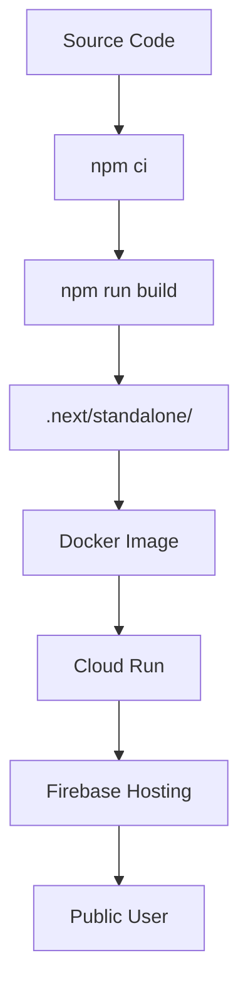

# 03. Functional Requirements

Source baseline: `docs/phase2/_sources/litstream_phase2_sec02.md`

## Functional Architecture Overview

Mangu Publishers Phase 2 has three primary flows:

1. Next.js build-time compilation (`npm ci` + `npm run build`).
2. Runtime SSR/API handling via standalone Node.js server.
3. Static asset delivery through Cloud Run behind Firebase Hosting.

## Content Management Requirements

- Must support canonical document types: books, authors, categories.
- Must use approved Supabase queries for deterministic data extraction.
- Must produce stable data output through server-side data fetching or ISR.
- Must support portable text render pipeline without runtime secret usage.

## Build Pipeline Requirements

- Scripts required:
  - `npm ci`
  - `npm run build` (Next.js standalone build)
  - composite `build`
- Build output requirement: complete `.next/standalone/` directory suitable for Node.js serving.
- Dynamic routes must be discovered from Supabase content, not hardcoded.
- Next.js must generate route shells for SSR/SSG and static asset delivery.

## Security Functional Requirements

- `SUPABASE_SERVICE_ROLE_KEY`, `STRIPE_SECRET_KEY`, and `RESEND_API_KEY` may only be available to server-side code (API routes, server components, server actions).
- Secrets must never be available to client/browser code paths.
- Build must fail if secret appears in generated client bundle.
- Docker image must not contain secrets as `ARG`, `ENV`, or embedded content.
- Cloud Run runtime env must not expose server secrets to the client.
- CSP must prevent runtime unauthorized API access.

## Container And Runtime Requirements

- Runtime image is Node.js Next.js standalone image.
- Container must run as non-root UID 1001.
- Service must listen on Cloud Run-compatible port 3000.
- Build must hard-fail if `.next/standalone/server.js` is missing.
- `/api/health` endpoint must respond 200.
- Next.js handles routing natively; no additional SPA/deep-link fallback configuration required.

## Cloud Build Requirements

- Pipeline must preserve deterministic step ordering per [`05-milestone-implementation-plan.md`](05-milestone-implementation-plan.md): dependency install + Next.js build producing `.next/standalone/`, then **docker build**, **push to Artifact Registry**, **vulnerability scan on the pushed image**, then **deploy** and verify.
- `SUPABASE_SERVICE_ROLE_KEY`, `STRIPE_SECRET_KEY`, and `RESEND_API_KEY` must be injected via `secretEnv` or Google Secret Manager at runtime deploy, not at build time. They must never be present in the build context, Docker build args, or client bundle.
- Deployment target must use Cloud Run gen2 with `--memory=512Mi`.
- Build logging must use `CLOUD_LOGGING_ONLY` (see ADR-006).

## Environment Variable Classification (Security Boundary)

Full table: [`09-appendices.md`](09-appendices.md) Appendix A.

| Variable | NEXT_PUBLIC prefix? | Typical source | Consumer | Secret? |
|---|---|---|---|---|
| `NEXT_PUBLIC_SUPABASE_URL` | Yes | `.env.local` / CI | Client + server | No |
| `NEXT_PUBLIC_SUPABASE_ANON_KEY` | Yes | `.env.local` / CI | Client + server | No |
| `NEXT_PUBLIC_STRIPE_PUBLISHABLE_KEY` | Yes | `.env.local` / CI | Client | No |
| `NEXT_PUBLIC_SITE_URL` | Yes | `.env.local` / CI | Sitemap / SEO | No |
| `NEXT_PUBLIC_APP_VERSION` | Yes | CI (`SHORT_SHA`) | Client / Sentry release tag | No |
| `SUPABASE_SERVICE_ROLE_KEY` | **No** | Secret Manager → runtime only | Server-side code only | **Yes** |
| `STRIPE_SECRET_KEY` | **No** | Secret Manager → runtime only | Server-side code only | **Yes** |
| `RESEND_API_KEY` | **No** | Secret Manager → runtime only | Server-side code only | **Yes** |
| `PORT` | No | Cloud Run / Next.js standalone | Node.js server | Auto |

## Hosting And Domain Requirements

- Firebase Hosting rewrites all public routes to Cloud Run backend.
- HTTPS/TLS must be enabled for custom domain.
- Deep-linking must function without server-side 404 regressions.
- Next.js static asset handling applies immutable cache headers to hashed assets.

## Observability Requirements

- Sentry release tracking required with commit SHA.
- Cloud Monitoring uptime check for `/api/health`.
- Alert and rollback baselines match **`change-log-and-decisions.md` Decision 7**: **5xx rate > 5% / 5 min**, **p99 latency > 2000 ms / 5 min**, **memory > 85% of 512Mi / 5 min**, **instance count ≥ 8 (80% of maxScale) sustained 10 min**, plus **`/api/health`** failure triggers documented in `07-operational-runbook.md` / `13-cutover-day-runbook.md`.
- Billing budget alerts at staged thresholds (50/75/90).

## Functional Exit Criteria

Functional requirements are complete when all P0 tests in `06-acceptance-and-test-protocol.md` pass and production behavior matches declared constraints in `04-architecture-decisions.md`.
