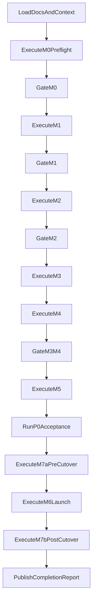

# 10. Agent Execution Playbook

Purpose: deterministic AI-assisted execution flow for Mangu Publishers Phase 2.

## Operating Rules

- Treat `05-milestone-implementation-plan.md` as the authoritative sequence.
- Do not start a milestone until prior milestone gate is explicitly green.
- Record every change, verification result, and unresolved risk.
- On failure, stop forward progress and execute the nearest troubleshooting runbook.
- Persist evidence links in `14-evidence-and-signoff-log.md` at each gate.

## Execution Lifecycle

## Milestone Execution Template

For each milestone:

1. Load objective, prerequisites, and outputs from `05`.
2. Create explicit action checklist from milestone action list.
3. Execute tasks in dependency order.
4. Run milestone-specific validation checks.
5. Log evidence artifacts (command output, screenshots, URLs, configs).
6. Mark gate pass/fail with clear rationale.

## Checkpoint Protocol (Mandatory)

Checkpoint at:

- milestone start
- pre-validation
- gate decision
- post-remediation retry
- handoff boundary

Each checkpoint record must include:

- current milestone and subtask
- commands executed
- observed status
- blocker list
- next action

## Failure Handling Protocol

- Security failure: immediate stop, classify as P0 until ruled out.
- CI/deploy failure: classify to risk ID from `08` and follow exact remediation.
- Runtime degradation: follow rollback path in `07`, then resume from last good state.
- Unknown failure: collect evidence first, avoid repeated blind retries.

## Retry Policy

- Max retries for same action without new evidence: `1`.
- A retry is valid only if one of these changed:
  - configuration input,
  - command parameters,
  - environment state,
  - dependency status.
- After second failure, escalate per `07-operational-runbook.md`.

## Required Evidence Ledger

Maintain a running execution log with:

- milestone ID and task ID
- action timestamp and operator/agent ID
- command or configuration change
- observed output
- pass/fail result
- next action

## Deterministic Execution Log Template

Use this format for each entry:

| Timestamp | Milestone | Task | Command/Action | Result | Evidence Link | Next Step |
| --------- | --------- | ---- | -------------- | ------ | ------------- | --------- |
|           |           |      |                |        |               |           |

## Acceptance Gate Protocol

Before launch:

1. Execute all P0 tests in `06`.
2. Ensure no open critical/unknown risks remain.
3. Verify `M7a` observability controls are complete.
4. Verify rollback readiness using prerecorded fields from `07`.
5. Confirm required named placeholders are populated in `11`, `12`, and `14`.
6. Produce launch recommendation: GO or NO-GO.

## Agent-To-Agent Handoff Protocol

When one agent hands off to another:

1. Freeze current state and write final checkpoint.
2. List completed, in-progress, blocked items.
3. Attach evidence links for every completed gate.
4. State explicit next executable command/action.
5. Name unresolved risks with owner and ETA.

## GO/NO-GO Decision Standard

- **GO:** all P0 tests pass, no unresolved critical risks, rollback plan validated.
- **NO-GO:** any P0 failure, unresolved secret/security concern, unknown deploy state, missing named owner in `12`, unreplaced worksheet placeholders in `12`, or **PENDING** cells in `11`/`14` that still lack real names/evidence URLs.

## Post-Launch Agent Loop

- Monitor first production window for regressions.
- Validate alert pipeline behavior.
- Confirm webhook-triggered rebuilds (e.g., Supabase webhooks, Stripe events) and release tagging.
- Create closeout report summarizing evidence, residual risks, and next hardening actions.

## Closeout Minimum Fields

- release SHA
- launch timestamp
- all P0 outcomes
- incidents during launch window
- rollback usage (yes/no and reason)
- residual risks and assigned owners
