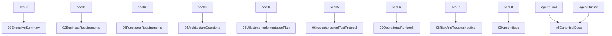

# Mangu Publishers Phase 2 Documentation Package

This package is the execution-grade documentation set for the Mangu Publishers Next.js 14 standalone application running on Cloud Run. It is organized for engineers, operators, and AI agents to execute the phase from pre-flight through post-launch guardrails.

## How To Use This Package

- Read `01` through `04` first to align on goals, requirements, and architecture constraints.
- Use `05` as the milestone execution document (primary build order and gates).
- Use `06` as the acceptance gate before launch.
- Use `07` and `08` for day-2 operations and incident response.
- Use `10` when running this work with AI-assisted execution loops.

## Quick Paths

- Fastest path to launch: `01` -> `05` -> `06` -> `07`
- Security-first review: `02` -> `04` -> `06` -> `08`
- Production incident response: `07` -> `08`
- AI-assisted implementation loop: `10` -> `05` -> `06`
- Handoff readiness: `11` -> `12` -> `14` -> `13`
- New operator onboarding: `15` -> `07` -> `08`

## Document Map

- [01-executive-summary.md](./01-executive-summary.md)
- [02-business-requirements.md](./02-business-requirements.md)
- [03-functional-requirements.md](./03-functional-requirements.md)
- [04-architecture-decisions.md](./04-architecture-decisions.md)
- [05-milestone-implementation-plan.md](./05-milestone-implementation-plan.md)
- [06-acceptance-and-test-protocol.md](./06-acceptance-and-test-protocol.md)
- [07-operational-runbook.md](./07-operational-runbook.md)
- [08-risk-and-troubleshooting.md](./08-risk-and-troubleshooting.md)
- [09-appendices.md](./09-appendices.md)
- [10-agent-execution-playbook.md](./10-agent-execution-playbook.md)
- [11-handoff-master-checklist.md](./11-handoff-master-checklist.md)
- [12-ownership-raci.md](./12-ownership-raci.md)
- [13-cutover-day-runbook.md](./13-cutover-day-runbook.md)
- [14-evidence-and-signoff-log.md](./14-evidence-and-signoff-log.md)
- [15-onboarding-quickstart.md](./15-onboarding-quickstart.md)
- [change-log-and-decisions.md](./change-log-and-decisions.md)

## Handoff Pathway Index

- Handoff gate checklist: `11-handoff-master-checklist.md`
- Ownership and approval mapping: `12-ownership-raci.md`
- Launch window sequence: `13-cutover-day-runbook.md`
- Canonical evidence and signoff record: `14-evidence-and-signoff-log.md`
- New operator ramp path: `15-onboarding-quickstart.md`

## Source Traceability

Primary source files are stored in `docs/phase2/_sources/` and consolidated into canonical docs above.

| Source | Canonical Target |
|---|---|
| `litstream_phase2_sec00.md` | `01-executive-summary.md` |
| `litstream_phase2_sec01.md` | `02-business-requirements.md` |
| `litstream_phase2_sec02.md` | `03-functional-requirements.md` |
| `litstream_phase2_sec03.md` | `04-architecture-decisions.md` |
| `litstream_phase2_sec04.md` | `05-milestone-implementation-plan.md` |
| `litstream_phase2_sec05.md` | `06-acceptance-and-test-protocol.md` |
| `litstream_phase2_sec06.md` | `07-operational-runbook.md` |
| `litstream_phase2_sec07.md` | `08-risk-and-troubleshooting.md` |
| `litstream_phase2_sec08.md` | `09-appendices.md` |
| `litstream_phase2.agent.final.md` | Cross-cutting normalization and gap fill |
| `litstream_phase2.agent.outline.md` | Section structure validation |
| `plan.md` | Original planning workflow lineage |

## Canonical Operating Constraints

- Server secrets (`SUPABASE_SERVICE_ROLE_KEY`, `STRIPE_SECRET_KEY`, `RESEND_API_KEY`) must never use `NEXT_PUBLIC_` prefix or appear in client bundles. Public env vars (`NEXT_PUBLIC_SUPABASE_URL`, `NEXT_PUBLIC_SUPABASE_ANON_KEY`, `NEXT_PUBLIC_STRIPE_PUBLISHABLE_KEY`) are allowed in the client bundle.
- Container is Node.js Next.js standalone server on port 3000, non-root.
- Cloud Run deploy target uses gen2 and `--memory=512Mi`.
- Cloud Build pipeline is ~14 steps with runtime secrets injected at deploy via Google Secret Manager.
- Launch gate requires P0 acceptance checks and operational guardrails.
